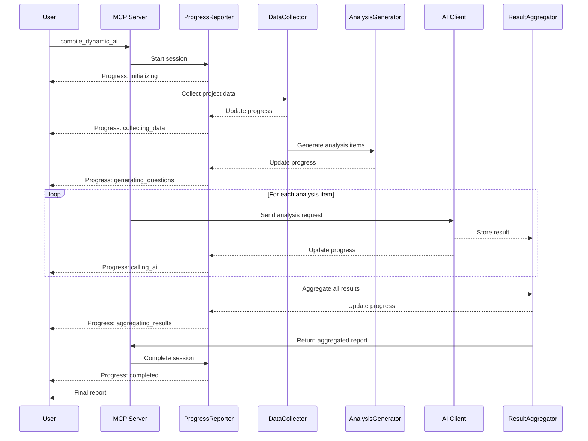
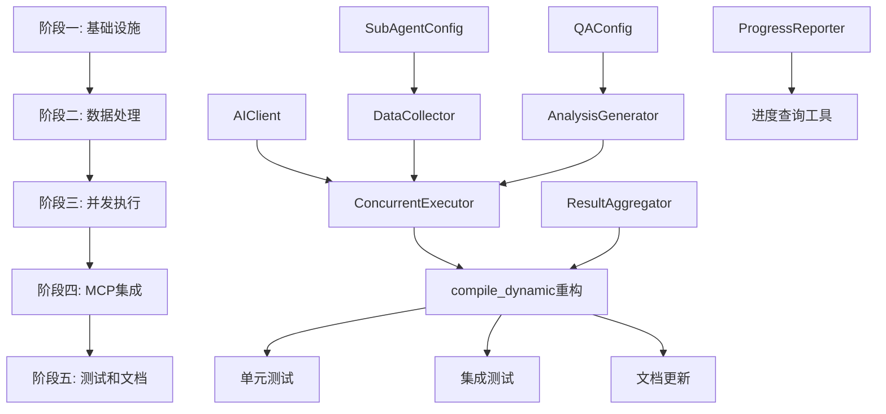

# MCP动态编译重构方案

## 1. 概述

### 1.1 背景
当前AITDD项目的MCP动态编译逻辑需要重构，以支持AI驱动的任务/模块/项目设计合理性验证。新的动态编译将利用AI大模型分析项目结构，提供智能化的设计建议和问题发现。

### 1.2 目标
- 实现AI驱动的设计合理性分析
- 支持任务、模块、项目三个层级的分析
- 提供流畅的进度反馈机制
- 并发处理多个AI请求
- 结构化的分析结果输出

## 2. 架构设计

### 2.1 整体架构

```mermaid
flowchart TB
    subgraph 用户交互
        U[用户] --> T[触发编译]
    end
    
    subgraph MCP层
        T[触发编译] --> CM[compile_dynamic_ai]
        CM --> |检查配置]
        CM --> |准备数据]
        CM --> |生成问题]
        CM --> |并发请求AI]
        CM --> |聚合结果]
    end
    
    subgraph 配置层
        CONFIG[sub_agent.json]
        QA[qa.json]
        CONFIG --> |检查配置]
    end
    
    subgraph 数据层
        DB[(数据库)]
        API[REST API]
        DB --> API
        API --> |准备数据|
    end
    
    subgraph AI层
        AI[AI大模型]
        |并发请求AI| --> AI
        AI --> |聚合结果|
    end
    
    subgraph 输出层
        |聚合结果| --> R[分析报告]
        R --> U
    end
```

### 2.2 新增代码模块

| 模块 | 文件路径 | 职责 |
|------|----------|------|
| SubAgentConfig | `backend/internal/mcp/sub_agent_config.go` | AI子代理配置管理 |
| QAConfig | `backend/internal/mcp/qa_config.go` | 问题配置管理 |
| AIClient | `backend/internal/mcp/ai_client.go` | AI HTTP客户端封装 |
| DataCollector | `backend/internal/mcp/data_collector.go` | 数据收集器 |
| AnalysisGenerator | `backend/internal/mcp/analysis_generator.go` | 分析问题生成器 |
| ResultAggregator | `backend/internal/mcp/result_aggregator.go` | 结果聚合器 |
| ProgressReporter | `backend/internal/mcp/progress_reporter.go` | 进度报告器 |

### 2.3 与现有代码的集成点

| 集成点 | 现有代码 | 新代码 | 说明 |
|--------|----------|--------|------|
| compile_dynamic | `tools_other.go` | 新实现 | 替换现有动态编译逻辑 |
| ConfigManager | `config.go` | SubAgentConfig | 扩展配置管理 |
| MCPServer | `server.go` | 新工具注册 | 注册新的compile_dynamic_ai工具 |

## 3. 配置文件结构设计

### 3.1 sub_agent.json 结构

```json
{
  "version": "1.0",
  "provider": "openai",
  "models": {
    "primary": {
      "url": "https://api.openai.com/v1",
      "apiKey": "${OPENAI_API_KEY}",
      "baseUrl": "/chat/completions",
      "model": "gpt-4",
      "maxTokens": 4096,
      "temperature": 0.7
    },
    "fallback": {
      "url": "https://api.anthropic.com/v1",
      "apiKey": "${ANTHROPIC_API_KEY}",
      "baseUrl": "/messages",
      "model": "claude-3-sonnet",
      "maxTokens": 4096,
      "temperature": 0.7
    }
  },
  "retry": {
    "maxRetries": 3,
    "initialDelayMs": 1000,
    "maxDelayMs": 10000,
    "backoffMultiplier": 2.0
  },
  "timeout": {
    "connectionMs": 5000,
    "requestMs": 30000
  },
  "concurrency": {
    "maxConcurrent": 5,
    "rateLimitPerMinute": 60
  }
}
```

### 3.2 qa.json 结构

```json
{
  "version": "1.0",
  "questions": {
    "task": [
      {
        "id": "prompt_clarity",
        "category": "prompt",
        "question": "请分析以下任务的提示词是否清晰、完整，能否指导开发人员正确实现功能？",
        "severity": "error"
      },
      {
        "id": "test_rationality",
        "category": "test",
        "question": "请分析以下任务的测试用例是否合理，能否覆盖主要功能场景？",
        "severity": "warning"
      },
      {
        "id": "upstream_interface_completeness",
        "category": "contract",
        "question": "请分析以下任务的上游接口定义是否完整，是否包含所有必要的输入信息？",
        "severity": "error"
      },
      {
        "id": "interface_description_clarity",
        "category": "contract",
        "question": "请分析以下任务的接口描述是否清晰，参数和返回值是否定义明确？",
        "severity": "warning"
      },
      {
        "id": "downstream_interface_rationality",
        "category": "contract",
        "question": "请分析以下任务的下游接口定义是否合理，是否满足下游任务的需求？",
        "severity": "warning"
      },
      {
        "id": "module_attribution_correctness",
        "category": "architecture",
        "question": "请分析以下任务是否归属到正确的模块，是否应该移动到其他模块？",
        "severity": "info"
      },
      {
        "id": "project_requirement_alignment",
        "category": "requirement",
        "question": "请分析以下任务是否符合项目整体需求，是否偏离了项目目标？",
        "severity": "warning"
      }
    ],
    "module": [
      {
        "id": "dependency_rationality",
        "category": "dependency",
        "question": "请分析以下模块的依赖关系是否合理，是否存在不必要的依赖或缺失的依赖？",
        "severity": "error"
      },
      {
        "id": "function_description_rationality",
        "category": "description",
        "question": "请分析以下模块的功能描述是否合理，是否清晰定义了模块的职责边界？",
        "severity": "warning"
      },
      {
        "id": "task_granularity_rationality",
        "category": "task",
        "question": "请分析以下模块的任务粒度是否合理，是否存在过大或过小的任务划分？",
        "severity": "warning"
      },
      {
        "id": "responsibility_scope_correctness",
        "category": "architecture",
        "question": "请分析以下模块的职责范围是否正确，是否与其他模块存在职责重叠？",
        "severity": "error"
      },
      {
        "id": "module_responsibility_clarity",
        "category": "description",
        "question": "请分析以下模块的职责描述是否清晰，能否让开发人员理解模块的核心功能？",
        "severity": "warning"
      },
      {
        "id": "project_design_alignment",
        "category": "requirement",
        "question": "请分析以下模块是否符合项目整体设计，是否偏离了架构规划？",
        "severity": "warning"
      }
    ],
    "project": [
      {
        "id": "clarification_needed",
        "category": "requirement",
        "question": "请分析以下项目是否有需要澄清的地方，需求是否明确？",
        "severity": "info"
      },
      {
        "id": "architecture_selection_rationality",
        "category": "architecture",
        "question": "请分析以下项目的架构选型是否合理，技术栈选择是否适合项目需求？",
        "severity": "error"
      },
      {
        "id": "module_coupling_design",
        "category": "architecture",
        "question": "请分析以下项目的模块耦合性设计是否合理，模块间依赖是否清晰？",
        "severity": "warning"
      }
    ]
  }
}
```

## 4. AI请求/响应格式设计

### 4.1 场景A - 任务分析请求格式

```json
{
  "analysisType": "task",
  "task": {
    "pathName": "MyProject/用户管理/登录功能",
    "name": "登录功能",
    "description": "实现用户登录功能",
    "prompt": "...",
    "status": "ready",
    "upstreamContractDetail": {...},
    "downstreamContractDetail": {...},
    "tests": [...]
  },
  "context": {
    "upstreamContractTasks": [
      {
        "pathName": "MyProject/用户管理/用户注册",
        "name": "用户注册",
        "downstreamContractDetail": {...}
      }
    ],
    "upstreamModule": {
      "pathName": "MyProject/用户管理",
      "name": "用户管理",
      "upstreamContractSummary": "...",
      "downstreamContractSummary": "..."
    },
    "downstreamContractTasks": [...],
    "downstreamModule": {...},
    "project": {
      "pathName": "MyProject",
      "name": "我的项目",
      "constitution": "..."
    }
  },
  "questions": [
    {
      "id": "prompt_clarity",
      "question": "请分析以下任务的提示词是否清晰..."
    }
  ]
}
```

### 4.2 场景B - 模块分析请求格式

```json
{
  "analysisType": "module",
  "module": {
    "pathName": "MyProject/用户管理",
    "name": "用户管理",
    "description": "...",
    "prompt": "...",
    "status": "developing"
  },
  "context": {
    "tasks": [
      {
        "pathName": "MyProject/用户管理/登录功能",
        "name": "登录功能",
        "status": "ready"
      }
    ],
    "upstreamDependencies": [
      {
        "type": "module",
        "pathName": "MyProject/基础服务",
        "name": "基础服务"
      }
    ],
    "downstreamDependencies": [...],
    "project": {...}
  },
  "questions": [...]
}
```

### 4.3 场景C - 项目分析请求格式

```json
{
  "analysisType": "project",
  "project": {
    "pathName": "MyProject",
    "name": "我的项目",
    "constitution": "..."
  },
  "context": {
    "modules": [
      {
        "pathName": "MyProject/用户管理",
        "name": "用户管理",
        "status": "developing",
        "taskCount": 5
      }
    ],
    "tasks": [...],
    "moduleDependencies": [
      {
        "upstream": "MyProject/基础服务",
        "downstream": "MyProject/用户管理",
        "type": "required"
      }
    ]
  },
  "questions": [...]
}
```

### 4.4 AI响应格式

```json
{
  "analysisType": "task",
  "targetPathName": "MyProject/用户管理/登录功能",
  "analyzedAt": "2026-03-04T12:00:00Z",
  "responses": [
    {
      "questionId": "prompt_clarity",
      "category": "prompt",
      "assessment": {
        "score": 7,
        "level": "good"
      },
      "analysis": "任务提示词整体清晰，包含了主要功能描述...",
      "issues": [
        {
          "severity": "warning",
          "description": "缺少错误处理场景的说明",
          "suggestion": "建议补充登录失败时的处理逻辑说明"
        }
      ],
      "recommendations": [
        "增加错误处理场景的描述",
        "补充边界条件的说明"
      ]
    }
  ],
  "overallAssessment": {
    "score": 7.5,
    "level": "good",
    "summary": "任务设计整体合理，有少量改进空间"
  }
}
```

### 4.5 评估等级定义

| 等级 | 分数范围 | 说明 |
|------|----------|------|
| excellent | 9-10 | 优秀，无需改进 |
| good | 7-8 | 良好，有少量改进空间 |
| acceptable | 5-6 | 可接受，建议改进 |
| poor | 3-4 | 较差，需要改进 |
| critical | 1-2 | 严重问题，必须立即处理 |

### 4.6 错误处理和重试机制

```go
type RetryConfig struct {
    MaxRetries         int     `json:"maxRetries"`
    InitialDelayMs     int     `json:"initialDelayMs"`
    MaxDelayMs         int     `json:"maxDelayMs"`
    BackoffMultiplier  float64 `json:"backoffMultiplier"`
}

type AIError struct {
    Type       string `json:"type"`        // connection_timeout, rate_limit, server_error, invalid_response
    Message    string `json:"message"`
    Retryable  bool   `json:"retryable"`
    Attempt   int    `json:"attempt"`
}

func (e *AIError) Error() string {
    return fmt.Sprintf("AI error [%s]: %s (attempt %d, retryable: %v)", 
        e.Type, e.Message, e.Attempt, e.Retryable)
}
```

## 5. 并发处理和进度反馈机制

### 5.1 并发请求策略

```go
type ConcurrencyConfig struct {
    MaxConcurrent      int `json:"maxConcurrent"`      // 最大并发数
    RateLimitPerMinute int `json:"rateLimitPerMinute"` // 每分钟请求限制
}

type ConcurrentExecutor struct {
    semaphore  chan struct{}
    rateLimiter *rate.Limiter
    wg         sync.WaitGroup
    results    chan AnalysisResult
    errors     chan error
}

func NewConcurrentExecutor(config ConcurrencyConfig) *ConcurrentExecutor {
    return &ConcurrentExecutor{
        semaphore:  make(chan struct{}, config.MaxConcurrent),
        rateLimiter: rate.NewLimiter(rate.Every(time.Minute, time.Duration(config.RateLimitPerMinute)),
    }
}
```

### 5.2 进度报告机制

```go
type ProgressReport struct {
    SessionID     string        `json:"sessionId"`
    Phase         string        `json:"phase"`          // initializing, collecting_data, generating_questions, calling_ai, aggregating_results, completed
    Current       int           `json:"current"`
    Total         int           `json:"total"`
    Message       string        `json:"message"`
    CompletedAt  time.Time     `json:"completedAt,omitempty"`
    Items         []ProgressItem `json:"items,omitempty"`
}

type ProgressItem struct {
    Type          string    `json:"type"`           // task, module, project
    PathName      string    `json:"pathName"`
    Status        string    `json:"status"`         // pending, in_progress, completed, failed
    Message       string    `json:"message"`
    CompletedAt   time.Time `json:"completedAt,omitempty"`
}

type ProgressReporter interface {
    Start(sessionID string, total int) error
    Update(sessionID string, item ProgressItem) error
    Complete(sessionID string) error
    GetProgress(sessionID string) (*ProgressReport, error)
}
```

### 5.3 结果聚合逻辑

```go
type ResultAggregator struct {
    mu           sync.Mutex
    results      map[string]*AnalysisResult
    errors       map[string]error
    startTime    time.Time
}

type AnalysisResult struct {
    AnalysisType    string           `json:"analysisType"`
    TargetPathName  string           `json:"targetPathName"`
    Responses       []QuestionResponse `json:"responses"`
    OverallScore    float64          `json:"overallScore"`
    OverallLevel    string           `json:"overallLevel"`
    CompletedAt     time.Time        `json:"completedAt"`
    Duration        time.Duration   `json:"duration"`
}

type AggregatedReport struct {
    SessionID       string             `json:"sessionId"`
    ProjectPathName string             `json:"projectPathName"`
    StartedAt       time.Time          `json:"startedAt"`
    CompletedAt     time.Time          `json:"completedAt"`
    Duration        time.Duration      `json:"duration"`
    Statistics      ReportStatistics  `json:"statistics"`
    TaskResults     []AnalysisResult  `json:"taskResults"`
    ModuleResults   []AnalysisResult  `json:"moduleResults"`
    ProjectResult   *AnalysisResult   `json:"projectResult,omitempty"`
    Issues          []ReportIssue     `json:"issues"`
}

type ReportStatistics struct {
    TotalAnalyzed    int `json:"totalAnalyzed"`
    TasksAnalyzed    int `json:"tasksAnalyzed"`
    ModulesAnalyzed  int `json:"modulesAnalyzed"`
    ProjectAnalyzed  int `json:"projectAnalyzed"`
    CriticalIssues   int `json:"criticalIssues"`
    Warnings         int `json:"warnings"`
    Suggestions      int `json:"suggestions"`
    AmbiguousAreas   int `json:"ambiguousAreas"`
}

type ReportIssue struct {
    Severity        string   `json:"severity"`      // critical, warning, suggestion, ambiguous
    Type            string   `json:"type"`          // task, module, project
    PathName        string   `json:"pathName"`
    QuestionId      string   `json:"questionId"`
    Description     string   `json:"description"`
    Suggestion      string   `json:"suggestion"`
    RelatedItems    []string `json:"relatedItems,omitempty"`
}
```

### 5.4 数据流图



## 6. 详细实施计划

### 6.1 阶段一：基础设施（Infrastructure）

#### 任务1.1： 创建配置管理模块
- **文件**: `backend/internal/mcp/sub_agent_config.go`
- **内容**:
  - SubAgentConfig 结构体定义
  - LoadSubAgentConfig() 加载函数
  - SaveSubAgentConfig() 保存函数
  - ValidateSubAgentConfig() 验证函数
  - GetPrimaryModel() / GetFallbackModel() 获取模型配置

#### 任务1.2: 创建问题配置管理模块
- **文件**: `backend/internal/mcp/qa_config.go`
- **内容**:
  - QAConfig 结构体定义
  - LoadQAConfig() 加载函数
  - SaveQAConfig() 保存函数
  - GetDefaultQAConfig() 获取默认配置
  - GetQuestionsByType() 按类型获取问题

#### 任务1.3: 创建AI客户端模块
- **文件**: `backend/internal/mcp/ai_client.go`
- **内容**:
  - AIClient 结构体定义
  - NewAIClient() 创建客户端
  - Call() 调用AI API
  - 重试逻辑实现
  - 超时处理

### 6.2 阶段二： 数据处理（Data Processing）

#### 任务2.1: 创建数据收集器
- **文件**: `backend/internal/mcp/data_collector.go`
- **内容**:
  - DataCollector 结构体定义
  - CollectTaskData() 收集任务分析数据
  - CollectModuleData() 收集模块分析数据
  - CollectProjectData() 收集项目分析数据
  - 依赖现有的 REST API 获取数据

  - **数据收集逻辑**:
    - 任务数据：当前任务 + 上游契约任务（去重）+ 上游模块 + 下游契约任务（去重）+ 下游模块 + 项目信息
    - 模块数据：当前模块 + 模块任务 + 上游依赖（排除当前模块）+ 下游依赖（排除当前模块）+ 项目信息
    - 项目数据：项目 + 所有模块 + 所有任务 + 模块依赖关系

#### 任务2.2: 创建分析问题生成器
- **文件**: `backend/internal/mcp/analysis_generator.go`
- **内容**:
  - AnalysisGenerator 结构体定义
  - GenerateTaskAnalysis() 生成任务分析请求
  - GenerateModuleAnalysis() 生成模块分析请求
  - GenerateProjectAnalysis() 生成项目分析请求
  - 合并问题和上下文数据

### 6.3 阶段三： 并发执行（Concurrent Execution）

#### 任务3.1: 创建并发执行器
- **文件**: `backend/internal/mcp/concurrent_executor.go`
- **内容**:
  - ConcurrentExecutor 结构体定义
  - Execute() 执行并发分析
  - 信号量控制并发数
  - 速率限制器
  - 错误收集

#### 任务3.2: 创建进度报告器
- **文件**: `backend/internal/mcp/progress_reporter.go`
- **内容**:
  - ProgressReporter 结构体定义
  - WebSocket 或 SSE 实时进度推送
  - 进度状态管理
  - 进度查询接口

#### 任务3.3: 创建结果聚合器
- **文件**: `backend/internal/mcp/result_aggregator.go`
- **内容**:
  - ResultAggregator 结构体定义
  - AddResult() 添加结果
  - AddError() 添加错误
  - Aggregate() 生成最终报告
  - 问题分类逻辑

### 6.4 阶段四： MCP工具集成（MCP Integration）

#### 任务4.1: 重构 compile_dynamic 工具
- **文件**: `backend/internal/mcp/tools_other.go`
- **内容**:
  - 修改 handleCompileDynamicImpl 函数
  - 集成新的分析流程
  - 调用各模块完成分析

#### 任务4.2: 添加进度查询工具
- **文件**: `backend/internal/mcp/server.go`
- **内容**:
  - 注册 get_analysis_progress 工具
  - 返回当前分析进度

#### 任务4.3: 更新配置管理
- **文件**: `backend/internal/mcp/config.go`
- **内容**:
  - 添加 SubAgentConfig 和 QAConfig 的支持
  - 配置加载和保存

### 6.5 阶段五： 测试和文档（Testing & Documentation）

#### 任务5.1: 单元测试
- **文件**: `backend/internal/mcp/*_test.go`
- **内容**:
  - 配置加载/保存测试
  - AI客户端测试（使用 mock）
  - 数据收集器测试
  - 结果聚合器测试

#### 任务5.2: 集成测试
- **文件**: `backend/internal/mcp/integration_test.go`
- **内容**:
  - 完整流程测试
  - 模拟 AI 响应
  - 并发测试

#### 任务5.3: 更新文档
- **文件**: `docs/mcp-guide.md`
- **内容**:
  - 更新 compile_dynamic 工具说明
  - 添加配置文件说明
  - 添加使用示例

## 7. 测试方案

### 7.1 单元测试策略

| 模块 | 测试内容 | 测试方法 |
|------|----------|----------|
| SubAgentConfig | 配置加载/保存/验证 | 文件系统 mock |
| QAConfig | 默认配置生成/问题获取 | 表驱动测试 |
| AIClient | HTTP请求/重试/超时 | httptest.Server mock |
| DataCollector | 数据收集完整性 | API mock |
| ResultAggregator | 结果聚合/分类 | 表驱动测试 |

### 7.2 集成测试策略

```go
func TestCompileDynamicAI_FullFlow(t *testing.T) {
    // 1. 创建测试项目结构
    // 2. 配置模拟AI服务器
    // 3. 执行完整分析流程
    // 4. 验证结果格式和内容
}

func TestCompileDynamicAI_ConcurrentExecution(t *testing.T) {
    // 1. 创建多个任务/模块
    // 2. 验证并发执行
    // 3. 验证速率限制
}

func TestCompileDynamicAI_ErrorHandling(t *testing.T) {
    // 1. 模拟各种错误场景
    // 2. 验证重试逻辑
    // 3. 验证错误报告
}
```

### 7.3 模拟AI响应的测试方法

```go
type MockAIServer struct {
    server      *httptest.Server
    responses   map[string]interface{}
    callCount   int
    requestLog  []string
}

func NewMockAIServer() *MockAIServer {
    return &MockAIServer{
        responses: make(map[string]interface{}),
    }
}

func (m *MockAIServer) SetResponse(analysisType, pathName string, response interface{}) {
    key := fmt.Sprintf("%s:%s", analysisType, pathName)
    m.responses[key] = response
}

func (m *MockAIServer) Start() {
    m.server = httptest.NewServer(http.HandlerFunc(func(w http.ResponseWriter, r *http.Request) {
        m.callCount++
        m.requestLog = append(m.requestLog, r.URL.Path)
        
        // 解析请求并返回预设响应
        var req map[string]interface{}
        json.NewDecoder(r.Body).Decode(&req)
        
        analysisType := req["analysisType"].(string)
        pathName := req["targetPathName"].(string)
        
        key := fmt.Sprintf("%s:%s", analysisType, pathName)
        if resp, ok := m.responses[key]; ok {
            json.NewEncoder(w).Encode(resp)
        } else {
            // 返回默认响应
            json.NewEncoder(w).Encode(m.defaultResponse(analysisType))
        }
    }))
}
```

## 8. 输出格式示例

### 8.1 完整分析报告示例

```json
{
  "sessionId": "analysis-20260304-120000",
  "projectPathName": "MyProject",
  "startedAt": "2026-03-04T12:00:00Z",
  "completedAt": "2026-03-04T12:05:30Z",
  "duration": "5m30s",
  "statistics": {
    "totalAnalyzed": 15,
    "tasksAnalyzed": 10,
    "modulesAnalyzed": 4,
    "projectAnalyzed": 1,
    "criticalIssues": 2,
    "warnings": 5,
    "suggestions": 8,
    "ambiguousAreas": 3
  },
  "taskResults": [
    {
      "analysisType": "task",
      "targetPathName": "MyProject/用户管理/登录功能",
      "overallScore": 7.5,
      "overallLevel": "good",
      "responses": [
        {
          "questionId": "prompt_clarity",
          "category": "prompt",
          "assessment": {
            "score": 7,
            "level": "good"
          },
          "analysis": "任务提示词整体清晰，包含了主要功能描述。但缺少错误处理场景的说明。",
          "issues": [
            {
              "severity": "warning",
              "description": "缺少错误处理场景的说明",
              "suggestion": "建议补充登录失败时的处理逻辑说明"
            }
          ],
          "recommendations": [
            "增加错误处理场景的描述",
            "补充边界条件的说明"
          ]
        }
      ]
    }
  ],
  "moduleResults": [...],
  "projectResult": {...},
  "issues": [
    {
      "severity": "critical",
      "type": "task",
      "pathName": "MyProject/用户管理/密码重置",
      "questionId": "upstream_interface_completeness",
      "description": "任务缺少关键的上游接口定义，无法获取用户邮箱信息",
      "suggestion": "需要在用户注册任务中添加邮箱字段的下游接口定义",
      "relatedItems": [
        "MyProject/用户管理/用户注册"
      ]
    },
    {
      "severity": "warning",
      "type": "module",
      "pathName": "MyProject/用户管理",
      "questionId": "task_granularity_rationality",
      "description": "模块中存在过大的任务：'用户CRUD' 任务包含过多功能",
      "suggestion": "建议将'用户CRUD'拆分为'创建用户'、'更新用户'、'删除用户'三个独立任务"
    }
  ]
}
```

### 8.2 进度报告示例

```json
{
  "sessionId": "analysis-20260304-120000",
  "phase": "calling_ai",
  "current": 8,
  "total": 15,
  "message": "正在分析任务: MyProject/用户管理/登录功能",
  "items": [
    {
      "type": "task",
      "pathName": "MyProject/用户管理/用户注册",
      "status": "completed",
      "message": "分析完成"
    },
    {
      "type": "task",
      "pathName": "MyProject/用户管理/登录功能",
      "status": "in_progress",
      "message": "正在调用AI分析..."
    },
    {
      "type": "task",
      "pathName": "MyProject/用户管理/密码重置",
      "status": "pending",
      "message": "等待分析"
    }
  ]
}
```

## 9. 依赖关系



## 10. 风险和缓解措施

| 风险 | 影响 | 缓解措施 |
|------|------|----------|
| AI API 不可用 | 无法完成分析 | 实现多模型回退机制 |
| 并发请求过多 | 触发速率限制 | 实现信号量和速率限制器 |
| 大项目分析时间长 | 用户体验差 | 提供实时进度反馈 |
| AI 响应格式不一致 | 解析失败 | 定义严格的响应 schema，实现容错解析 |
| 配置文件损坏 | 功能异常 | 实现配置验证，提供默认配置回退 |

## 11. 后续优化方向

1. **增量分析**: 只分析变更的任务/模块，而非全量分析
2. **分析缓存**: 缓存AI分析结果，避免重复请求
3. **自定义问题**: 允许用户添加自定义分析问题
4. **分析模板**: 预定义不同类型项目的分析模板
5. **学习机制**: 根据用户反馈优化分析问题
