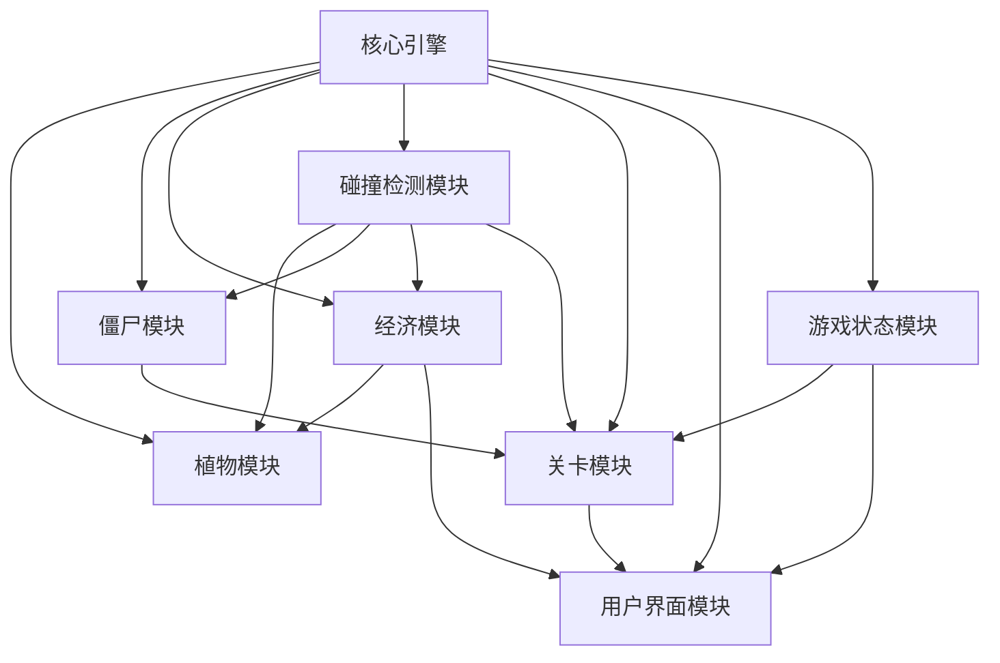

# AITDD项目改进计划

## 背景

当前系统存在两个主要问题：
1. **模块依赖未定义** - 模块间没有定义依赖关系，但实际上任务之间存在跨模块依赖
2. **测试覆盖率为0%** - 所有模块的测试覆盖率均为0%，任务没有定义测试用例

## 当前状态分析

### 模块清单

| 模块ID | 模块名称 | 描述 | 测试覆盖率 |
|--------|----------|------|-----------|
| d77d7963-80f4-4cf6-9f7e-f223fd352448 | 核心引擎 | 游戏循环、画布管理、网格系统等基础功能 | 0% |
| b5639bad-c862-4dfd-8383-187f682709a4 | 植物模块 | 所有植物类及其逻辑 | 0% |
| bbbe4f58-d712-432e-9554-b37f8c8f94c2 | 僵尸模块 | 所有僵尸类及其逻辑 | 0% |
| 6a09d7ea-21d1-489c-a68b-71885dd7cb52 | 经济模块 | 阳光、卡片、Buff等经济系统 | 0% |
| 68e4017f-d32a-49f2-8238-af319082c5e2 | 碰撞检测模块 | 管理豌豆与僵尸、僵尸与植物的碰撞 | 0% |
| 539931eb-c352-4177-b5ad-4a6a40e0c80e | 关卡模块 | 关卡数据、僵尸波次生成 | 0% |
| a366b725-2f71-4f08-ba6c-26b1647551b8 | 用户界面模块 | HUD、菜单等界面元素 | 0% |
| 8c38110a-5f1a-4633-a16b-592aea9a9698 | 游戏状态模块 | 管理游戏进行中、胜利、失败状态 | 0% |

### 任务跨模块依赖分析

通过分析任务的`upstreamContractDetail`和`downstreamContractDetail`，识别出以下模块依赖关系：



## 改进计划

### 第一部分：定义模块依赖关系

根据任务间的契约依赖，需要在模块级别定义以下依赖关系：

| 源模块 | 目标模块 | 依赖类型 | 契约摘要 |
|--------|----------|----------|----------|
| 植物模块 | 核心引擎 | required | 游戏循环注册、网格坐标转换 |
| 植物模块 | 碰撞检测模块 | required | 添加豌豆/植物到碰撞检测 |
| 植物模块 | 经济模块 | required | 阳光系统接口 |
| 僵尸模块 | 核心引擎 | required | 游戏循环注册 |
| 僵尸模块 | 碰撞检测模块 | required | 获取植物列表 |
| 经济模块 | 核心引擎 | required | 游戏循环注册 |
| 经济模块 | 碰撞检测模块 | optional | 僵尸死亡事件（卡片掉落） |
| 碰撞检测模块 | 核心引擎 | required | 游戏循环注册 |
| 关卡模块 | 核心引擎 | required | 游戏循环注册、网格信息 |
| 关卡模块 | 僵尸模块 | required | 创建僵尸实例 |
| 关卡模块 | 碰撞检测模块 | required | 添加僵尸到碰撞检测 |
| 关卡模块 | 游戏状态模块 | required | 设置游戏状态 |
| 用户界面模块 | 核心引擎 | required | 游戏循环渲染 |
| 用户界面模块 | 经济模块 | required | 阳光/卡片/Buff数据 |
| 用户界面模块 | 关卡模块 | required | 波次信息 |
| 用户界面模块 | 游戏状态模块 | required | 游戏状态 |
| 游戏状态模块 | 核心引擎 | required | 停止游戏循环 |

### 第二部分：为任务添加测试用例

每个任务需要添加测试用例，测试用例应包含：
- 测试描述
- 输入条件
- 预期输出
- 边界条件

#### 测试用例模板

```json
[
  {
    "name": "测试用例名称",
    "description": "测试用例描述",
    "precondition": "前置条件",
    "steps": ["步骤1", "步骤2"],
    "expected": "预期结果"
  }
]
```

#### 各任务测试用例规划

**核心引擎模块任务：**

1. 创建游戏画布
   - 测试画布创建成功
   - 测试获取上下文
   - 测试清除画布

2. 游戏循环
   - 测试启动/停止循环
   - 测试回调注册
   - 测试deltaTime计算

3. 网格系统
   - 测试坐标转行列
   - 测试边界计算
   - 测试中心点计算

**植物模块任务：**

1. 植物基类
   - 测试构造函数
   - 测试受伤逻辑
   - 测试死亡判定

2. 向日葵植物
   - 测试阳光生成
   - 测试渲染

3. 豌豆射手植物
   - 测试豌豆发射
   - 测试攻击速度

4. 种植逻辑
   - 测试阳光扣除
   - 测试位置检测

**僵尸模块任务：**

1. 僵尸基类
   - 测试移动逻辑
   - 测试攻击逻辑

2. 普通僵尸
   - 测试属性配置
   - 测试行为逻辑

**经济模块任务：**

1. 阳光系统
   - 测试阳光生成
   - 测试阳光收集
   - 测试阳光消耗

2. 阳光收集
   - 测试点击检测
   - 测试收集逻辑

3. 卡片拾取
   - 测试拾取逻辑
   - 测试背包上限

4. Buff管理
   - 测试Buff添加
   - 测试效果计算
   - 测试Buff叠加

5. 卡片掉落
   - 测试掉落概率
   - 测试稀有度分配

**碰撞检测模块任务：**

1. 碰撞检测管理
   - 测试豌豆碰撞
   - 测试僵尸植物碰撞
   - 测试死亡回调

**关卡模块任务：**

1. 关卡管理器
   - 测试波次生成
   - 测试胜利条件
   - 测试失败条件

**用户界面模块任务：**

1. HUD界面
   - 测试信息显示
   - 测试数据更新

2. 状态栏显示
   - 测试Buff显示
   - 测试通知功能

3. 抽卡界面
   - 测试随机选择
   - 测试Buff应用

**游戏状态模块任务：**

1. 游戏状态管理
   - 测试状态切换
   - 测试游戏结束逻辑

## 执行计划

### 阶段一：创建模块依赖

使用 `mcp--aitdd--create_module_dependency` 工具为每个模块创建依赖关系。

执行顺序（按依赖层级从底到顶）：
1. 核心引擎模块 - 无依赖
2. 碰撞检测模块 → 核心引擎
3. 经济模块 → 核心引擎、碰撞检测模块
4. 僵尸模块 → 核心引擎、碰撞检测模块
5. 植物模块 → 核心引擎、碰撞检测模块、经济模块
6. 游戏状态模块 → 核心引擎
7. 关卡模块 → 核心引擎、僵尸模块、碰撞检测模块、游戏状态模块
8. 用户界面模块 → 核心引擎、经济模块、关卡模块、游戏状态模块

### 阶段二：添加测试用例

使用 `mcp--aitdd--update_task` 工具为每个任务添加 `tests` 字段。

按模块顺序执行，每个任务添加JSON格式的测试用例。

## 预期成果

1. **模块依赖图完整** - 所有模块间的依赖关系明确定义
2. **测试覆盖率提升** - 每个任务至少有2-3个测试用例
3. **文档完善** - 契约摘要清晰描述模块间交互

## 风险与注意事项

1. 创建依赖时需确保目标模块已存在
2. 测试用例应与任务prompt保持一致
3. 依赖类型应合理选择（required/optional）
