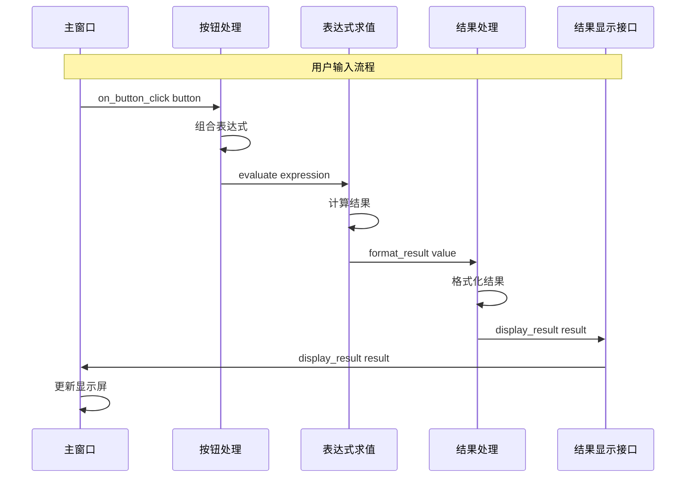
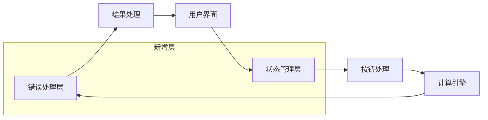

# 计算器项目设计分析报告

## 1. 模块结构评估

### 1.1 模块概览

| 模块名称 | 状态 | 子任务数 | 职责描述 |
|---------|------|---------|---------|
| 用户界面 | designing | 2 | 计算器的用户界面模块，负责显示和用户交互 |
| 计算引擎 | designing | 2 | 计算器的核心计算模块，负责执行数学运算 |
| 共享接口 | designing | 1 | 定义计算器程序的公共接口，用于解耦用户界面和计算引擎 |

### 1.2 模块划分合理性分析

**评分: 4/5分**

**优点:**
- ✅ 采用三层架构设计（UI → 共享接口 → 计算引擎），职责分离清晰
- ✅ 引入共享接口模块实现解耦，避免UI和计算引擎直接依赖
- ✅ 模块粒度适中，不过度拆分

**改进空间:**
- ⚠️ 模块级契约摘要（upstreamContractSummary/downstreamContractSummary）为空，缺少模块间的正式依赖声明
- ⚠️ 所有模块状态都是 designing，建议根据实际进度更新状态

### 1.3 各模块职责清晰度评分

| 模块 | 清晰度评分 | 说明 |
|-----|-----------|------|
| 用户界面 | 4/5 | 职责明确，但与共享接口的边界略显模糊 |
| 计算引擎 | 5/5 | 职责单一明确，专注数学运算 |
| 共享接口 | 4/5 | 解耦意图清晰，但只有一个任务略显单薄 |

---

## 2. 任务设计评估

### 2.1 任务列表详情

| 任务路径 | 状态 | 代码路径 | 职责 |
|---------|------|---------|------|
| 计算器程序/用户界面/主窗口 | ready | src/ui/main_window.py | 实现计算器主窗口，包含显示屏和按钮 |
| 计算器程序/用户界面/按钮处理 | ready | src/ui/button_handler.py | 处理按钮点击，组合表达式 |
| 计算器程序/计算引擎/表达式求值 | ready | src/engine/expression_evaluator.py | 解析并计算表达式 |
| 计算器程序/计算引擎/结果处理 | ready | src/engine/result_formatter.py | 格式化计算结果 |
| 计算器程序/共享接口/结果显示接口 | ready | calculator/shared/interface.py | 定义结果显示接口规范 |

### 2.2 任务粒度分析

**评分: 4/5分**

**优点:**
- ✅ 每个任务职责单一，符合单一职责原则
- ✅ 任务粒度适中，便于独立开发和测试
- ✅ 代码路径明确，每个任务对应独立文件

**问题:**
- ⚠️ 主窗口任务同时负责创建界面和接收结果显示，职责略有重叠
- ⚠️ 结果处理任务与共享接口的显示接口存在功能重叠

### 2.3 各任务契约分析

#### 用户界面模块

**主窗口任务:**
```
上游契约: display_result(result: str) ← 来自结果显示接口
下游契约: on_button_click(button: str) → 提供给按钮处理
```

**按钮处理任务:**
```
上游契约: on_button_click(button: str) ← 来自主窗口
下游契约: evaluate(expression: str) -> float → 提供给表达式求值
```

#### 计算引擎模块

**表达式求值任务:**
```
上游契约: evaluate(expression: str) -> float ← 来自按钮处理
下游契约: format_result(value: float) -> str → 提供给结果处理
```

**结果处理任务:**
```
上游契约: format_result(value: float) -> str ← 来自表达式求值
下游契约: display_result(result: str) → 提供给结果显示接口
```

#### 共享接口模块

**结果显示接口任务:**
```
上游契约: 无
下游契约: display_result(result: str) → 提供给主窗口和结果处理
```

---

## 3. 依赖关系图

### 3.1 任务依赖关系图

```mermaid
graph TD
    subgraph 共享接口模块
        A[结果显示接口]<br/>calculator/shared/interface.py
    end
    
    subgraph 用户界面模块
        B[主窗口]<br/>src/ui/main_window.py
        C[按钮处理]<br/>src/ui/button_handler.py
    end
    
    subgraph 计算引擎模块
        D[表达式求值]<br/>src/engine/expression_evaluator.py
        E[结果处理]<br/>src/engine/result_formatter.py
    end
    
    A -->|display_result| B
    B -->|on_button_click| C
    C -->|evaluate| D
    D -->|format_result| E
    E -->|display_result| A
    
    style A fill:#e1f5fe
    style B fill:#fff3e0
    style C fill:#fff3e0
    style D fill:#e8f5e9
    style E fill:#e8f5e9
```

### 3.2 数据流向图



---

## 4. 可并行性分析

### 4.1 依赖链分析

根据任务间的契约依赖，识别出以下依赖链：

```
结果显示接口 → 主窗口 → 按钮处理 → 表达式求值 → 结果处理 → 结果显示接口
```

**注意:** 存在循环依赖！结果处理通过共享接口回到主窗口。

### 4.2 可并行任务组

| 并行组 | 任务 | 说明 |
|-------|------|------|
| 第1层 | 结果显示接口 | 无上游依赖，可首先开发 |
| 第2层 | 主窗口 | 依赖第1层 |
| 第3层 | 按钮处理 | 依赖第2层 |
| 第4层 | 表达式求值 | 依赖第3层 |
| 第5层 | 结果处理 | 依赖第4层 |

### 4.3 并行执行建议

```mermaid
gantt
    title 计算器项目开发顺序
    dateFormat X
    axisFormat %s
    
    section 第1阶段
    结果显示接口定义           :a1, 0, 1
    
    section 第2阶段
    主窗口界面开发             :a2, after a1, 1
    
    section 第3阶段
    按钮处理逻辑               :a3, after a2, 1
    
    section 第4阶段
    表达式求值实现             :a4, after a3, 1
    
    section 第5阶段
    结果格式化处理             :a5, after a4, 1
```



**实际可并行情况:**

由于存在严格的链式依赖，**所有任务必须串行执行**。但可以考虑以下优化：

1. **接口先行策略**: 先完成结果显示接口定义，然后可以并行开发：
   - 主窗口（使用mock数据显示）
   - 表达式求值（独立计算逻辑）
   - 结果处理（独立格式化逻辑）

2. **契约驱动开发**: 在接口定义完成后，各任务可基于契约并行开发，最后集成测试

---

## 5. 模糊地带识别

### 5.1 职责不清晰区域

| 区域 | 问题描述 | 严重程度 |
|-----|---------|---------|
| 结果显示 | 结果处理任务和结果显示接口都涉及结果处理，边界模糊 | 中 |
| 主窗口职责 | 主窗口既是UI创建者，又是结果显示接收者，职责双重 | 低 |
| 接口模块定位 | 共享接口模块只有一个任务，是否应该合并到其他模块 | 低 |

### 5.2 契约定义问题

**问题1: 契约来源指向自身**

在任务契约中，`from` 字段存在指向自身的问题：
- 主窗口的下游契约 `from: 计算器程序/用户界面/主窗口` 应该指向按钮处理
- 表达式求值的下游契约 `from: 计算器程序/计算引擎/表达式求值` 应该指向结果处理

**问题2: 循环依赖**

```
结果处理 → 结果显示接口 → 主窗口
```

虽然通过共享接口解耦，但逻辑上仍形成循环。

### 5.3 缺失的中间层

| 缺失层 | 说明 | 建议 |
|-------|------|------|
| 事件调度层 | 按钮处理和表达式求值之间缺少事件调度 | 可选优化 |
| 错误处理层 | 缺少统一的错误处理机制 | 建议添加 |
| 状态管理 | 缺少计算器状态管理（如当前输入、历史记录） | 建议添加 |

---

## 6. 优化建议

### 6.1 模块重组建议

**当前结构:**
```
计算器程序
├── 用户界面
│   ├── 主窗口
│   └── 按钮处理
├── 计算引擎
│   ├── 表达式求值
│   └── 结果处理
└── 共享接口
    └── 结果显示接口
```

**建议优化结构:**
```
计算器程序
├── 用户界面
│   ├── 主窗口        # 纯UI渲染
│   ├── 按钮处理      # 事件处理
│   └── 显示适配器    # 实现结果显示接口
├── 计算引擎
│   ├── 表达式求值    # 核心计算
│   └── 结果处理      # 格式化
├── 共享接口
│   ├── 结果显示接口  # 显示接口
│   └── 错误处理接口  # 新增：错误处理接口
└── 状态管理          # 新增模块
    └── 计算器状态    # 管理当前输入和历史
```

### 6.2 任务拆分/合并建议

| 操作 | 任务 | 原因 |
|-----|------|------|
| 拆分 | 主窗口 | 将UI创建和结果显示分离 |
| 新增 | 显示适配器 | 专门实现结果显示接口 |
| 新增 | 错误处理 | 统一处理除零等错误 |
| 新增 | 计算器状态 | 管理计算器运行状态 |

### 6.3 契约修正建议

**修正前:**
```yaml
# 主窗口的下游契约
downstreamContractDetail:
  list:
    - contract_api: "on_button_click(button: str)"
      from: 计算器程序/用户界面/主窗口  # 错误：指向自己
```

**修正后:**
```yaml
# 主窗口的下游契约
downstreamContractDetail:
  list:
    - contract_api: "on_button_click(button: str)"
      from: 计算器程序/用户界面/按钮处理  # 正确：指向消费者
```

### 6.4 新增中间层建议



---

## 7. 总结

### 7.1 整体评分

| 评估维度 | 评分 | 说明 |
|---------|------|------|
| 模块划分 | 4/5 | 三层架构清晰，但模块契约不完整 |
| 任务设计 | 4/5 | 职责单一，但存在轻微重叠 |
| 可并行性 | 2/5 | 链式依赖导致必须串行 |
| 契约完整性 | 3/5 | 契约定义存在指向错误 |
| 解耦程度 | 4/5 | 通过共享接口实现良好解耦 |

**综合评分: 3.4/5**

### 7.2 关键改进点

1. **修正契约指向**: 修复 `from` 字段指向自身的问题
2. **补充模块契约**: 填充模块级的 upstreamContractSummary 和 downstreamContractSummary
3. **增加状态管理**: 新增状态管理模块处理计算器运行状态
4. **优化并行性**: 采用契约驱动开发，在接口定义后并行开发各模块
5. **统一错误处理**: 新增错误处理接口和任务

### 7.3 下一步行动

- [ ] 修正所有任务的契约 from 字段
- [ ] 补充模块级契约摘要
- [ ] 评估是否需要新增状态管理模块
- [ ] 制定契约驱动开发策略以提高并行性
