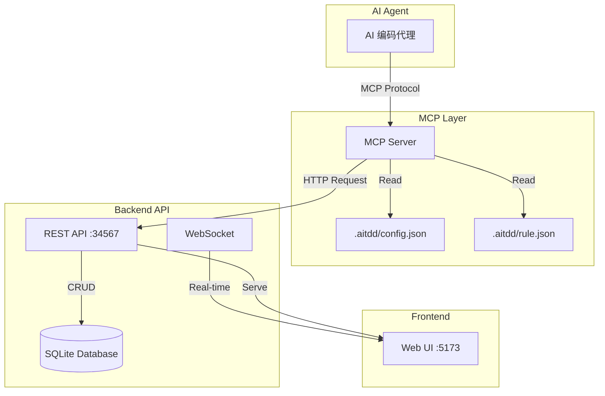
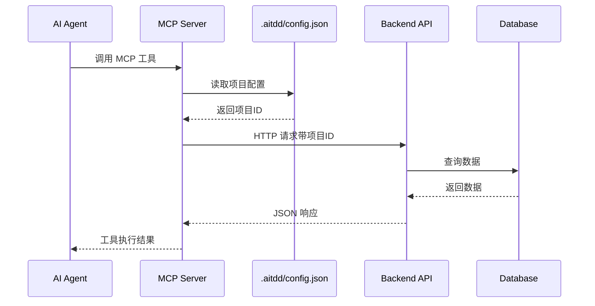
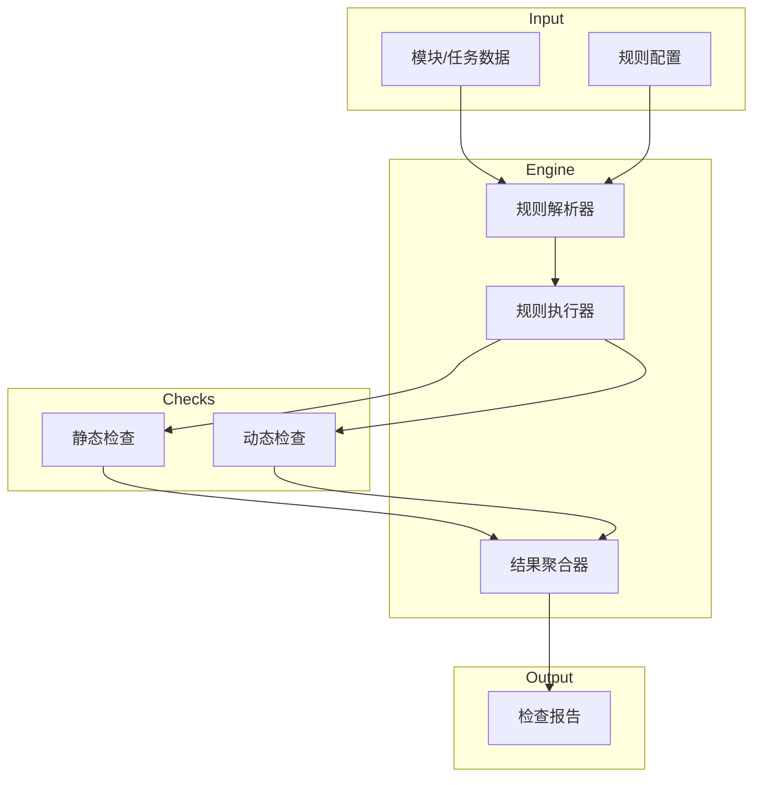
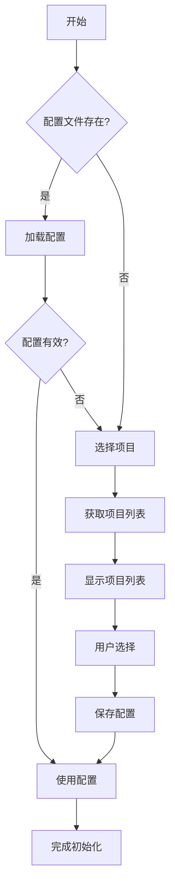

# AITDD MCP 完整实现方案设计文档

## 一、整体架构

### 1.1 系统架构图



### 1.2 数据流架构



---

## 二、配置文件结构设计

### 2.1 `.aitdd/config.json` - 项目配置文件

```json
{
  "version": "1.0.0",
  "project": {
    "id": "proj-uuid-xxxx",
    "name": "项目名称",
    "description": "项目描述",
    "apiBaseURL": "http://localhost:34567/api/v1"
  },
  "mcp": {
    "serverName": "aitdd",
    "serverVersion": "1.0.0",
    "timeout": 30000
  },
  "lastSync": {
    "timestamp": 1709000000000,
    "status": "synced"
  }
}
```

**字段说明：**

| 字段路径 | 类型 | 必填 | 说明 |
|---------|------|------|------|
| version | string | 是 | 配置文件版本号 |
| project.id | string | 是 | 项目唯一标识符 |
| project.name | string | 是 | 项目名称 |
| project.description | string | 否 | 项目描述 |
| project.apiBaseURL | string | 是 | 后端 API 基础地址 |
| mcp.serverName | string | 是 | MCP 服务器名称 |
| mcp.serverVersion | string | 是 | MCP 服务器版本 |
| mcp.timeout | number | 否 | 请求超时时间（毫秒） |
| lastSync.timestamp | number | 否 | 最后同步时间戳 |
| lastSync.status | string | 否 | 同步状态 |

### 2.2 `.aitdd/rule.json` - 检查规则配置文件

```json
{
  "version": "1.0.0",
  "rules": {
    "static": [
      {
        "id": "S-01",
        "name": "提示词完整性检查",
        "description": "检查任务提示词是否包含必要的描述",
        "severity": "error",
        "enabled": true,
        "check": {
          "field": "prompt",
          "condition": "not_empty",
          "minLength": 50
        }
      },
      {
        "id": "S-02",
        "name": "上游契约完整性",
        "description": "检查上游契约是否正确声明",
        "severity": "warning",
        "enabled": true,
        "check": {
          "field": "upstreamContractDetail",
          "condition": "valid_json"
        }
      },
      {
        "id": "S-03",
        "name": "下游契约完整性",
        "description": "检查下游契约是否正确声明",
        "severity": "warning",
        "enabled": true,
        "check": {
          "field": "downstreamContractDetail",
          "condition": "valid_json"
        }
      },
      {
        "id": "S-04",
        "name": "测试用例存在性",
        "description": "检查任务是否定义了测试用例",
        "severity": "warning",
        "enabled": true,
        "check": {
          "field": "tests",
          "condition": "not_empty_array"
        }
      },
      {
        "id": "S-05",
        "name": "代码路径声明",
        "description": "检查任务是否声明了代码路径",
        "severity": "info",
        "enabled": true,
        "check": {
          "field": "codePaths",
          "condition": "valid_json_array"
        }
      },
      {
        "id": "S-06",
        "name": "模块描述完整性",
        "description": "检查模块是否有描述信息",
        "severity": "warning",
        "enabled": true,
        "check": {
          "field": "description",
          "condition": "not_empty",
          "minLength": 20
        }
      },
      {
        "id": "S-07",
        "name": "模块提示词完整性",
        "description": "检查模块是否有提示词",
        "severity": "info",
        "enabled": true,
        "check": {
          "field": "prompt",
          "condition": "not_empty",
          "minLength": 100
        }
      },
      {
        "id": "D-01",
        "name": "循环依赖检测",
        "description": "检测任务间是否存在循环依赖",
        "severity": "error",
        "enabled": true,
        "check": {
          "type": "circular_dependency"
        }
      },
      {
        "id": "D-02",
        "name": "孤立任务检测",
        "description": "检测没有依赖关系的孤立任务",
        "severity": "warning",
        "enabled": true,
        "check": {
          "type": "orphan_task"
        }
      },
      {
        "id": "D-03",
        "name": "契约一致性检查",
        "description": "检查上下游契约是否匹配",
        "severity": "error",
        "enabled": true,
        "check": {
          "type": "contract_consistency"
        }
      },
      {
        "id": "D-04",
        "name": "模块依赖完整性",
        "description": "检查模块依赖是否正确声明",
        "severity": "warning",
        "enabled": true,
        "check": {
          "type": "module_dependency完整性"
        }
      },
      {
        "id": "D-05",
        "name": "任务状态一致性",
        "description": "检查任务状态与依赖关系是否一致",
        "severity": "warning",
        "enabled": true,
        "check": {
          "type": "status_consistency"
        }
      },
      {
        "id": "D-06",
        "name": "文件路径冲突检测",
        "description": "检测多个任务是否声明了相同的代码路径",
        "severity": "error",
        "enabled": true,
        "check": {
          "type": "path_conflict"
        }
      },
      {
        "id": "D-07",
        "name": "模块状态一致性",
        "description": "检查模块状态与任务状态是否一致",
        "severity": "warning",
        "enabled": true,
        "check": {
          "type": "module_status_consistency"
        }
      },
      {
        "id": "D-08",
        "name": "锁定状态检查",
        "description": "检查资源锁定状态是否有效",
        "severity": "info",
        "enabled": true,
        "check": {
          "type": "lock_validity"
        }
      },
      {
        "id": "D-09",
        "name": "测试覆盖率检查",
        "description": "检查模块测试覆盖率是否达标",
        "severity": "info",
        "enabled": true,
        "check": {
          "type": "test_coverage",
          "threshold": 80
        }
      },
      {
        "id": "D-10",
        "name": "版本一致性检查",
        "description": "检查数据版本是否一致",
        "severity": "warning",
        "enabled": true,
        "check": {
          "type": "version_consistency"
        }
      },
      {
        "id": "D-11",
        "name": "同步状态检查",
        "description": "检查数据同步状态",
        "severity": "info",
        "enabled": true,
        "check": {
          "type": "sync_status"
        }
      }
    ],
    "dynamic": [
      {
        "id": "DYN-01",
        "name": "任务执行超时检测",
        "description": "检测任务是否执行超时",
        "severity": "error",
        "enabled": true,
        "check": {
          "type": "execution_timeout",
          "threshold": 3600000
        }
      },
      {
        "id": "DYN-02",
        "name": "锁定过期检测",
        "description": "检测资源锁定是否过期",
        "severity": "warning",
        "enabled": true,
        "check": {
          "type": "lock_expired",
          "threshold": 1800000
        }
      },
      {
        "id": "DYN-03",
        "name": "依赖任务失败检测",
        "description": "检测依赖的任务是否失败",
        "severity": "error",
        "enabled": true,
        "check": {
          "type": "dependency_failed"
        }
      },
      {
        "id": "DYN-04",
        "name": "阻塞任务检测",
        "description": "检测被阻塞的任务",
        "severity": "warning",
        "enabled": true,
        "check": {
          "type": "blocked_tasks"
        }
      },
      {
        "id": "DYN-05",
        "name": "测试失败检测",
        "description": "检测测试是否失败",
        "severity": "error",
        "enabled": true,
        "check": {
          "type": "test_failed"
        }
      },
      {
        "id": "DYN-06",
        "name": "Bug 日志检测",
        "description": "检测是否有未解决的 Bug",
        "severity": "warning",
        "enabled": true,
        "check": {
          "type": "has_bugs"
        }
      },
      {
        "id": "DYN-07",
        "name": "人工协助请求检测",
        "description": "检测是否有人工协助请求",
        "severity": "info",
        "enabled": true,
        "check": {
          "type": "human_assistance_needed"
        }
      },
      {
        "id": "DYN-08",
        "name": "Issue 详情检测",
        "description": "检测是否有未处理的 Issue",
        "severity": "warning",
        "enabled": true,
        "check": {
          "type": "has_issues"
        }
      },
      {
        "id": "DYN-09",
        "name": "长期未更新检测",
        "description": "检测长期未更新的任务",
        "severity": "info",
        "enabled": true,
        "check": {
          "type": "stale_task",
          "threshold": 86400000
        }
      },
      {
        "id": "DYN-10",
        "name": "进度停滞检测",
        "description": "检测进度停滞的模块",
        "severity": "warning",
        "enabled": true,
        "check": {
          "type": "stalled_progress"
        }
      },
      {
        "id": "DYN-11",
        "name": "资源争用检测",
        "description": "检测资源争用情况",
        "severity": "warning",
        "enabled": true,
        "check": {
          "type": "resource_contention"
        }
      },
      {
        "id": "DYN-12",
        "name": "并行度检测",
        "description": "检测可并行执行的任务",
        "severity": "info",
        "enabled": true,
        "check": {
          "type": "parallelism_opportunity"
        }
      },
      {
        "id": "DYN-13",
        "name": "关键路径检测",
        "description": "检测关键路径上的任务",
        "severity": "info",
        "enabled": true,
        "check": {
          "type": "critical_path"
        }
      },
      {
        "id": "DYN-14",
        "name": "瓶颈任务检测",
        "description": "检测可能成为瓶颈的任务",
        "severity": "warning",
        "enabled": true,
        "check": {
          "type": "bottleneck_task"
        }
      },
      {
        "id": "DYN-15",
        "name": "完成率预测",
        "description": "预测项目完成率",
        "severity": "info",
        "enabled": true,
        "check": {
          "type": "completion_prediction"
        }
      }
    ]
  },
  "report": {
    "format": "markdown",
    "includeSuggestions": true,
    "groupBy": "severity"
  }
}
```

---

## 三、MCP 工具规范

### 3.1 获取类工具

#### 3.1.1 `get_project_info` - 获取项目信息

**描述：** 获取项目简介、架构信息、编码规范

**输入参数：**
| 参数名 | 类型 | 必填 | 描述 |
|--------|------|------|------|
| projectId | string | 否 | 项目ID，不传则使用配置文件中的项目ID |

**输出格式：**
```json
{
  "id": "proj-uuid",
  "name": "项目名称",
  "description": "项目描述",
  "constitution": "项目公约内容",
  "statistics": {
    "totalModules": 10,
    "totalTasks": 50,
    "completedTasks": 20,
    "inProgressTasks": 15,
    "pendingTasks": 15
  },
  "createdAt": 1709000000000,
  "updatedAt": 1709000000000
}
```

**对应后端 API：**
- `GET /api/v1/projects/:id`
- `GET /api/v1/projects/:id/constitution`

---

#### 3.1.2 `get_all_task_code_paths` - 获取所有任务代码路径

**描述：** 获取项目中所有任务的代码结构路径

**输入参数：**
| 参数名 | 类型 | 必填 | 描述 |
|--------|------|------|------|
| projectId | string | 否 | 项目ID |

**输出格式：**
```json
{
  "paths": [
    {
      "taskId": "task-uuid",
      "taskName": "任务名称",
      "moduleId": "mod-uuid",
      "moduleName": "模块名称",
      "codePaths": ["src/core/canvas.js", "src/core/context.js"]
    }
  ],
  "tree": {
    "src/": {
      "core/": ["canvas.js", "context.js"],
      "plants/": ["plant.js", "sunflower.js"]
    }
  }
}
```

**对应后端 API：**
- `GET /api/v1/tasks?projectIds={projectId}&fields=id,name,moduleId,codePaths`

---

#### 3.1.3 `get_all_modules` - 获取所有模块概要信息

**描述：** 获取所有模块的 id、名称、介绍

**输入参数：**
| 参数名 | 类型 | 必填 | 描述 |
|--------|------|------|------|
| projectId | string | 否 | 项目ID |
| includeStats | boolean | 否 | 是否包含统计信息，默认 false |

**输出格式：**
```json
{
  "modules": [
    {
      "id": "mod-uuid",
      "name": "核心引擎",
      "description": "游戏循环、画布管理、网格系统等基础功能",
      "status": "developing",
      "taskCount": 5,
      "completedTaskCount": 2,
      "parentId": null
    }
  ],
  "total": 10
}
```

**对应后端 API：**
- `GET /api/v1/modules?projectId={projectId}`

---

#### 3.1.4 `get_module_tasks` - 获取模块任务列表

**描述：** 获取某模块的所有任务列表概要

**输入参数：**
| 参数名 | 类型 | 必填 | 描述 |
|--------|------|------|------|
| moduleId | string | 是 | 模块ID |
| includeContracts | boolean | 否 | 是否包含契约信息，默认 false |

**输出格式：**
```json
{
  "module": {
    "id": "mod-uuid",
    "name": "核心引擎",
    "status": "developing"
  },
  "tasks": [
    {
      "id": "task-uuid",
      "name": "创建游戏画布",
      "status": "ready",
      "locked": false,
      "hasUpstreamContract": true,
      "hasDownstreamContract": true
    }
  ],
  "total": 5
}
```

**对应后端 API：**
- `GET /api/v1/tasks?moduleId={moduleId}`

---

#### 3.1.5 `get_task_detail` - 获取任务详细信息

**描述：** 获取某任务的详细信息

**输入参数：**
| 参数名 | 类型 | 必填 | 描述 |
|--------|------|------|------|
| taskId | string | 是 | 任务ID |

**输出格式：**
```json
{
  "id": "task-uuid",
  "moduleId": "mod-uuid",
  "moduleName": "核心引擎",
  "name": "创建游戏画布",
  "description": "在 HTML 中创建 Canvas 元素",
  "status": "ready",
  "prompt": "创建一个 CanvasManager 类...",
  "upstreamContractDetail": {
    "title": "依赖上游任务提供",
    "list": [
      {
        "label": "获取画布宽度",
        "contract_api": "getWidth() -> number",
        "from": "task-canvas"
      }
    ]
  },
  "downstreamContractDetail": {
    "title": "为下游任务提供以下接口",
    "list": [
      {
        "label": "获取 canvas DOM 元素",
        "contract_api": "getCanvas() -> HTMLCanvasElement",
        "from": "task-canvas"
      }
    ]
  },
  "tests": [
    {
      "target": "验证画布是否正确创建",
      "api": "testCanvasCreation()"
    }
  ],
  "testResult": [],
  "codePaths": ["src/core/canvas.js"],
  "bugLog": [],
  "humanAssistance": {},
  "issueDetails": "",
  "locked": false,
  "lockedBy": null,
  "createdAt": 1709000000000,
  "updatedAt": 1709000000000,
  "version": 1
}
```

**对应后端 API：**
- `GET /api/v1/tasks/:id`

---

#### 3.1.6 `get_task_contracts` - 获取任务契约信息

**描述：** 获取某任务的上下游契约接口信息

**输入参数：**
| 参数名 | 类型 | 必填 | 描述 |
|--------|------|------|------|
| taskId | string | 是 | 任务ID |
| direction | string | 否 | 方向：upstream/downstream/both，默认 both |

**输出格式：**
```json
{
  "task": {
    "id": "task-uuid",
    "name": "创建游戏画布"
  },
  "upstream": {
    "title": "依赖上游任务提供",
    "contracts": [
      {
        "label": "获取画布宽度",
        "contract_api": "getWidth() -> number",
        "from": "task-canvas",
        "fromTaskName": "画布管理"
      }
    ],
    "tasks": [
      {
        "id": "task-upstream-uuid",
        "name": "画布管理",
        "status": "completed"
      }
    ]
  },
  "downstream": {
    "title": "为下游任务提供以下接口",
    "contracts": [
      {
        "label": "获取 canvas DOM 元素",
        "contract_api": "getCanvas() -> HTMLCanvasElement",
        "from": "task-canvas"
      }
    ],
    "dependentTasks": [
      {
        "id": "task-downstream-uuid",
        "name": "游戏循环",
        "status": "ready"
      }
    ]
  }
}
```

**对应后端 API：**
- `GET /api/v1/tasks/:id`
- `GET /api/v1/dependencies?taskId={taskId}`

---

### 3.2 修改类工具

#### 3.2.1 `delete_module` - 删除模块

**描述：** 删除指定模块及其所有子任务

**输入参数：**
| 参数名 | 类型 | 必填 | 描述 |
|--------|------|------|------|
| moduleId | string | 是 | 模块ID |
| force | boolean | 否 | 是否强制删除（即使有依赖），默认 false |

**输出格式：**
```json
{
  "success": true,
  "message": "模块删除成功",
  "deletedModule": {
    "id": "mod-uuid",
    "name": "模块名称"
  },
  "deletedTasks": ["task-uuid-1", "task-uuid-2"],
  "warnings": []
}
```

**对应后端 API：**
- `DELETE /api/v1/modules/:id`

---

#### 3.2.2 `create_module` - 创建模块

**描述：** 添加新模块

**输入参数：**
| 参数名 | 类型 | 必填 | 描述 |
|--------|------|------|------|
| name | string | 是 | 模块名称 |
| description | string | 否 | 模块描述 |
| prompt | string | 否 | 模块提示词 |
| parentId | string | 否 | 父模块ID |
| projectId | string | 否 | 项目ID |

**输出格式：**
```json
{
  "success": true,
  "message": "模块创建成功",
  "module": {
    "id": "mod-new-uuid",
    "name": "新模块",
    "description": "模块描述",
    "prompt": "",
    "status": "designing",
    "parentId": null,
    "projectId": "proj-uuid",
    "createdAt": 1709000000000,
    "updatedAt": 1709000000000,
    "version": 1
  }
}
```

**对应后端 API：**
- `POST /api/v1/modules`

---

#### 3.2.3 `update_module` - 更新模块信息

**描述：** 修改模块信息

**输入参数：**
| 参数名 | 类型 | 必填 | 描述 |
|--------|------|------|------|
| moduleId | string | 是 | 模块ID |
| name | string | 否 | 模块名称 |
| description | string | 否 | 模块描述 |
| prompt | string | 否 | 模块提示词 |
| status | string | 否 | 模块状态 |
| upstreamContractSummary | string | 否 | 上游契约摘要 |
| downstreamContractSummary | string | 否 | 下游契约摘要 |
| version | number | 是 | 当前版本号 |

**输出格式：**
```json
{
  "success": true,
  "message": "模块更新成功",
  "module": {
    "id": "mod-uuid",
    "name": "更新后的名称",
    "version": 2,
    "updatedAt": 1709000000000
  }
}
```

**对应后端 API：**
- `PUT /api/v1/modules/:id`

---

#### 3.2.4 `delete_module_tasks` - 删除模块所有任务

**描述：** 删除模块的所有任务

**输入参数：**
| 参数名 | 类型 | 必填 | 描述 |
|--------|------|------|------|
| moduleId | string | 是 | 模块ID |
| force | boolean | 否 | 是否强制删除（即使有依赖），默认 false |

**输出格式：**
```json
{
  "success": true,
  "message": "删除成功",
  "deletedCount": 5,
  "deletedTasks": [
    {"id": "task-1", "name": "任务1"},
    {"id": "task-2", "name": "任务2"}
  ],
  "warnings": []
}
```

**对应后端 API：**
- `GET /api/v1/tasks?moduleId={moduleId}`
- `DELETE /api/v1/tasks/:id` (批量)

---

#### 3.2.5 `create_task` - 创建任务

**描述：** 在模块中添加新任务

**输入参数：**
| 参数名 | 类型 | 必填 | 描述 |
|--------|------|------|------|
| moduleId | string | 是 | 模块ID |
| name | string | 是 | 任务名称 |
| description | string | 否 | 任务描述 |
| prompt | string | 否 | 任务提示词 |
| upstreamContractDetail | object | 否 | 上游契约详情 |
| downstreamContractDetail | object | 否 | 下游契约详情 |
| tests | array | 否 | 测试用例列表 |
| codePaths | array | 否 | 代码路径列表 |

**输出格式：**
```json
{
  "success": true,
  "message": "任务创建成功",
  "task": {
    "id": "task-new-uuid",
    "moduleId": "mod-uuid",
    "name": "新任务",
    "description": "任务描述",
    "status": "ready",
    "prompt": "任务提示词...",
    "upstreamContractDetail": {"title": "", "list": []},
    "downstreamContractDetail": {"title": "", "list": []},
    "tests": [],
    "codePaths": [],
    "createdAt": 1709000000000,
    "updatedAt": 1709000000000,
    "version": 1
  }
}
```

**对应后端 API：**
- `POST /api/v1/tasks`

---

#### 3.2.6 `update_module_full` - 完整更新模块

**描述：** 重新定义模块的所有信息

**输入参数：**
| 参数名 | 类型 | 必填 | 描述 |
|--------|------|------|------|
| moduleId | string | 是 | 模块ID |
| name | string | 否 | 模块名称 |
| description | string | 否 | 模块描述 |
| prompt | string | 否 | 模块提示词 |
| status | string | 否 | 模块状态 |
| testCoverage | number | 否 | 测试覆盖率 |
| upstreamContractSummary | string | 否 | 上游契约摘要 |
| downstreamContractSummary | string | 否 | 下游契约摘要 |
| tasks | array | 否 | 任务列表（可选，用于同时更新任务） |
| version | number | 是 | 当前版本号 |

**输出格式：**
```json
{
  "success": true,
  "message": "模块完整更新成功",
  "module": {
    "id": "mod-uuid",
    "name": "模块名称",
    "version": 2,
    "updatedAt": 1709000000000
  },
  "updatedTasks": 3,
  "warnings": []
}
```

**对应后端 API：**
- `PUT /api/v1/modules/:id`
- `PUT /api/v1/tasks/:id` (批量)

---

#### 3.2.7 `update_task_full` - 完整更新任务

**描述：** 重新定义任务的完整信息

**输入参数：**
| 参数名 | 类型 | 必填 | 描述 |
|--------|------|------|------|
| taskId | string | 是 | 任务ID |
| name | string | 否 | 任务名称 |
| description | string | 否 | 任务描述 |
| status | string | 否 | 任务状态 |
| assignee | string | 否 | 指派给谁 |
| prompt | string | 否 | 任务提示词 |
| upstreamContractDetail | object | 否 | 上游契约详情 |
| downstreamContractDetail | object | 否 | 下游契约详情 |
| tests | array | 否 | 测试用例 |
| testResult | array | 否 | 测试结果 |
| codePaths | array | 否 | 代码路径 |
| bugLog | array | 否 | Bug 日志 |
| humanAssistance | object | 否 | 人工协助信息 |
| issueDetails | string | 否 | Issue 详情 |
| version | number | 是 | 当前版本号 |

**输出格式：**
```json
{
  "success": true,
  "message": "任务完整更新成功",
  "task": {
    "id": "task-uuid",
    "name": "任务名称",
    "version": 2,
    "updatedAt": 1709000000000
  }
}
```

**对应后端 API：**
- `PUT /api/v1/tasks/:id`

---

### 3.3 错误处理类工具

#### 3.3.1 `get_project_errors` - 获取项目错误列表

**描述：** 返回整个项目的错误列表

**输入参数：**
| 参数名 | 类型 | 必填 | 描述 |
|--------|------|------|------|
| projectId | string | 否 | 项目ID |
| severity | string | 否 | 严重级别过滤：error/warning/info |
| includeDetails | boolean | 否 | 是否包含详细信息，默认 true |

**输出格式：**
```json
{
  "projectId": "proj-uuid",
  "scanTime": 1709000000000,
  "summary": {
    "total": 15,
    "errors": 3,
    "warnings": 8,
    "infos": 4
  },
  "errors": [
    {
      "ruleId": "S-01",
      "ruleName": "提示词完整性检查",
      "severity": "error",
      "resourceType": "task",
      "resourceId": "task-uuid",
      "resourceName": "任务名称",
      "message": "任务提示词长度不足50字符",
      "suggestion": "请补充任务提示词，至少50字符",
      "location": {
        "moduleId": "mod-uuid",
        "moduleName": "模块名称"
      }
    }
  ]
}
```

**对应后端 API：**
- `GET /api/v1/tasks?projectIds={projectId}`
- `GET /api/v1/modules?projectId={projectId}`
- 本地规则检查逻辑

---

#### 3.3.2 `get_module_errors` - 获取模块错误列表

**描述：** 返回某模块的所有子任务错误列表

**输入参数：**
| 参数名 | 类型 | 必填 | 描述 |
|--------|------|------|------|
| moduleId | string | 是 | 模块ID |
| severity | string | 否 | 严重级别过滤 |
| includeDetails | boolean | 否 | 是否包含详细信息 |

**输出格式：**
```json
{
  "moduleId": "mod-uuid",
  "moduleName": "核心引擎",
  "scanTime": 1709000000000,
  "summary": {
    "total": 5,
    "errors": 1,
    "warnings": 3,
    "infos": 1
  },
  "errors": [
    {
      "ruleId": "D-03",
      "ruleName": "契约一致性检查",
      "severity": "error",
      "resourceType": "task",
      "resourceId": "task-uuid",
      "resourceName": "网格系统",
      "message": "上游契约声明的接口与实际提供不匹配",
      "suggestion": "检查 task-canvas 是否提供了 getWidth() 接口",
      "details": {
        "expected": "getWidth() -> number",
        "actual": null
      }
    }
  ]
}
```

**对应后端 API：**
- `GET /api/v1/modules/:id`
- `GET /api/v1/tasks?moduleId={moduleId}`
- 本地规则检查逻辑

---

### 3.4 状态类工具

#### 3.4.1 `get_all_task_status` - 获取所有任务状态

**描述：** 获取项目中所有任务的状态信息

**输入参数：**
| 参数名 | 类型 | 必填 | 描述 |
|--------|------|------|------|
| projectId | string | 否 | 项目ID |
| status | string | 否 | 状态过滤 |
| includeLockInfo | boolean | 否 | 是否包含锁定信息 |

**输出格式：**
```json
{
  "projectId": "proj-uuid",
  "summary": {
    "total": 50,
    "byStatus": {
      "ready": 15,
      "claimed": 5,
      "in_progress": 10,
      "pending_review": 8,
      "completed": 10,
      "failed": 1,
      "blocked": 1
    },
    "locked": 3
  },
  "tasks": [
    {
      "id": "task-uuid",
      "name": "创建游戏画布",
      "moduleId": "mod-uuid",
      "moduleName": "核心引擎",
      "status": "ready",
      "locked": false,
      "lockedBy": null,
      "updatedAt": 1709000000000
    }
  ]
}
```

**对应后端 API：**
- `GET /api/v1/tasks?projectIds={projectId}`

---

#### 3.4.2 `get_module_task_status` - 获取模块任务状态

**描述：** 获取当前模块的所有任务状态信息

**输入参数：**
| 参数名 | 类型 | 必填 | 描述 |
|--------|------|------|------|
| moduleId | string | 是 | 模块ID |
| includeLockInfo | boolean | 否 | 是否包含锁定信息 |

**输出格式：**
```json
{
  "moduleId": "mod-uuid",
  "moduleName": "核心引擎",
  "moduleStatus": "developing",
  "summary": {
    "total": 5,
    "byStatus": {
      "ready": 2,
      "in_progress": 2,
      "completed": 1
    },
    "locked": 1,
    "progress": 20
  },
  "tasks": [
    {
      "id": "task-uuid",
      "name": "创建游戏画布",
      "status": "completed",
      "locked": false,
      "dependencies": {
        "upstream": 0,
        "downstream": 2
      },
      "updatedAt": 1709000000000
    }
  ]
}
```

**对应后端 API：**
- `GET /api/v1/modules/:id`
- `GET /api/v1/tasks?moduleId={moduleId}`

---

### 3.5 检查类工具

#### 3.5.1 `check_module` - 检查模块

**描述：** 输出某模块的检查报告

**输入参数：**
| 参数名 | 类型 | 必填 | 描述 |
|--------|------|------|------|
| moduleId | string | 是 | 模块ID |
| rules | array | 否 | 指定检查规则ID列表，不传则检查所有 |
| includeDynamic | boolean | 否 | 是否包含动态检查，默认 true |

**输出格式：**

```markdown
# 模块检查报告

## 基本信息
- **模块名称**: 核心引擎
- **模块ID**: mod-core
- **状态**: developing
- **检查时间**: 2024-02-26 16:00:00

## 检查摘要

| 严重级别 | 数量 |
|---------|------|
| 错误 | 2 |
| 警告 | 3 |
| 信息 | 1 |

## 详细结果

### 错误 (2)

#### [S-01] 提示词完整性检查
- **资源**: 任务 - 创建游戏画布
- **消息**: 任务提示词长度不足50字符
- **建议**: 请补充任务提示词，至少50字符

#### [D-03] 契约一致性检查
- **资源**: 任务 - 网格系统
- **消息**: 上游契约声明的接口与实际提供不匹配
- **建议**: 检查 task-canvas 是否提供了 getWidth() 接口

### 警告 (3)

#### [S-04] 测试用例存在性
- **资源**: 任务 - 游戏循环
- **消息**: 任务未定义测试用例
- **建议**: 为任务添加测试用例

...

## 改进建议

1. 补充任务"创建游戏画布"的提示词内容
2. 检查并修复契约一致性问题
3. 为缺少测试的任务添加测试用例
```

**对应后端 API：**
- `GET /api/v1/modules/:id`
- `GET /api/v1/tasks?moduleId={moduleId}`
- `GET /api/v1/dependencies?taskId={taskId}` (批量)
- 本地规则检查引擎

---

## 四、检查规则实现方案

### 4.1 规则检查引擎架构



### 4.2 规则检查实现伪代码

```go
// Rule 规则定义
type Rule struct {
    ID          string
    Name        string
    Description string
    Severity    string // error, warning, info
    Enabled     bool
    Check       RuleCheck
}

// RuleCheck 规则检查条件
type RuleCheck struct {
    Field      string
    Condition  string
    MinLength  int
    Type       string
    Threshold  int
}

// CheckResult 检查结果
type CheckResult struct {
    RuleID      string
    RuleName    string
    Severity    string
    ResourceType string
    ResourceID   string
    ResourceName string
    Message      string
    Suggestion   string
    Details      map[string]interface{}
}

// RuleEngine 规则引擎
type RuleEngine struct {
    staticRules  []Rule
    dynamicRules []Rule
}

// Execute 执行检查
func (e *RuleEngine) Execute(data interface{}, ruleType string) []CheckResult {
    var results []CheckResult
    
    rules := e.staticRules
    if ruleType == "dynamic" {
        rules = e.dynamicRules
    }
    
    for _, rule := range rules {
        if !rule.Enabled {
            continue
        }
        if result := e.checkRule(rule, data); result != nil {
            results = append(results, *result)
        }
    }
    
    return results
}

// checkRule 执行单个规则检查
func (e *RuleEngine) checkRule(rule Rule, data interface{}) *CheckResult {
    switch rule.Check.Condition {
    case "not_empty":
        return e.checkNotEmpty(rule, data)
    case "valid_json":
        return e.checkValidJSON(rule, data)
    case "not_empty_array":
        return e.checkNotEmptyArray(rule, data)
    // ... 其他条件
    }
    return nil
}
```

### 4.3 关键规则实现细节

#### S-01: 提示词完整性检查

```go
func (e *RuleEngine) checkPromptCompleteness(task Task) *CheckResult {
    if len(task.Prompt) < 50 {
        return &CheckResult{
            RuleID:       "S-01",
            RuleName:     "提示词完整性检查",
            Severity:     "error",
            ResourceType: "task",
            ResourceID:   task.ID,
            ResourceName: task.Name,
            Message:      fmt.Sprintf("任务提示词长度不足50字符，当前%d字符", len(task.Prompt)),
            Suggestion:   "请补充任务提示词，至少50字符",
        }
    }
    return nil
}
```

#### D-01: 循环依赖检测

```go
func (e *RuleEngine) checkCircularDependency(tasks []Task, deps []Dependency) []CheckResult {
    var results []CheckResult
    graph := buildDependencyGraph(tasks, deps)
    
    for _, task := range tasks {
        if hasCycle(graph, task.ID) {
            results = append(results, CheckResult{
                RuleID:       "D-01",
                RuleName:     "循环依赖检测",
                Severity:     "error",
                ResourceType: "task",
                ResourceID:   task.ID,
                ResourceName: task.Name,
                Message:      "检测到循环依赖",
                Suggestion:   "请检查并解除循环依赖关系",
            })
        }
    }
    
    return results
}
```

#### D-03: 契约一致性检查

```go
func (e *RuleEngine) checkContractConsistency(tasks []Task, deps []Dependency) []CheckResult {
    var results []CheckResult
    
    // 构建契约映射
    contractMap := make(map[string][]ContractItem)
    for _, task := range tasks {
        var downstream ContractDetail
        json.Unmarshal([]byte(task.DownstreamContractDetail), &downstream)
        contractMap[task.ID] = downstream.List
    }
    
    // 检查每个任务的上游契约是否被满足
    for _, task := range tasks {
        var upstream ContractDetail
        json.Unmarshal([]byte(task.UpstreamContractDetail), &upstream)
        
        for _, required := range upstream.List {
            sourceTask := findTaskByContract(contractMap, required.ContractAPI)
            if sourceTask == nil {
                results = append(results, CheckResult{
                    RuleID:       "D-03",
                    RuleName:     "契约一致性检查",
                    Severity:     "error",
                    ResourceType: "task",
                    ResourceID:   task.ID,
                    ResourceName: task.Name,
                    Message:      fmt.Sprintf("上游契约 %s 未被满足", required.ContractAPI),
                    Suggestion:   fmt.Sprintf("检查 %s 任务是否提供了该接口", required.From),
                })
            }
        }
    }
    
    return results
}
```

---

## 五、与后端 API 的集成方案

### 5.1 API 客户端封装

```go
// APIClient API 客户端
type APIClient struct {
    baseURL    string
    httpClient *http.Client
    config     *Config
}

// NewAPIClient 创建 API 客户端
func NewAPIClient(configPath string) (*APIClient, error) {
    config, err := LoadConfig(configPath)
    if err != nil {
        return nil, fmt.Errorf("加载配置失败: %w", err)
    }
    
    return &APIClient{
        baseURL: config.Project.APIBaseURL,
        httpClient: &http.Client{
            Timeout: time.Duration(config.MCP.Timeout) * time.Millisecond,
        },
        config: config,
    }, nil
}

// GetProjectID 获取项目ID
func (c *APIClient) GetProjectID() string {
    return c.config.Project.ID
}
```

### 5.2 MCP 工具与 API 映射表

| MCP 工具 | HTTP 方法 | API 路径 | 备注 |
|---------|----------|---------|------|
| get_project_info | GET | /projects/:id | 合并 constitution |
| get_all_task_code_paths | GET | /tasks?projectIds={id}&fields=codePaths | 需聚合 |
| get_all_modules | GET | /modules?projectId={id} | - |
| get_module_tasks | GET | /tasks?moduleId={id} | - |
| get_task_detail | GET | /tasks/:id | - |
| get_task_contracts | GET | /tasks/:id + /dependencies?taskId={id} | 合并数据 |
| delete_module | DELETE | /modules/:id | - |
| create_module | POST | /modules | - |
| update_module | PUT | /modules/:id | - |
| delete_module_tasks | DELETE | /tasks/:id (批量) | 需先查询 |
| create_task | POST | /tasks | - |
| update_module_full | PUT | /modules/:id + PUT /tasks/:id | 事务性 |
| update_task_full | PUT | /tasks/:id | - |
| get_project_errors | GET | /tasks + /modules | 本地检查 |
| get_module_errors | GET | /modules/:id + /tasks?moduleId={id} | 本地检查 |
| get_all_task_status | GET | /tasks?projectIds={id} | - |
| get_module_task_status | GET | /tasks?moduleId={id} | - |
| check_module | GET | /modules/:id + /tasks + /dependencies | 本地检查 |

### 5.3 错误处理策略

```go
// HandleAPIError 处理 API 错误
func (c *APIClient) HandleAPIError(resp *http.Response) error {
    var errResp struct {
        Code    int    `json:"code"`
        Message string `json:"message"`
    }
    
    json.NewDecoder(resp.Body).Decode(&errResp)
    
    switch resp.StatusCode {
    case 400:
        return fmt.Errorf("请求参数错误: %s", errResp.Message)
    case 404:
        return fmt.Errorf("资源不存在: %s", errResp.Message)
    case 423:
        return fmt.Errorf("资源被锁定: %s", errResp.Message)
    case 500:
        return fmt.Errorf("服务器内部错误: %s", errResp.Message)
    default:
        return fmt.Errorf("未知错误: %s", errResp.Message)
    }
}
```

### 5.4 版本冲突处理

```go
// UpdateWithRetry 带重试的更新
func (c *APIClient) UpdateWithRetry(resourceType, id string, updateFunc func(int) map[string]interface{}) error {
    maxRetries := 3
    
    for i := 0; i < maxRetries; i++ {
        // 获取当前版本
        current, err := c.Get(resourceType, id)
        if err != nil {
            return err
        }
        
        version := current["version"].(int)
        
        // 执行更新
        updateData := updateFunc(version)
        resp, err := c.Put(resourceType+"/"+id, updateData)
        
        if resp.StatusCode == 409 {
            // 版本冲突，重试
            continue
        }
        
        return err
    }
    
    return fmt.Errorf("版本冲突，重试次数超限")
}
```

---

## 六、项目初始化流程

### 6.1 交互式项目选择



### 6.2 初始化工具设计

#### `init_project` - 项目初始化工具

**描述：** 初始化或选择项目

**输入参数：**
| 参数名 | 类型 | 必填 | 描述 |
|--------|------|------|------|
| projectId | string | 否 | 项目ID，不传则列出可选项目 |
| force | boolean | 否 | 是否强制重新选择 |

**输出格式（无 projectId）：**
```json
{
  "message": "请选择项目",
  "projects": [
    {
      "id": "proj-1",
      "name": "植物大战僵尸",
      "description": "HTML5 游戏",
      "moduleCount": 8,
      "taskCount": 30
    },
    {
      "id": "proj-2",
      "name": "电商平台",
      "description": "React 电商网站",
      "moduleCount": 12,
      "taskCount": 50
    }
  ]
}
```

**输出格式（有 projectId）：**
```json
{
  "success": true,
  "message": "项目初始化成功",
  "project": {
    "id": "proj-1",
    "name": "植物大战僵尸",
    "description": "HTML5 游戏"
  },
  "configPath": ".aitdd/config.json"
}
```

---

## 七、检查报告格式规范

### 7.1 Markdown 报告模板

```markdown
# {resourceType} 检查报告

## 基本信息
- **{resourceTypeName}名称**: {name}
- **{resourceTypeName}ID**: {id}
- **状态**: {status}
- **检查时间**: {timestamp}

## 检查摘要

| 严重级别 | 数量 |
|---------|------|
| 错误 | {errorCount} |
| 警告 | {warningCount} |
| 信息 | {infoCount} |

## 详细结果

### 错误 ({errorCount})

{#each errors}
#### [{ruleId}] {ruleName}
- **资源**: {resourceType} - {resourceName}
- **消息**: {message}
- **建议**: {suggestion}
{#if details}
- **详情**: 
  - {details}
{/if}
{/each}

### 警告 ({warningCount})

{#each warnings}
... 同上格式
{/each}

### 信息 ({infoCount})

{#each infos}
... 同上格式
{/each}

## 改进建议

{#each suggestions}
{index}. {suggestion}
{/each}

## 下一步操作

1. 优先处理错误级别的问题
2. 评估警告级别的问题影响
3. 根据信息级别优化项目

---
*报告生成时间: {generatedAt}*
*规则版本: {ruleVersion}*
```

### 7.2 JSON 报告格式

```json
{
  "meta": {
    "resourceType": "module",
    "resourceId": "mod-uuid",
    "resourceName": "核心引擎",
    "status": "developing",
    "timestamp": 1709000000000,
    "ruleVersion": "1.0.0"
  },
  "summary": {
    "total": 10,
    "bySeverity": {
      "error": 2,
      "warning": 5,
      "info": 3
    }
  },
  "results": [
    {
      "ruleId": "S-01",
      "ruleName": "提示词完整性检查",
      "severity": "error",
      "resourceType": "task",
      "resourceId": "task-uuid",
      "resourceName": "创建游戏画布",
      "message": "任务提示词长度不足50字符",
      "suggestion": "请补充任务提示词，至少50字符",
      "details": {
        "currentLength": 23,
        "requiredLength": 50
      }
    }
  ],
  "suggestions": [
    "补充任务\"创建游戏画布\"的提示词内容",
    "检查并修复契约一致性问题"
  ]
}
```

---

## 八、实现优先级建议

### Phase 1 - 核心功能
1. 配置文件结构实现
2. `init_project` - 项目初始化
3. `get_project_info` - 获取项目信息
4. `get_all_modules` - 获取所有模块
5. `get_module_tasks` - 获取模块任务
6. `get_task_detail` - 获取任务详情

### Phase 2 - 修改功能
1. `create_module` - 创建模块
2. `create_task` - 创建任务
3. `update_module` - 更新模块
4. `update_task_full` - 更新任务
5. `delete_module` - 删除模块
6. `delete_module_tasks` - 删除模块任务

### Phase 3 - 检查功能
1. 静态规则检查引擎
2. `check_module` - 模块检查
3. `get_project_errors` - 项目错误
4. `get_module_errors` - 模块错误

### Phase 4 - 高级功能
1. 动态规则检查
2. `get_task_contracts` - 契约信息
3. `get_all_task_status` - 任务状态
4. `get_module_task_status` - 模块任务状态

---

## 九、总结

本设计文档定义了 AITDD MCP 的完整实现方案，包括：

1. **配置文件结构** - `.aitdd/config.json` 和 `.aitdd/rule.json`
2. **17 个 MCP 工具** - 覆盖获取、修改、错误处理、状态和检查五大类
3. **26 条检查规则** - 11 条静态规则 + 15 条动态规则
4. **与后端 API 的完整映射** - 确保与现有系统的兼容性
5. **检查报告格式** - Markdown 和 JSON 两种格式

该方案遵循 MCP 协议规范，与现有后端 API 无缝集成，为 AI 编码代理提供完整的项目管理和检查能力。
