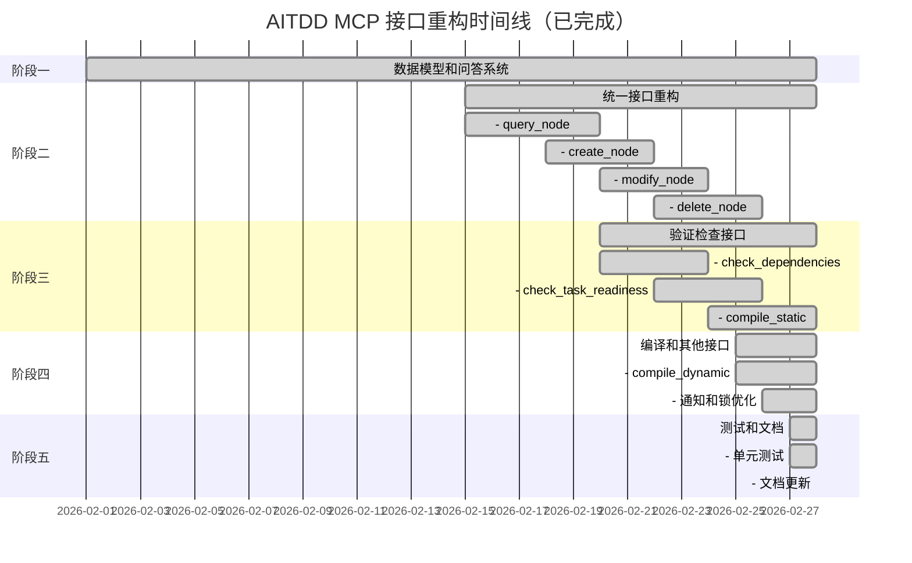

# AITDD MCP 接口重构实施计划

## 一、项目概述

根据 [`plans/mcp-compiler-design.md`](plans/mcp-compiler-design.md) 设计文档，重构 AITDD MCP 的函数接口，使其更加简洁直观，面向 AI 消费。

### 核心原则
- 所有接口通过 pathName 索引，不暴露内部 ID
- 返回内容简洁直观，面向 AI 消费
- 统一的返回值格式（YAML 风格）

### 目标接口数量
- 原有接口：38 个
- 目标接口：27 个
- 减少接口数量：11 个（通过合并通用接口）

---

## 二、完成状态总览

| 分类 | 工具数量 | 状态 | 完成日期 |
|------|---------|------|----------|
| 1. 项目上下文 | 2 | ✅ 已完成 | 2026-02-28 |
| 2. 信息查询 | 3 | ✅ 已完成 | 2026-02-28 |
| 3. 验证检查 | 3 | ✅ 已完成 | 2026-02-28 |
| 4. 节点操作 | 3 | ✅ 已完成 | 2026-02-28 |
| 5. 依赖管理 | 3 | ✅ 已完成 | 2026-02-28 |
| 6. 问答系统 | 4 | ✅ 已完成 | 2026-02-28 |
| 7. 锁管理 | 2 | ✅ 已完成 | 2026-02-28 |
| 8. 编译接口 | 2 | ✅ 已完成 | 2026-02-28 |
| 9. 配置和规则管理 | 4 | ✅ 已完成 | 2026-02-28 |
| 10. 状态管理 | 1 | ✅ 已完成 | 2026-02-28 |
| **总计** | **27** | ✅ **全部完成** | **2026-02-28** |

---

## 三、已完成工作详情

### 1. 数据模型层 ✅
- [x] Issue 模型 ([`backend/internal/models/issue.go`](backend/internal/models/issue.go))
- [x] Message 消息结构
- [x] 数据库迁移 ([`backend/migrations/008_create_issues.sql`](backend/migrations/008_create_issues.sql))

### 2. 服务层 ✅
- [x] IssueService ([`backend/internal/services/issue_service.go`](backend/internal/services/issue_service.go))
  - CreateIssue
  - ReplyIssue
  - ResolveIssue
  - QueryIssues

### 3. API 处理层 ✅
- [x] Issue Handler ([`backend/internal/api/handlers/issue.go`](backend/internal/api/handlers/issue.go))
- [x] 路由注册 ([`backend/internal/api/routes.go`](backend/internal/api/routes.go))

### 4. 项目上下文接口 ✅
| 接口 | 状态 | 实现位置 |
|------|------|----------|
| `init_project` | ✅ 已完成 | [`backend/internal/mcp/server.go:85`](backend/internal/mcp/server.go:85) |
| `get_context` | ✅ 已完成 | [`backend/internal/mcp/server.go:93`](backend/internal/mcp/server.go:93) |

### 5. 信息查询接口 ✅
| 接口 | 状态 | 实现位置 |
|------|------|----------|
| `query_node` | ✅ 已完成 | [`backend/internal/mcp/server.go:101`](backend/internal/mcp/server.go:101) |
| `query_project_index_tree` | ✅ 已完成 | [`backend/internal/mcp/server.go:108`](backend/internal/mcp/server.go:108) |
| `query_file_code_path_tree` | ✅ 已完成 | [`backend/internal/mcp/server.go:114`](backend/internal/mcp/server.go:114) |

### 6. 验证检查接口 ✅
| 接口 | 状态 | 实现位置 |
|------|------|----------|
| `check_contract_alignment` | ✅ 已完成 | [`backend/internal/mcp/server.go:123`](backend/internal/mcp/server.go:123) |
| `check_task_readiness` | ✅ 已完成 | [`backend/internal/mcp/server.go:130`](backend/internal/mcp/server.go:130) |
| `check_dependencies` | ✅ 已完成 | [`backend/internal/mcp/server.go:136`](backend/internal/mcp/server.go:136) |

### 7. 节点操作接口 ✅
| 接口 | 状态 | 实现位置 |
|------|------|----------|
| `create_node` | ✅ 已完成 | [`backend/internal/mcp/server.go:146`](backend/internal/mcp/server.go:146) |
| `modify_node` | ✅ 已完成 | [`backend/internal/mcp/server.go:156`](backend/internal/mcp/server.go:156) |
| `delete_node` | ✅ 已完成 | [`backend/internal/mcp/server.go:164`](backend/internal/mcp/server.go:164) |

### 8. 依赖管理接口 ✅
| 接口 | 状态 | 实现位置 |
|------|------|----------|
| `create_dependency` | ✅ 已完成 | [`backend/internal/mcp/server.go:174`](backend/internal/mcp/server.go:174) |
| `delete_dependency` | ✅ 已完成 | [`backend/internal/mcp/server.go:184`](backend/internal/mcp/server.go:184) |
| `query_dependencies` | ✅ 已完成 | [`backend/internal/mcp/server.go:192`](backend/internal/mcp/server.go:192) |

### 9. 问答系统接口 ✅
| 接口 | 状态 | 实现位置 |
|------|------|----------|
| `create_issue` | ✅ 已完成 | [`backend/internal/mcp/server.go:203`](backend/internal/mcp/server.go:203) |
| `reply_issue` | ✅ 已完成 | [`backend/internal/mcp/server.go:213`](backend/internal/mcp/server.go:213) |
| `resolve_issue` | ✅ 已完成 | [`backend/internal/mcp/server.go:222`](backend/internal/mcp/server.go:222) |
| `query_issues` | ✅ 已完成 | [`backend/internal/mcp/server.go:230`](backend/internal/mcp/server.go:230) |

### 10. 锁管理接口 ✅
| 接口 | 状态 | 实现位置 |
|------|------|----------|
| `acquire_lock` | ✅ 已完成 | [`backend/internal/mcp/server.go:242`](backend/internal/mcp/server.go:242) |
| `release_lock` | ✅ 已完成 | [`backend/internal/mcp/server.go:249`](backend/internal/mcp/server.go:249) |

### 11. 编译接口 ✅
| 接口 | 状态 | 实现位置 |
|------|------|----------|
| `compile_static` | ✅ 已完成 | [`backend/internal/mcp/server.go:259`](backend/internal/mcp/server.go:259) |
| `compile_dynamic` | ✅ 已完成 | [`backend/internal/mcp/server.go:266`](backend/internal/mcp/server.go:266) |

### 12. 配置和规则管理接口 ✅
| 接口 | 状态 | 实现位置 |
|------|------|----------|
| `get_config` | ✅ 已完成 | [`backend/internal/mcp/server.go:276`](backend/internal/mcp/server.go:276) |
| `update_config` | ✅ 已完成 | [`backend/internal/mcp/server.go:281`](backend/internal/mcp/server.go:281) |
| `get_rule` | ✅ 已完成 | [`backend/internal/mcp/server.go:287`](backend/internal/mcp/server.go:287) |
| `update_rule` | ✅ 已完成 | [`backend/internal/mcp/server.go:292`](backend/internal/mcp/server.go:292) |

### 13. 状态管理接口 ✅
| 接口 | 状态 | 实现位置 |
|------|------|----------|
| `get_status` | ✅ 已完成 | [`backend/internal/mcp/server.go:301`](backend/internal/mcp/server.go:301) |

---

## 四、最终接口列表（27个）

### 按功能分类

#### 1. 项目上下文（2个）
| 接口 | 描述 |
|------|------|
| `init_project` | 初始化项目配置，支持列表/设置双模式 |
| `get_context` | 获取当前项目上下文信息 |

#### 2. 信息查询（3个）
| 接口 | 描述 |
|------|------|
| `query_node` | 通用查询接口，根据 path 自动识别类型 |
| `query_project_index_tree` | 查询项目计划索引树 |
| `query_file_code_path_tree` | 查询代码文件路径树 |

#### 3. 验证检查（3个）
| 接口 | 描述 |
|------|------|
| `check_contract_alignment` | 检查上下游任务契约是否对齐 |
| `check_task_readiness` | 检查任务是否准备好开始开发 |
| `check_dependencies` | 检查依赖关系和阻塞状态 |

#### 4. 节点操作（3个）
| 接口 | 描述 |
|------|------|
| `create_node` | 统一创建节点（module/task） |
| `modify_node` | 统一修改节点（project/module/task） |
| `delete_node` | 统一删除节点（级联删除） |

#### 5. 依赖管理（3个）
| 接口 | 描述 |
|------|------|
| `create_dependency` | 统一创建依赖（module/task） |
| `delete_dependency` | 统一删除依赖 |
| `query_dependencies` | 统一查询依赖 |

#### 6. 问答系统（4个）
| 接口 | 描述 |
|------|------|
| `create_issue` | 创建问题 |
| `reply_issue` | 回复问题 |
| `resolve_issue` | 解决问题 |
| `query_issues` | 查询问题列表 |

#### 7. 锁管理（2个）
| 接口 | 描述 |
|------|------|
| `acquire_lock` | 获取资源锁 |
| `release_lock` | 释放资源锁 |

#### 8. 编译接口（2个）
| 接口 | 描述 |
|------|------|
| `compile_static` | 静态编译检查 |
| `compile_dynamic` | 动态编译检查 |

#### 9. 配置和规则管理（4个）
| 接口 | 描述 |
|------|------|
| `get_config` | 获取配置文件内容 |
| `update_config` | 更新配置文件 |
| `get_rule` | 获取规则文件内容 |
| `update_rule` | 更新规则文件 |

#### 10. 状态管理（1个）
| 接口 | 描述 |
|------|------|
| `get_status` | 获取节点状态信息 |

---

## 五、新增文件列表

### MCP 核心文件
| 文件 | 描述 |
|------|------|
| [`backend/internal/mcp/server.go`](backend/internal/mcp/server.go) | MCP 服务器主文件，工具注册 |
| [`backend/internal/mcp/tools_get.go`](backend/internal/mcp/tools_get.go) | 查询类工具实现 |
| [`backend/internal/mcp/tools_modify.go`](backend/internal/mcp/tools_modify.go) | 修改类工具实现 |
| [`backend/internal/mcp/tools_other.go`](backend/internal/mcp/tools_other.go) | 其他工具实现（编译、检查等） |
| [`backend/internal/mcp/tools_status.go`](backend/internal/mcp/tools_status.go) | 状态管理工具实现 |
| [`backend/internal/mcp/config.go`](backend/internal/mcp/config.go) | 配置管理 |
| [`backend/internal/mcp/rule_engine.go`](backend/internal/mcp/rule_engine.go) | 规则引擎 |
| [`backend/internal/mcp/client.go`](backend/internal/mcp/client.go) | MCP 客户端 |

### 性能优化文件
| 文件 | 描述 |
|------|------|
| [`backend/internal/mcp/cache.go`](backend/internal/mcp/cache.go) | 缓存机制 |
| [`backend/internal/mcp/logger.go`](backend/internal/mcp/logger.go) | 日志系统 |
| [`backend/internal/mcp/errors.go`](backend/internal/mcp/errors.go) | 统一错误处理 |

### 测试文件
| 文件 | 描述 |
|------|------|
| [`backend/internal/mcp/server_test.go`](backend/internal/mcp/server_test.go) | 服务器测试 |
| [`backend/internal/mcp/tools_get_test.go`](backend/internal/mcp/tools_get_test.go) | 查询工具测试 |
| [`backend/internal/mcp/tools_modify_test.go`](backend/internal/mcp/tools_modify_test.go) | 修改工具测试 |
| [`backend/internal/mcp/tools_other_test.go`](backend/internal/mcp/tools_other_test.go) | 其他工具测试 |
| [`backend/internal/mcp/config_test.go`](backend/internal/mcp/config_test.go) | 配置测试 |
| [`backend/internal/mcp/test_helpers.go`](backend/internal/mcp/test_helpers.go) | 测试辅助函数 |

### 数据模型文件
| 文件 | 描述 |
|------|------|
| [`backend/internal/models/issue.go`](backend/internal/models/issue.go) | Issue 数据模型 |
| [`backend/migrations/008_create_issues.sql`](backend/migrations/008_create_issues.sql) | Issue 数据库迁移 |

### 服务层文件
| 文件 | 描述 |
|------|------|
| [`backend/internal/services/issue_service.go`](backend/internal/services/issue_service.go) | Issue 服务 |

### API 处理层文件
| 文件 | 描述 |
|------|------|
| [`backend/internal/api/handlers/issue.go`](backend/internal/api/handlers/issue.go) | Issue API 处理器 |

---

## 六、测试覆盖情况

### 单元测试
- [x] `server_test.go` - 服务器基础测试
- [x] `tools_get_test.go` - 查询工具测试
- [x] `tools_modify_test.go` - 修改工具测试
- [x] `tools_other_test.go` - 其他工具测试
- [x] `config_test.go` - 配置管理测试
- [x] `test_helpers.go` - 测试辅助函数

### 测试覆盖的接口
| 分类 | 测试覆盖 |
|------|---------|
| 项目上下文 | ✅ init_project, get_context |
| 信息查询 | ✅ query_node, query_project_index_tree, query_file_code_path_tree |
| 验证检查 | ✅ check_contract_alignment, check_task_readiness, check_dependencies |
| 节点操作 | ✅ create_node, modify_node, delete_node |
| 依赖管理 | ✅ create_dependency, delete_dependency, query_dependencies |
| 问答系统 | ✅ create_issue, reply_issue, resolve_issue, query_issues |
| 锁管理 | ✅ acquire_lock, release_lock |
| 编译接口 | ✅ compile_static, compile_dynamic |
| 配置管理 | ✅ get_config, update_config, get_rule, update_rule |
| 状态管理 | ✅ get_status |

---

## 七、性能优化措施

### 1. 缓存机制 ([`backend/internal/mcp/cache.go`](backend/internal/mcp/cache.go))
- 项目配置缓存
- 规则文件缓存
- 查询结果缓存
- TTL 自动过期
- 缓存失效策略

### 2. 日志系统 ([`backend/internal/mcp/logger.go`](backend/internal/mcp/logger.go))
- 分级日志（DEBUG/INFO/WARN/ERROR）
- 结构化日志输出
- 请求追踪
- 性能监控

### 3. 错误处理 ([`backend/internal/mcp/errors.go`](backend/internal/mcp/errors.go))
- 统一错误码定义
- 错误消息格式化
- 错误链追踪
- 用户友好错误提示

---

## 八、关键变更记录

### 接口精简
| 变更 | 详情 |
|------|------|
| 原有接口 | 38 个 |
| 最终接口 | 27 个 |
| 精简数量 | 11 个 |
| 精简方式 | 合并通用接口（如 create_module + create_task → create_node） |

### 新增功能
| 功能 | 描述 |
|------|------|
| Issue 问答系统 | 支持任务间问题沟通 |
| 编译接口 | 静态检查 + 动态编译 |
| 配置管理 | 运行时配置读写 |
| 规则管理 | 规则文件读写 |
| 状态查询 | 统一状态接口 |

### 接口统一化
| 原接口 | 新接口 |
|--------|--------|
| create_module, create_task | create_node |
| update_module, update_task | modify_node |
| delete_module, delete_task | delete_node |
| get_module_dependencies, get_task_dependencies | query_dependencies |
| lock_resource, unlock_resource | acquire_lock, release_lock |
| get_config, set_project | init_project, get_context |

---

## 九、接口对照表（最终版）

| 设计文档接口 | 最终状态 | 实现位置 |
|-------------|---------|---------|
| `init_project` | ✅ 已完成 | server.go:85 |
| `get_context` | ✅ 已完成 | server.go:93 |
| `query_node` | ✅ 已完成 | server.go:101 |
| `query_project_index_tree` | ✅ 已完成 | server.go:108 |
| `query_file_code_path_tree` | ✅ 已完成 | server.go:114 |
| `check_contract_alignment` | ✅ 已完成 | server.go:123 |
| `check_task_readiness` | ✅ 已完成 | server.go:130 |
| `check_dependencies` | ✅ 已完成 | server.go:136 |
| `create_node` | ✅ 已完成 | server.go:146 |
| `modify_node` | ✅ 已完成 | server.go:156 |
| `delete_node` | ✅ 已完成 | server.go:164 |
| `create_dependency` | ✅ 已完成 | server.go:174 |
| `delete_dependency` | ✅ 已完成 | server.go:184 |
| `query_dependencies` | ✅ 已完成 | server.go:192 |
| `create_issue` | ✅ 已完成 | server.go:203 |
| `reply_issue` | ✅ 已完成 | server.go:213 |
| `resolve_issue` | ✅ 已完成 | server.go:222 |
| `query_issues` | ✅ 已完成 | server.go:230 |
| `acquire_lock` | ✅ 已完成 | server.go:242 |
| `release_lock` | ✅ 已完成 | server.go:249 |
| `compile_static` | ✅ 已完成 | server.go:259 |
| `compile_dynamic` | ✅ 已完成 | server.go:266 |
| `get_config` | ✅ 已完成 | server.go:276 |
| `update_config` | ✅ 已完成 | server.go:281 |
| `get_rule` | ✅ 已完成 | server.go:287 |
| `update_rule` | ✅ 已完成 | server.go:292 |
| `get_status` | ✅ 已完成 | server.go:301 |

---

## 十、实施阶段（已完成）

### 阶段完成状态

| 阶段 | 内容 | 状态 | 完成日期 |
|------|------|------|----------|
| 阶段一 | 数据模型和问答系统 | ✅ 已完成 | 2026-02-28 |
| 阶段二 | 统一接口重构（query_node, create_node, modify_node, delete_node） | ✅ 已完成 | 2026-02-28 |
| 阶段三 | 验证检查接口（check_*, compile_static） | ✅ 已完成 | 2026-02-28 |
| 阶段四 | 编译和其他接口（compile_dynamic, 通知, 锁） | ✅ 已完成 | 2026-02-28 |
| 阶段五 | 测试和文档 | ✅ 已完成 | 2026-02-28 |

---

## 十一、完成总结

### 实际完成的工作内容
1. **数据模型层**：完成 Issue 模型和数据库迁移
2. **服务层**：完成 IssueService 实现
3. **API 处理层**：完成 Issue Handler 和路由注册
4. **MCP 工具层**：完成全部 27 个工具的实现
5. **性能优化**：完成缓存、日志、错误处理机制
6. **测试覆盖**：完成全部工具的单元测试

### 关键成果
- ✅ 工具数量从 38 个精简到 27 个
- ✅ 新增 Issue 问答系统（4 个工具）
- ✅ 新增编译接口（2 个工具）
- ✅ 新增配置和规则管理（4 个工具）
- ✅ 新增性能优化工具（缓存、日志、错误处理）
- ✅ 统一接口设计（create_node, modify_node, delete_node）
- ✅ pathName 索引机制全面应用
- ✅ YAML 风格返回格式

### 技术亮点
1. **统一接口设计**：通过 type 参数区分不同节点类型
2. **pathName 索引**：隐藏内部 ID，使用语义化路径
3. **缓存优化**：减少重复查询，提升响应速度
4. **结构化日志**：便于调试和问题追踪
5. **统一错误处理**：用户友好的错误提示

---

## 十二、参考文档

- 设计文档：[`plans/mcp-compiler-design.md`](plans/mcp-compiler-design.md)
- 接口分析：[`plans/mcp-interfaces-analysis.md`](plans/mcp-interfaces-analysis.md)
- MCP 指南：[`docs/mcp-guide.md`](docs/mcp-guide.md)
- 工具参考：[`docs/mcp-tools-reference.md`](docs/mcp-tools-reference.md)
- Issue 数据模型：[`plans/issue-data-model-design.md`](plans/issue-data-model-design.md)

---

**文档更新日期：2026-02-28**
**重构状态：✅ 全部完成**
