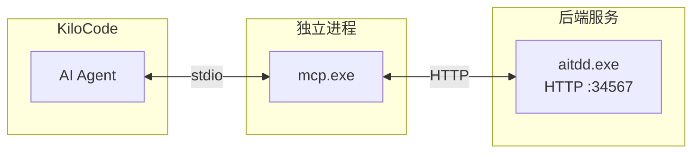
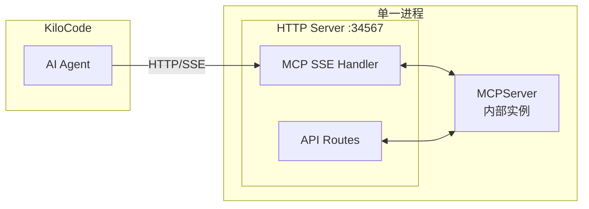
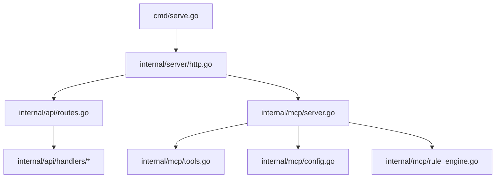

# MCP 重构计划：从 Stdio 到 SSE 模式

## 1. 背景与问题分析

### 1.1 当前架构

当前 AITDD 项目的 MCP 实现采用 **Stdio 模式**：



### 1.2 存在的问题

| 问题 | 描述 |
|------|------|
| 连接不稳定 | 出现 `MCP error -32000: Connection closed` 错误 |
| 架构冗余 | mcp.exe 通过 HTTP 调用后端 API，多了一层转发 |
| 进程管理复杂 | 需要单独编译和维护 mcp.exe |
| 资源浪费 | 两个独立进程，内存和 CPU 开销更大 |

### 1.3 现有代码分析

#### 文件结构

```
backend/cmd/mcp/
├── main.go        # 约 1600 行，MCP 服务器主逻辑
├── config.go      # 配置管理（约 200 行）
└── rule_engine.go # 规则引擎（约 585 行）
```

#### 关键代码片段

**当前启动方式** ([`main.go:1594-1597`](backend/cmd/mcp/main.go:1594)):
```go
func (s *MCPServer) Run() error {
    log.Println("Starting AITDD MCP Server...")
    return server.ServeStdio(s.server)  // stdio 模式
}
```

**工具注册模式** ([`main.go:108-130`](backend/cmd/mcp/main.go:108)):
```go
func (s *MCPServer) registerTools() {
    s.registerConfigTools()    // 配置管理工具
    s.registerGetTools()       // 获取类工具
    s.registerModifyTools()    // 修改类工具
    s.registerStatusTools()    // 状态类工具
    s.registerErrorTools()     // 错误处理类工具
    s.registerCheckTools()     // 检查类工具
    s.registerOtherTools()     // 其他工具
}
```

---

## 2. 目标架构

### 2.1 新架构设计

将 MCP Server 集成到后端 HTTP 服务中，采用 **SSE 模式**：



### 2.2 架构对比

| 方面 | 当前架构 | 新架构 |
|------|----------|--------|
| 进程数 | 2 个 | 1 个 |
| 通信方式 | stdio + HTTP | SSE over HTTP |
| 部署复杂度 | 需要两个 exe | 只需一个 exe |
| 连接稳定性 | 容易断开 | HTTP 长连接，更稳定 |
| 资源占用 | 较高 | 较低 |

---

## 3. 文件变更清单

### 3.1 需要新建的文件

| 文件路径 | 描述 |
|----------|------|
| `backend/internal/mcp/server.go` | MCP 服务器核心逻辑（从 cmd/mcp 迁移） |
| `backend/internal/mcp/tools.go` | 工具注册和处理函数 |
| `backend/internal/mcp/handlers.go` | SSE HTTP 处理器 |
| `backend/internal/mcp/config.go` | 配置管理（从 cmd/mcp 迁移） |
| `backend/internal/mcp/rule_engine.go` | 规则引擎（从 cmd/mcp 迁移） |

### 3.2 需要修改的文件

| 文件路径 | 变更内容 |
|----------|----------|
| `backend/internal/api/routes.go` | 添加 MCP SSE 路由 |
| `backend/internal/server/http.go` | 集成 MCP 服务器初始化 |
| `backend/go.mod` | 确认 mcp-go 依赖版本 |
| `.kilocode/mcp.json` | 更新 MCP 配置格式 |

### 3.3 需要删除的文件

| 文件路径 | 原因 |
|----------|------|
| `backend/cmd/mcp/main.go` | 迁移到 internal/mcp |
| `backend/cmd/mcp/config.go` | 迁移到 internal/mcp |
| `backend/cmd/mcp/rule_engine.go` | 迁移到 internal/mcp |
| `backend/mcp.exe` | 不再需要独立 exe |

---

## 4. 实现步骤

### 步骤 1：创建 MCP 内部包结构

**目标**：将 MCP 逻辑从 cmd 迁移到 internal 包

**输入**：
- `backend/cmd/mcp/main.go`
- `backend/cmd/mcp/config.go`
- `backend/cmd/mcp/rule_engine.go`

**输出**：
```
backend/internal/mcp/
├── server.go       # MCPServer 结构和方法
├── tools.go        # 工具注册函数
├── handlers.go     # 工具处理函数
├── config.go       # ConfigManager
└── rule_engine.go  # RuleEngine
```

**详细任务**：
1. 创建 `backend/internal/mcp/` 目录
2. 将 `ConfigManager` 迁移到 `config.go`，移除全局单例，改为依赖注入
3. 将 `RuleEngine` 迁移到 `rule_engine.go`
4. 将 `MCPServer` 结构迁移到 `server.go`
5. 将工具注册逻辑迁移到 `tools.go`
6. 将工具处理函数迁移到 `handlers.go`

---

### 步骤 2：实现 SSE 处理器

**目标**：创建 HTTP SSE 端点处理 MCP 请求

**输入**：
- mcp-go 库的 SSE 支持
- Gin 路由框架

**输出**：
- `backend/internal/mcp/handlers.go` 中的 SSE 处理器

**代码示例**：
```go
// backend/internal/mcp/handlers.go
package mcp

import (
    "github.com/gin-gonic/gin"
    "github.com/mark3labs/mcp-go/server"
)

type SSEHandler struct {
    mcpServer *MCPServer
}

func NewSSEHandler(mcpServer *MCPServer) *SSEHandler {
    return &SSEHandler{mcpServer: mcpServer}
}

// HandleSSE 处理 SSE 连接
func (h *SSEHandler) HandleSSE(c *gin.Context) {
    // 使用 mcp-go 的 SSE 支持
    handler := server.NewSSEServer(h.mcpServer.server)
    handler.ServeHTTP(c.Writer, c.Request)
}

// HandleMessage 处理消息
func (h *SSEHandler) HandleMessage(c *gin.Context) {
    handler := server.NewSSEServer(h.mcpServer.server)
    handler.ServeHTTP(c.Writer, c.Request)
}
```

---

### 步骤 3：集成到 HTTP 服务器

**目标**：在 HTTP 服务器启动时初始化 MCP 并注册路由

**输入**：
- `backend/internal/server/http.go`
- `backend/internal/api/routes.go`

**输出**：
- 修改后的 HTTP 服务器和路由配置

**routes.go 变更**：
```go
// backend/internal/api/routes.go
func SetupRouter(mcpHandler *mcp.SSEHandler) *gin.Engine {
    r := gin.New()
    
    // ... 现有中间件 ...
    
    // MCP SSE 端点
    mcp := r.Group("/mcp")
    {
        mcp.GET("/sse", mcpHandler.HandleSSE)
        mcp.POST("/message", mcpHandler.HandleMessage)
    }
    
    // ... 现有路由 ...
    
    return r
}
```

**http.go 变更**：
```go
// backend/internal/server/http.go
func (s *HTTPServer) Start() error {
    // 初始化 MCP 服务器
    mcpServer := mcp.NewMCPServer()
    mcpHandler := mcp.NewSSEHandler(mcpServer)
    
    // 设置路由
    router := api.SetupRouter(mcpHandler)
    
    // ... 其余代码 ...
}
```

---

### 步骤 4：更新 MCP 配置

**目标**：更新 .kilocode/mcp.json 配置为 SSE 模式

**输入**：
- 当前 `.kilocode/mcp.json`

**输出**：
- 新的 SSE 模式配置

**新配置格式**：
```json
{
  "mcpServers": {
    "aitdd": {
      "url": "http://localhost:34567/mcp/sse",
      "transport": "sse",
      "enabled": true
    }
  }
}
```

---

### 步骤 5：清理旧代码

**目标**：删除不再需要的文件

**任务**：
1. 删除 `backend/cmd/mcp/` 目录
2. 删除 `backend/mcp.exe`
3. 更新构建脚本（如果有）

---

## 5. API 端点设计

### 5.1 SSE 端点

| 端点 | 方法 | 描述 |
|------|------|------|
| `/mcp/sse` | GET | SSE 连接端点，用于建立长连接 |
| `/mcp/message` | POST | 发送 MCP 消息 |

### 5.2 消息格式

SSE 事件格式遵循 MCP 协议规范：

```
event: message
data: {"jsonrpc":"2.0","method":"tools/list","params":{}}

event: message
data: {"jsonrpc":"2.0","result":{"tools":[...]},"id":1}
```

### 5.3 完整路由结构

```
:34567
├── /health                    # 健康检查
├── /api/v1/                   # REST API
│   ├── /project               # 项目相关
│   ├── /modules               # 模块相关
│   ├── /tasks                 # 任务相关
│   └── ...
└── /mcp/                      # MCP SSE 端点
    ├── /sse                   # SSE 连接
    └── /message               # 消息发送
```

---

## 6. 配置变更

### 6.1 当前配置

```json
{
  "mcpServers": {
    "aitdd": {
      "command": "E:/GitProject/AITDD/backend/mcp.exe",
      "args": [],
      "cwd": "E:/GitProject/AITDD",
      "enabled": true
    }
  }
}
```

### 6.2 新配置

```json
{
  "mcpServers": {
    "aitdd": {
      "url": "http://localhost:34567/mcp/sse",
      "transport": "sse",
      "enabled": true
    }
  }
}
```

### 6.3 配置字段说明

| 字段 | 类型 | 描述 |
|------|------|------|
| `url` | string | SSE 端点 URL |
| `transport` | string | 传输类型，固定为 `sse` |
| `enabled` | boolean | 是否启用 |

---

## 7. 向后兼容

### 7.1 MCP 工具保持不变

所有现有的 MCP 工具函数将保持完全相同的接口：

| 工具名称 | 状态 |
|----------|------|
| `init_project` | 保持不变 |
| `get_config` | 保持不变 |
| `set_project` | 保持不变 |
| `get_project_info` | 保持不变 |
| `get_all_modules` | 保持不变 |
| `get_module_tasks` | 保持不变 |
| `get_task_detail` | 保持不变 |
| `create_module` | 保持不变 |
| `update_module` | 保持不变 |
| `delete_module` | 保持不变 |
| `create_task` | 保持不变 |
| `update_task` | 保持不变 |
| `delete_task` | 保持不变 |
| ... | ... |

### 7.2 API 端点保持不变

所有 `/api/v1/*` 端点保持不变，前端和 MCP 都可以继续使用。

### 7.3 配置文件保持不变

`.aitdd/config.json` 和 `.aitdd/rule.json` 格式保持不变。

---

## 8. 依赖确认

### 8.1 mcp-go 库版本

当前 `go.mod` 中已包含：
```
github.com/mark3labs/mcp-go v0.44.0
```

### 8.2 SSE 支持

mcp-go 库从 v0.4.0 开始支持 SSE 模式，需要确认 API：

```go
import "github.com/mark3labs/mcp-go/server"

// 创建 SSE 服务器
sseServer := server.NewSSEServer(mcpServer)

// 处理 SSE 请求
sseServer.ServeHTTP(w, r)
```

---

## 9. 风险与缓解

| 风险 | 影响 | 缓解措施 |
|------|------|----------|
| mcp-go SSE API 变化 | 代码需要调整 | 实现前查阅最新文档 |
| KiloCode SSE 支持不完整 | 连接问题 | 测试 SSE 连接稳定性 |
| 并发请求处理 | 性能问题 | 添加连接池和限流 |

---

## 10. 验收标准

- [ ] MCP 服务集成到后端 HTTP 服务
- [ ] 只需启动一个 exe 文件
- [ ] SSE 连接稳定，无 -32000 错误
- [ ] 所有现有 MCP 工具正常工作
- [ ] 前端功能不受影响
- [ ] 配置更新为 SSE 模式

---

## 11. 附录

### A. 文件依赖关系



### B. 相关文档

- [MCP 设计文档](mcp-design.md)
- [API 文档](../backend/docs/api.md)
- [开发指南](../docs/development.md)
