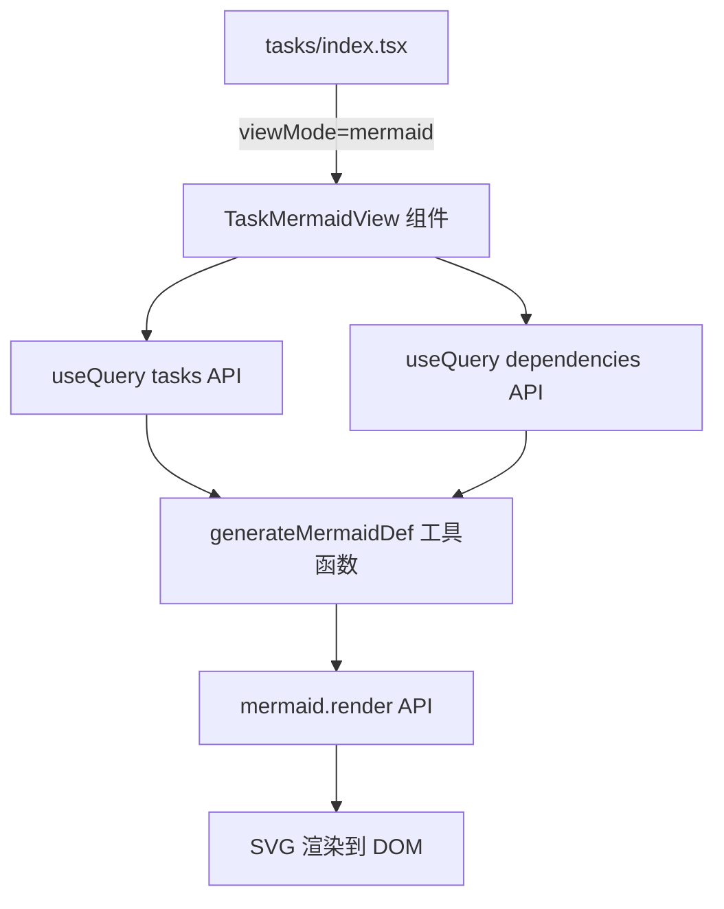
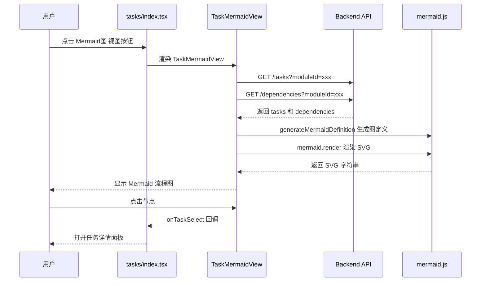

# AITDD 前端 Mermaid 流程图视图实施计划

## 一、现有视图架构分析

### 1.1 应用架构概览

- [`frontend/src/App.tsx`](frontend/src/App.tsx) — 应用根组件，通过 `React.lazy` 异步加载各页面：`DashboardPage`、`ModulesPage`、`TasksPage` 等
- [`frontend/src/features/tasks/index.tsx`](frontend/src/features/tasks/index.tsx) — 任务管理页面，包含视图切换逻辑
- [`frontend/src/features/modules/index.tsx`](frontend/src/features/modules/index.tsx) — 模块管理页面，使用 `ViewMode` 类型

### 1.2 当前视图切换机制（两处实现，风格不同）

#### 任务页（tasks/index.tsx）
使用 Ant Design `Segmented` 组件，本地 state 控制 `viewMode: 'list' | 'graph'`：
- `list` → 渲染 `<TaskList>`
- `graph` → 渲染 `<TaskGraph>`（基于 ReactFlow）

#### 模块页（modules/index.tsx）
使用自定义 `<ViewSwitcher>` 组件，接受 `ViewMode` 类型 prop：
- `list` → 渲染 `<ProjectGroupedTree>`
- `graph` → 渲染 `<ModuleGraphView>`（基于 ReactFlow）

### 1.3 ViewSwitcher 组件（modules 专属）

[`frontend/src/features/modules/components/ViewSwitcher/index.tsx`](frontend/src/features/modules/components/ViewSwitcher/index.tsx)

- 接受 `currentMode: ViewMode` 和 `onModeChange` 回调
- 使用 Ant Design `Button + Tooltip` 实现两个切换按钮（列表/节点）
- 深色主题样式，与整体 UI 风格一致

### 1.4 现有类型定义

[`frontend/src/types/index.ts`](frontend/src/types/index.ts)

```ts
export type ViewMode = 'list' | 'graph';
```

---

## 二、依赖数据结构

### 2.1 Task 模型（`backend/internal/models/task.go`）

| 字段 | 类型 | 说明 |
|------|------|------|
| `id` | string | 主键 |
| `name` | string | 任务名称 |
| `pathName` | string | 唯一路径标识 |
| `status` | string | 任务状态（详见下方） |
| `moduleId` | string | 所属模块 |

**任务状态枚举：**
- `ready` — 就绪
- `claimed` — 已认领
- `in_progress` — 进行中
- `pending_review` — 待审查
- `completed` — 已完成
- `failed` — 失败
- `blocked` — 阻塞

### 2.2 Dependency 模型（`backend/internal/models/dependency.go`）

| 字段 | 类型 | 说明 |
|------|------|------|
| `id` | string | 主键 |
| `upstreamTaskId` | string | 上游任务 ID |
| `downstreamTaskId` | string | 下游任务 ID |
| `contractSummary` | string | 契约摘要（边标签） |

### 2.3 API 端点

- `GET /tasks?moduleId=xxx&pageSize=100` — 获取模块下的任务列表
- `GET /dependencies?moduleId=xxx` — 获取任务依赖关系列表

---

## 三、Mermaid 流程图视图实施方案

### 3.1 技术选型

**推荐使用 `mermaid` 官方 npm 包**，而非 `react-mermaid2`。原因：
- `mermaid` 官方包更稳定、文档更完善
- `react-mermaid2` 包已停止维护（最后更新 2022 年）
- 直接使用 `mermaid.render()` API 可以更精确地控制渲染流程
- 对 TypeScript 支持更好（有完整类型声明）

**安装：**
```bash
npm install mermaid
```

### 3.2 Mermaid 图定义生成逻辑

将任务和依赖转换为 `flowchart TD` 格式：

```
flowchart TD
  taskId1["任务名称\n状态: ready"]:::ready
  taskId2["任务名称\n状态: in_progress"]:::in_progress
  taskId1 -->|契约摘要| taskId2

  classDef ready fill:#1890ff,stroke:#096dd9,color:#fff
  classDef claimed fill:#722ed1,stroke:#531dab,color:#fff
  classDef in_progress fill:#fa8c16,stroke:#d46b08,color:#fff
  classDef pending_review fill:#13c2c2,stroke:#08979c,color:#fff
  classDef completed fill:#52c41a,stroke:#389e0d,color:#fff
  classDef failed fill:#f5222d,stroke:#cf1322,color:#fff
  classDef blocked fill:#8c8c8c,stroke:#595959,color:#fff
```

**关键约束：**
- 节点 ID 不能直接用 UUID（含连字符），需将 `-` 替换为 `_` 或使用 `taskN` 索引映射
- 节点标签中的特殊字符需转义（引号用 `&quot;`）
- 边标签（contractSummary）超过 20 字符时截断并加 `...`

### 3.3 状态颜色映射

| 状态 | 颜色 | 说明 |
|------|------|------|
| `ready` | `#1890ff` 蓝色 | 就绪 |
| `claimed` | `#722ed1` 紫色 | 已认领 |
| `in_progress` | `#fa8c16` 橙色 | 进行中 |
| `pending_review` | `#13c2c2` 青色 | 待审查 |
| `completed` | `#52c41a` 绿色 | 已完成 |
| `failed` | `#f5222d` 红色 | 失败 |
| `blocked` | `#8c8c8c` 灰色 | 阻塞 |

### 3.4 架构流程图



---

## 四、需要新建的文件

### 4.1 `frontend/src/features/tasks/components/TaskMermaidView/index.tsx`（新建）

主组件，负责：
1. 通过 `useQuery` 获取任务列表和依赖关系
2. 将数据传入 `generateMermaidDefinition()` 转换为 Mermaid 定义字符串
3. 使用 `useEffect` 调用 `mermaid.render()` 将图表渲染到 DOM
4. 提供复制 Mermaid 代码按钮（方便用户导出）
5. 提供重置缩放按钮

**Props 接口：**
```typescript
interface TaskMermaidViewProps {
  moduleId: string;
  onTaskSelect?: (taskId: string) => void;
}
```

**组件结构：**
```typescript
const TaskMermaidView: React.FC<TaskMermaidViewProps> = ({ moduleId, onTaskSelect }) => {
  const diagramRef = useRef<HTMLDivElement>(null);
  // useQuery 获取任务和依赖
  // useEffect 监听数据变化，重新渲染 Mermaid 图
  // 渲染工具栏（复制代码、全屏等）
  return (
    <div className="task-mermaid-view">
      <div className="toolbar">...</div>
      <div ref={diagramRef} className="mermaid-container">...</div>
      <div className="legend">...</div>  {/* 状态图例 */}
    </div>
  );
};
```

### 4.2 `frontend/src/features/tasks/utils/mermaidGenerator.ts`（新建）

纯函数工具，负责将 API 数据转换为 Mermaid 图定义字符串：

```typescript
interface Task {
  id: string;
  name: string;
  status: string;
}

interface Dependency {
  id: string;
  upstreamTaskId: string;
  downstreamTaskId: string;
  contractSummary?: string;
}

/**
 * 将任务 ID 转换为 Mermaid 安全的节点 ID
 * UUID 中的 '-' 会导致 Mermaid 解析错误，需替换
 */
export function toMermaidId(taskId: string): string {
  return 'task_' + taskId.replace(/-/g, '_');
}

/**
 * 生成 Mermaid flowchart TD 格式的图定义字符串
 */
export function generateMermaidDefinition(tasks: Task[], dependencies: Dependency[]): string;
```

---

## 五、需要修改的文件

### 5.1 `frontend/src/types/index.ts`（修改）

将 `ViewMode` 类型扩展为三种视图：

```typescript
// 修改前
export type ViewMode = 'list' | 'graph';

// 修改后
export type ViewMode = 'list' | 'graph' | 'mermaid';
```

### 5.2 `frontend/src/features/tasks/index.tsx`（修改）

1. 将 `viewMode` state 类型从 `'list' | 'graph'` 改为 `'list' | 'graph' | 'mermaid'`
2. 在 `Segmented` 组件的 `options` 数组中新增第三个选项
3. 在渲染逻辑中新增 `mermaid` 分支，渲染 `<TaskMermaidView>`
4. 导入 `TaskMermaidView` 和 `BranchesOutlined`（Ant Design 图标）

**修改位置（第 15 行附近）：**
```typescript
const [viewMode, setViewMode] = useState<'list' | 'graph' | 'mermaid'>('list');
```

**修改位置（第 178-190 行附近，Segmented options）：**
```typescript
options={[
  { value: 'list', icon: <UnorderedListOutlined />, label: '列表视图' },
  { value: 'graph', icon: <ApartmentOutlined />, label: '依赖图' },
  { value: 'mermaid', icon: <BranchesOutlined />, label: 'Mermaid图' },  // 新增
]}
```

**修改位置（第 204-224 行附近，渲染逻辑）：**
```typescript
{viewMode === 'list' && <TaskList ... />}
{viewMode === 'graph' && <div style={{height: 600}}><TaskGraph ... /></div>}
{viewMode === 'mermaid' && (          // 新增
  <div style={{height: 600}}>
    <TaskMermaidView
      key={refreshKey}
      moduleId={selectedModuleId}
      onTaskSelect={handleTaskSelect}
    />
  </div>
)}
```

### 5.3 `frontend/src/features/modules/components/ViewSwitcher/index.tsx`（修改）

在 `ModulesPage` 的视图切换中也加入 Mermaid 视图按钮（可选，如果模块视图也需要）：

```typescript
// 新增第三个按钮
<Tooltip title="Mermaid 流程图">
  <Button
    type={currentMode === 'mermaid' ? 'primary' : 'text'}
    icon={<BranchesOutlined />}
    onClick={() => onModeChange('mermaid')}
    size="small"
    style={{ ... }}
  />
</Tooltip>
```

---

## 六、文件变更汇总

| 操作 | 文件路径 | 说明 |
|------|---------|------|
| **新建** | `frontend/src/features/tasks/components/TaskMermaidView/index.tsx` | Mermaid 视图主组件 |
| **新建** | `frontend/src/features/tasks/utils/mermaidGenerator.ts` | Mermaid 图定义生成工具函数 |
| **修改** | `frontend/src/types/index.ts` | 扩展 `ViewMode` 类型加入 `'mermaid'` |
| **修改** | `frontend/src/features/tasks/index.tsx` | 添加第三个视图选项和渲染分支 |
| **修改** | `frontend/src/features/modules/components/ViewSwitcher/index.tsx` | 添加 Mermaid 视图切换按钮 |

---

## 七、npm 包安装

```bash
cd frontend
npm install mermaid
npm install --save-dev @types/mermaid  # 如果官方包不含类型声明，则需安装
```

> **注意：** `mermaid` v10+ 已包含完整的 TypeScript 类型声明（`mermaid.d.ts`），无需单独安装 `@types/mermaid`。

---

## 八、Mermaid 渲染注意事项

1. **唯一 ID 要求：** 每次调用 `mermaid.render()` 需要传入不同的 `id`，避免 DOM 冲突。建议用时间戳或递增计数器。

2. **SSR 兼容：** `mermaid.initialize()` 需要在客户端（`useEffect`）调用，不能在 SSR 环境运行。

3. **中文字符支持：** Mermaid 支持中文节点标签，但需要用引号括起来：`nodeId["中文标签"]`

4. **SVG 事件绑定：** 如果需要点击节点触发 `onTaskSelect`，需要在渲染后手动给 SVG 元素绑定点击事件（通过 `querySelectorAll` 找到节点元素）。

5. **暗色主题：** 使用 `mermaid.initialize({ theme: 'dark' })` 或 `theme: 'base'` 配合自定义 `themeVariables` 以匹配现有 UI 深色主题（`#1a1a2e` 背景）。

---

## 九、实现流程时序图


