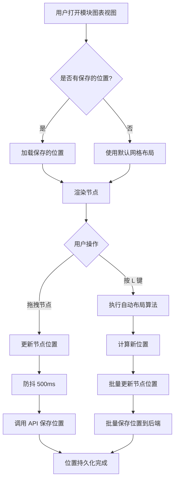

# 模块节点位置持久化功能技术设计文档

## 1. 概述

### 1.1 背景
用户需要在前端模块节点图表视图中实现：
1. 按 **L 快捷键** 自动排列模块节点（根据模块前后依赖关系）
2. 移动节点后 **自动保存位置** 到数据库
3. 下次打开页面时 **恢复节点位置**

### 1.2 设计目标
- 最小化对现有代码的改动
- 保持与现有架构风格一致
- 支持批量位置更新以减少网络请求
- 提供流畅的用户体验

---

## 2. 数据库设计

### 2.1 方案选择

**方案A：在 Module 表添加位置字段** ✅ 推荐
- 优点：查询简单，一次请求获取所有数据
- 缺点：Module 模型职责略微增加

**方案B：创建独立的 ModulePosition 表**
- 优点：职责分离
- 缺点：需要 JOIN 查询，增加复杂度

选择 **方案A**，因为位置信息与模块紧密相关，且查询频率高。

### 2.2 数据库迁移 SQL

创建文件：`backend/migrations/006_add_module_position.sql`

```sql
-- 006_add_module_position.sql
-- 添加模块节点位置字段

-- 添加位置字段到 modules 表
ALTER TABLE modules ADD COLUMN position_x REAL DEFAULT NULL;
ALTER TABLE modules ADD COLUMN position_y REAL DEFAULT NULL;

-- 添加位置更新时间字段（可选，用于调试和审计）
ALTER TABLE modules ADD COLUMN position_updated_at INTEGER DEFAULT NULL;

-- 创建位置索引（可选，用于按位置查询）
CREATE INDEX IF NOT EXISTS idx_modules_position ON modules(position_x, position_y);
```

### 2.3 Go 模型更新

修改文件：`backend/internal/models/module.go`

```go
// Module 模块
type Module struct {
    ID                       string  `json:"id" gorm:"primaryKey;type:text"`
    ParentID                 *string `json:"parentId" gorm:"type:text;index"`
    ProjectID                string  `json:"projectId" gorm:"not null;type:text;index"`
    Name                     string  `json:"name" gorm:"not null;type:text"`
    Description              string  `json:"description" gorm:"type:text"`
    Prompt                   string  `json:"prompt" gorm:"type:text"`
    Status                   string  `json:"status" gorm:"not null;default:'designing';type:text;index"`
    TestCoverage             float64 `json:"testCoverage" gorm:"default:0"`
    UpstreamContractSummary  string  `json:"upstreamContractSummary" gorm:"type:text"`
    DownstreamContractSummary string  `json:"downstreamContractSummary" gorm:"type:text"`
    Locked                   bool    `json:"locked" gorm:"not null;default:false"`
    LockedBy                 *string `json:"lockedBy" gorm:"type:text"`
    LockedAt                 *int64  `json:"lockedAt" gorm:"type:integer"`
    LockExpiresAt            *int64  `json:"lockExpiresAt" gorm:"type:integer"`
    // 新增位置字段
    PositionX                *float64 `json:"positionX" gorm:"type:real"`
    PositionY                *float64 `json:"positionY" gorm:"type:real"`
    PositionUpdatedAt        *int64   `json:"positionUpdatedAt" gorm:"type:integer"`
    // 原有字段
    CreatedAt                int64   `json:"createdAt" gorm:"not null"`
    UpdatedAt                int64   `json:"updatedAt" gorm:"not null"`
    Version                  int     `json:"version" gorm:"not null;default:1"`
    SyncStatus               string  `json:"syncStatus" gorm:"not null;default:'SYNCED';type:text"`
}
```

---

## 3. API 设计

### 3.1 API 端点设计

| 方法 | 端点 | 描述 |
|------|------|------|
| GET | `/api/v1/modules/positions` | 获取所有模块位置 |
| PUT | `/api/v1/modules/positions` | 批量更新模块位置 |
| PUT | `/api/v1/modules/:id/position` | 更新单个模块位置 |

### 3.2 API 详细设计

#### 3.2.1 获取所有模块位置

**请求**
```
GET /api/v1/modules/positions?projectId={projectId}
```

**响应**
```json
{
  "success": true,
  "data": {
    "positions": [
      {
        "moduleId": "module-uuid-1",
        "positionX": 100.0,
        "positionY": 200.0
      },
      {
        "moduleId": "module-uuid-2",
        "positionX": 500.0,
        "positionY": 200.0
      }
    ]
  },
  "timestamp": 1708867200000
}
```

#### 3.2.2 批量更新模块位置

**请求**
```
PUT /api/v1/modules/positions
Content-Type: application/json

{
  "positions": [
    {
      "moduleId": "module-uuid-1",
      "positionX": 150.0,
      "positionY": 250.0
    },
    {
      "moduleId": "module-uuid-2",
      "positionX": 550.0,
      "positionY": 250.0
    }
  ]
}
```

**响应**
```json
{
  "success": true,
  "data": {
    "updated": 2
  },
  "timestamp": 1708867200000
}
```

#### 3.2.3 更新单个模块位置

**请求**
```
PUT /api/v1/modules/:id/position
Content-Type: application/json

{
  "positionX": 150.0,
  "positionY": 250.0
}
```

**响应**
```json
{
  "success": true,
  "data": {
    "module": {
      "id": "module-uuid-1",
      "positionX": 150.0,
      "positionY": 250.0,
      "positionUpdatedAt": 1708867200000
    }
  },
  "timestamp": 1708867200000
}
```

### 3.3 后端 Handler 实现

创建文件：`backend/internal/api/handlers/module_position.go`

```go
package handlers

import (
    "time"
    "github.com/aitdd/backend/internal/database"
    "github.com/aitdd/backend/internal/models"
    "github.com/gin-gonic/gin"
)

// ModulePositionRequest 单个模块位置请求
type ModulePositionRequest struct {
    PositionX float64 `json:"positionX"`
    PositionY float64 `json:"positionY"`
}

// BatchPositionRequest 批量位置更新请求
type BatchPositionRequest struct {
    Positions []struct {
        ModuleID  string  `json:"moduleId" binding:"required"`
        PositionX float64 `json:"positionX"`
        PositionY float64 `json:"positionY"`
    } `json:"positions" binding:"required"`
}

// ModulePositionResponse 模块位置响应
type ModulePositionResponse struct {
    ModuleIDstring `json:"moduleId"`
    PositionX  float64 `json:"positionX"`
    PositionY  float64 `json:"positionY"`
}

// GetModulePositions 获取所有模块位置
func GetModulePositions(c *gin.Context) {
    projectID := c.Query("projectId")
    if projectID == "" {
        ValidationError(c, "projectId is required", nil)
        return
    }

    var modules []models.Module
    if err := database.DB.Select("id, position_x, position_y").
        Where("project_id = ?", projectID).
        Find(&modules).Error; err != nil {
        InternalError(c, "查询模块位置失败")
        return
    }

    positions := make([]ModulePositionResponse, 0, len(modules))
    for _, m := range modules {
        positions = append(positions, ModulePositionResponse{
            ModuleID:  m.ID,
            PositionX: *m.PositionX,
            PositionY: *m.PositionY,
        })
    }

    Success(c, gin.H{
        "positions": positions,
    })
}

// UpdateModulePosition 更新单个模块位置
func UpdateModulePosition(c *gin.Context) {
    moduleID := c.Param("id")

    var req ModulePositionRequest
    if err := c.ShouldBindJSON(&req); err != nil {
        ValidationError(c, "无效的请求数据", nil)
        return
    }

    now := time.Now().UnixMilli()
    updates := map[string]interface{}{
        "position_x":        req.PositionX,
        "position_y":        req.PositionY,
        "position_updated_at": now,
    }

    if err := database.DB.Model(&models.Module{}).
        Where("id = ?", moduleID).
        Updates(updates).Error; err != nil {
        InternalError(c, "更新模块位置失败")
        return
    }

    var module models.Module
    if err := database.DB.First(&module, "id = ?", moduleID).Error; err != nil {
        InternalError(c, "获取模块失败")
        return
    }

    Success(c, gin.H{
        "module": module,
    })
}

// BatchUpdateModulePositions 批量更新模块位置
func BatchUpdateModulePositions(c *gin.Context) {
    var req BatchPositionRequest
    if err := c.ShouldBindJSON(&req); err != nil {
        ValidationError(c, "无效的请求数据", nil)
        return
    }

    now := time.Now().UnixMilli()
    updated := 0

    tx := database.DB.Begin()
    for _, pos := range req.Positions {
        updates := map[string]interface{}{
            "position_x":          pos.PositionX,
            "position_y":          pos.PositionY,
            "position_updated_at": now,
        }
        if err := tx.Model(&models.Module{}).
            Where("id = ?", pos.ModuleID).
            Updates(updates).Error; err != nil {
            tx.Rollback()
            InternalError(c, "批量更新模块位置失败")
            return
        }
        updated++
    }
    tx.Commit()

    Success(c, gin.H{
        "updated": updated,
    })
}
```

### 3.4 路由注册

修改文件：`backend/internal/api/routes.go`

```go
// 在 modules 路由组中添加
modules.GET("/positions", handlers.GetModulePositions)
modules.PUT("/positions", handlers.BatchUpdateModulePositions)
modules.PUT("/:id/position", handlers.UpdateModulePosition)
```

---

## 4. 前端设计

### 4.1 TypeScript 类型更新

修改文件：`frontend/src/types/index.ts`

```typescript
/** 模块类型 - 与后端 models.Module 对齐 */
export interface Module {
  id: string;
  parentId?: string | null;
  projectId: string;
  name: string;
  description?: string;
  prompt?: string;
  status: ModuleStatus;
  testCoverage: number;
  upstreamContractSummary?: string;
  downstreamContractSummary?: string;
  locked: boolean;
  lockedBy?: string | null;
  lockedAt?: number | null;
  lockExpiresAt?: number | null;
  // 新增位置字段
  positionX?: number | null;
  positionY?: number | null;
  positionUpdatedAt?: number | null;
  // 原有字段
  createdAt: number;
  updatedAt: number;
  version: number;
  syncStatus: SyncStatus;
  children?: Module[];
}

/** 模块位置 */
export interface ModulePosition {
  moduleId: string;
  positionX: number;
  positionY: number;
}

/** 批量位置更新请求 */
export interface BatchPositionUpdateRequest {
  positions: ModulePosition[];
}
```

### 4.2 API 服务更新

修改文件：`frontend/src/services/api.ts`

```typescript
// 获取模块位置
export const getModulePositions = async (projectId: string): Promise<ModulePosition[]> => {
  const response = await fetch(`${API_BASE_URL}/modules/positions?projectId=${projectId}`);
  return handleResponse(response);
};

// 批量更新模块位置
export const batchUpdateModulePositions = async (positions: ModulePosition[]): Promise<void> => {
  const response = await fetch(`${API_BASE_URL}/modules/positions`, {
    method: 'PUT',
    headers: { 'Content-Type': 'application/json' },
    body: JSON.stringify({ positions }),
  });
  return handleResponse(response);
};

// 更新单个模块位置
export const updateModulePosition = async (moduleId: string, x: number, y: number): Promise<Module> => {
  const response = await fetch(`${API_BASE_URL}/modules/${moduleId}/position`, {
    method: 'PUT',
    headers: { 'Content-Type': 'application/json' },
    body: JSON.stringify({ positionX: x, positionY: y }),
  });
  return handleResponse(response);
};
```

### 4.3 自动布局算法设计

#### 4.3.1 层次布局算法（DAG Layout）

基于模块依赖关系的有向无环图（DAG）进行层次布局：

```typescript
interface LayoutConfig {
  nodeWidth: number;      // 节点宽度
  nodeHeight: number;     // 节点高度
  horizontalGap: number;  // 水平间距
  verticalGap: number;    // 垂直间距
  startX: number;         // 起始X坐标
  startY: number;         // 起始Y坐标
}

const defaultLayoutConfig: LayoutConfig = {
  nodeWidth: 320,
  nodeHeight: 200,
  horizontalGap: 100,
  verticalGap: 150,
  startX: 50,
  startY: 50,
};

/**
 * 基于依赖关系的层次布局算法
 * 1. 构建依赖图
 * 2. 拓扑排序确定层级
 * 3. 计算每层节点位置
 */
function calculateAutoLayout(
  modules: Module[],
  moduleDependencies: ModuleDependency[],
  config: LayoutConfig = defaultLayoutConfig
): Map<string, { x: number; y: number }> {
  const positions = new Map<string, { x: number; y: number }>();
  
  // 1. 构建邻接表（依赖关系：A depends on B => B -> A）
  const adjacencyList = new Map<string, string[]>();
  const inDegree = new Map<string, number>();
  
  modules.forEach(m => {
    adjacencyList.set(m.id, []);
    inDegree.set(m.id, 0);
  });
  
  moduleDependencies.forEach(dep => {
    // dep.moduleId 依赖于 dep.dependsOnModuleId
    // 所以 dependsOnModuleId -> moduleId
    const neighbors = adjacencyList.get(dep.dependsOnModuleId) || [];
    neighbors.push(dep.moduleId);
    adjacencyList.set(dep.dependsOnModuleId, neighbors);
    inDegree.set(dep.moduleId, (inDegree.get(dep.moduleId) || 0) + 1);
  });
  
  // 2. 拓扑排序 + 层级分配
  const layers: string[][] = [];
  const queue: string[] = [];
  const assigned = new Set<string>();
  
  // 找到所有入度为 0 的节点（没有依赖的模块）
  modules.forEach(m => {
    if (inDegree.get(m.id) === 0) {
      queue.push(m.id);
    }
  });
  
  while (queue.length > 0 || assigned.size < modules.length) {
    const currentLayer: string[] = [];
    const nextQueue: string[] = [];
    
    // 处理当前层的所有节点
    queue.forEach(moduleId => {
      if (!assigned.has(moduleId)) {
        currentLayer.push(moduleId);
        assigned.add(moduleId);
        
        // 更新邻居的入度
        const neighbors = adjacencyList.get(moduleId) || [];
        neighbors.forEach(neighborId => {
          const newDegree = (inDegree.get(neighborId) || 1) - 1;
          inDegree.set(neighborId, newDegree);
          if (newDegree === 0 && !assigned.has(neighborId)) {
            nextQueue.push(neighborId);
          }
        });
      }
    });
    
    if (currentLayer.length > 0) {
      layers.push(currentLayer);
    }
    
    // 处理孤立节点（没有依赖关系的节点）
    if (queue.length === 0 && assigned.size < modules.length) {
      modules.forEach(m => {
        if (!assigned.has(m.id)) {
          currentLayer.push(m.id);
          assigned.add(m.id);
        }
      });
    }
    
    queue.length = 0;
    queue.push(...nextQueue);
  }
  
  // 3. 计算位置
  layers.forEach((layer, layerIndex) => {
    const layerWidth = layer.length * config.nodeWidth + (layer.length - 1) * config.horizontalGap;
    const startX = config.startX + (layerWidth - config.nodeWidth) / 2;
    
    layer.forEach((moduleId, nodeIndex) => {
      positions.set(moduleId, {
        x: startX + nodeIndex * (config.nodeWidth + config.horizontalGap),
        y: config.startY + layerIndex * (config.nodeHeight + config.verticalGap),
      });
    });
  });
  
  return positions;
}
```

### 4.4 ModuleGraphView 组件更新

#### 4.4.1 位置加载逻辑

```typescript
// 在组件初始化时加载位置
useEffect(() => {
  const loadPositions = async () => {
    try {
      const positions = await getModulePositions(projectId);
      const positionMap = new Map(positions.map(p => [p.moduleId, { x: p.positionX, y: p.positionY }]));
      setPositionMap(positionMap);
    } catch (error) {
      console.error('Failed to load positions:', error);
    }
  };
  
  if (projectId) {
    loadPositions();
  }
}, [projectId]);
```

#### 4.4.2 位置保存逻辑（防抖）

```typescript
import { useRef, useCallback } from 'react';

// 防抖保存位置
const saveTimeoutRef = useRef<NodeJS.Timeout | null>(null);

const savePositions = useCallback(async (positions: ModulePosition[]) => {
  try {
    await batchUpdateModulePositions(positions);
  } catch (error) {
    console.error('Failed to save positions:', error);
  }
}, []);

const debouncedSavePositions = useCallback((positions: ModulePosition[]) => {
  if (saveTimeoutRef.current) {
    clearTimeout(saveTimeoutRef.current);
  }
  saveTimeoutRef.current = setTimeout(() => {
    savePositions(positions);
  }, 500); // 500ms 防抖
}, [savePositions]);

// 节点拖拽结束时的回调
const onNodeDragStop = useCallback((_: React.MouseEvent, node: Node) => {
  const moduleId = node.id.replace('module-', '');
  const position: ModulePosition = {
    moduleId,
    positionX: node.position.x,
    positionY: node.position.y,
  };
  debouncedSavePositions([position]);
}, [debouncedSavePositions]);
```

#### 4.4.3 L 快捷键自动布局

```typescript
import { useEffect, useCallback } from 'react';

// L 键自动布局
const handleAutoLayout = useCallback(() => {
  const newPositions = calculateAutoLayout(modules, moduleDependencies);
  
  // 更新节点位置
  setNodes(nodes => nodes.map(node => {
    const moduleId = node.id.replace('module-', '');
    const newPos = newPositions.get(moduleId);
    if (newPos) {
      return { ...node, position: newPos };
    }
    return node;
  }));
  
  // 批量保存位置
  const positionsToSave: ModulePosition[] = [];
  newPositions.forEach((pos, moduleId) => {
    positionsToSave.push({
      moduleId,
      positionX: pos.x,
      positionY: pos.y,
    });
  });
  savePositions(positionsToSave);
  
}, [modules, moduleDependencies, setNodes, savePositions]);

// 注册快捷键
useEffect(() => {
  const handleKeyDown = (event: KeyboardEvent) => {
    if (event.key === 'l' || event.key === 'L') {
      // 检查是否在输入框中
      const activeElement = document.activeElement;
      if (activeElement?.tagName === 'INPUT' || activeElement?.tagName === 'TEXTAREA') {
        return;
      }
      handleAutoLayout();
    }
  };
  
  window.addEventListener('keydown', handleKeyDown);
  return () => window.removeEventListener('keydown', handleKeyDown);
}, [handleAutoLayout]);
```

### 4.5 完整组件集成示例

```typescript
// ModuleGraphView/index.tsx 关键代码片段

const ModuleGraphView: React.FC<ModuleGraphViewProps> = ({
  modules,
  tasks,
  taskDependencies,
  moduleDependencies,
  onModuleClick,
  onTaskClick,
}) => {
  const [collapsedModules, setCollapsedModules] = useState<Set<string>>(new Set());
  const [displaySettings, setDisplaySettings] = useState<DisplaySettings>(defaultDisplaySettings);
  const [positionMap, setPositionMap] = useState<Map<string, { x: number; y: number }>>(new Map());
  const saveTimeoutRef = useRef<NodeJS.Timeout | null>(null);

  // 加载位置
  useEffect(() => {
    const loadPositions = async () => {
      if (modules.length > 0) {
        const projectId = modules[0].projectId;
        const positions = await getModulePositions(projectId);
        setPositionMap(new Map(positions.map(p => [p.moduleId, { x: p.positionX, y: p.positionY }])));
      }
    };
    loadPositions();
  }, [modules]);

  // 生成节点时使用保存的位置
  const { nodes: initialNodes, edges: initialEdges } = useMemo(() => {
    const nodes: Node<ModuleNodeData>[] = [];
    const edges: Edge[] = [];

    modules.forEach((module, index) => {
      // 优先使用保存的位置，否则使用默认网格布局
      const savedPos = positionMap.get(module.id);
      const defaultCol = index % columns;
      const defaultRow = Math.floor(index / columns);
      
      const position = savedPos || {
        x: defaultCol * columnWidth + 50,
        y: defaultRow * rowHeight + 50,
      };
      
      // ... 创建节点
    });
    
    return { nodes, edges };
  }, [modules, tasks, taskDependencies, collapsedModules, positionMap, displaySettings]);

  const [nodes, setNodes, onNodesChange] = useNodesState(initialNodes);
  const [edges, setEdges, onEdgesChange] = useEdgesState(initialEdges);

  // 防抖保存
  const debouncedSavePosition = useCallback((moduleId: string, x: number, y: number) => {
    if (saveTimeoutRef.current) {
      clearTimeout(saveTimeoutRef.current);
    }
    saveTimeoutRef.current = setTimeout(() => {
      updateModulePosition(moduleId, x, y);
    }, 500);
  }, []);

  // 拖拽结束保存位置
  const onNodeDragStop = useCallback((_: React.MouseEvent, node: Node) => {
    const moduleId = node.id.replace('module-', '');
    debouncedSavePosition(moduleId, node.position.x, node.position.y);
  }, [debouncedSavePosition]);

  // L 键自动布局
  const handleAutoLayout = useCallback(() => {
    const newPositions = calculateAutoLayout(modules, moduleDependencies);
    // ... 更新节点和保存
  }, [modules, moduleDependencies]);

  useEffect(() => {
    const handleKeyDown = (event: KeyboardEvent) => {
      if ((event.key === 'l' || event.key === 'L') && !isInputFocused()) {
        handleAutoLayout();
      }
    };
    window.addEventListener('keydown', handleKeyDown);
    return () => window.removeEventListener('keydown', handleKeyDown);
  }, [handleAutoLayout]);

  return (
    <ReactFlow
      nodes={nodes}
      edges={edges}
      onNodesChange={onNodesChange}
      onEdgesChange={onEdgesChange}
      onNodeDragStop={onNodeDragStop}
      // ... 其他属性
    >
      {/* ... */}
    </ReactFlow>
  );
};
```

---

## 5. 实现流程图



---

## 6. 实现清单

### 6.1 后端任务

- [ ] 创建数据库迁移文件 `006_add_module_position.sql`
- [ ] 更新 [`Module`](backend/internal/models/module.go:10) 模型添加位置字段
- [ ] 创建 [`module_position.go`](backend/internal/api/handlers) handler 文件
- [ ] 在 [`routes.go`](backend/internal/api/routes.go:30) 注册新路由

### 6.2 前端任务

- [ ] 更新 [`Module`](frontend/src/types/index.ts:19) 类型定义
- [ ] 在 [`api.ts`](frontend/src/services/api.ts) 添加位置相关 API
- [ ] 实现 `calculateAutoLayout` 自动布局算法
- [ ] 更新 [`ModuleGraphView`](frontend/src/features/modules/components/ModuleGraphView/index.tsx) 组件：
  - 添加位置加载逻辑
  - 添加拖拽保存逻辑（防抖）
  - 添加 L 快捷键监听

---

## 7. 注意事项

1. **防抖处理**：拖拽保存使用 500ms 防抖，避免频繁请求
2. **输入框检测**：L 快捷键需要检测当前焦点是否在输入框
3. **空值处理**：位置字段允许为 NULL（新创建的模块没有位置）
4. **批量操作**：自动布局后使用批量 API 一次保存所有位置
5. **错误处理**：位置保存失败不应影响用户操作，可静默重试
