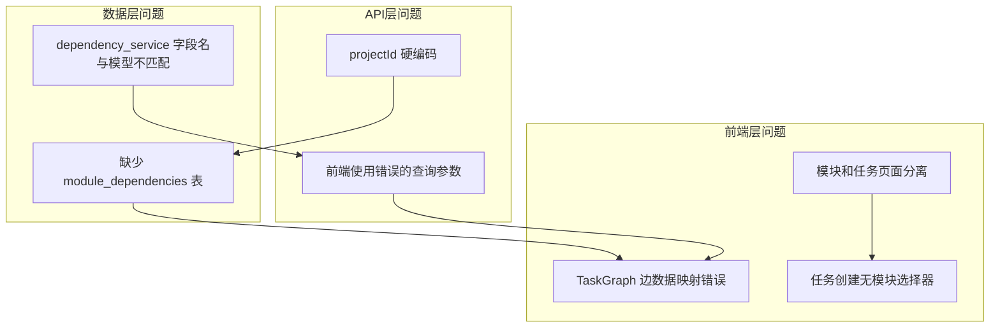

# 模块-任务系统架构分析报告

## 概述

本报告分析了用户反馈的五个核心问题，通过审查规格文档、后端代码和前端代码，识别出现有架构中的设计缺陷和实现问题。

---

## 一、问题清单与分析

### 问题1：创建模块后，加载模块失败

**严重程度**：🔴 高

**根因分析**：

1. **前端硬编码projectId问题**
   - [`frontend/src/features/modules/index.tsx:17`](frontend/src/features/modules/index.tsx:17) 中 `projectId` 被硬编码为 `'default'`
   - 没有从后端获取或创建真实的项目ID

2. **缺少项目初始化流程**
   - 规格文档要求 `aitdd init` 命令创建项目和初始化数据库
   - 但前端直接假设项目已存在，使用硬编码ID

**影响范围**：
- `frontend/src/features/modules/index.tsx`
- `frontend/src/features/tasks/index.tsx`

---

### 问题2：模块之间看不到依赖关系

**严重程度**：🔴 高

**根因分析**：

1. **数据模型设计缺陷**
   
   规格文档 [`data-model.md`](specs/001-visual-task-governance/data-model.md) 中只定义了**任务间依赖**：
   ```sql
   -- dependencies表只支持任务→任务
   upstream_task_id TEXT NOT NULL REFERENCES tasks(id)
   downstream_task_id TEXT NOT NULL REFERENCES tasks(id)
   ```

2. **缺少模块依赖模型**
   - 没有定义 `module_dependencies` 表
   - 模块之间的依赖关系无法存储

3. **服务层代码不一致**
   
   [`dependency_service.go`](backend/internal/services/dependency_service.go) 使用了错误的字段名：
   ```go
   // 第28行：使用 module_id 和 depends_on
   query = query.Where("module_id = ?", moduleID)
   ```
   
   但 [`dependency.go`](backend/internal/models/dependency.go) 模型定义是：
   ```go
   // 第12-13行：使用 upstream_task_id 和 downstream_task_id
   UpstreamTaskID string `gorm:"not null;type:text;index"`
   DownstreamTaskID string `gorm:"not null;type:text;index"`
   ```

**影响范围**：
- `backend/internal/models/dependency.go` - 缺少模块依赖模型
- `backend/internal/services/dependency_service.go` - 字段名不匹配
- `backend/migrations/001_init.sql` - 缺少模块依赖表

---

### 问题3：创建任务必须在对应模块中创建

**严重程度**：🟡 中

**根因分析**：

1. **API设计正确**
   - [`task.go:74`](backend/internal/api/handlers/task.go:74) 要求 `moduleId` 必填
   - 这符合规格设计：任务必须属于模块

2. **前端UX问题**
   - [`tasks/index.tsx:19`](frontend/src/features/tasks/index.tsx:19) 中 `selectedModuleId` 初始化为空字符串
   - [`tasks/index.tsx:139`](frontend/src/features/tasks/index.tsx:139) 使用 `'default'` 作为默认moduleId
   - 用户无法直观地选择目标任务模块

**建议**：
- 任务创建表单应提供模块选择器
- 或从模块详情页触发任务创建（自动关联当前模块）

**影响范围**：
- `frontend/src/features/tasks/index.tsx`
- `frontend/src/features/tasks/components/TaskForm/index.tsx`

---

### 问题4：模块和任务分开显示

**严重程度**：🟡 中

**根因分析**：

1. **页面结构分离**
   - `/modules` 路由：模块管理页面
   - `/tasks` 路由：任务管理页面
   - 两者独立运作，无关联展示

2. **用户期望 vs 实际设计**
   
   | 用户期望 | 实际实现 |
   |---------|---------|
   | 模块 = 文件夹 | ✅ 正确 |
   | 任务 = 文件夹中的文件 | ✅ 正确 |
   | 在模块视图中看到任务 | ❌ 需要切换页面 |
   | 层级结构展示 | ❌ 分离展示 |

3. **规格设计意图**
   
   [`spec.md:18-19`](specs/001-visual-task-governance/spec.md:18) 明确说明：
   > - **模块化**：支持无限层级模块嵌套，每个模块可包含多个任务
   
   但前端实现未体现"模块包含任务"的层级关系。

**影响范围**：
- `frontend/src/features/modules/index.tsx`
- `frontend/src/features/modules/components/ModuleDetail/index.tsx`
- `frontend/src/App.tsx` - 路由结构

---

### 问题5：关系图功能严重问题

**严重程度**：🔴 高

**根因分析**：

1. **API调用参数错误**
   
   [`TaskGraph/index.tsx:43-47`](frontend/src/features/tasks/components/TaskGraph/index.tsx:43)：
   ```tsx
   const response = await apiClient.get('/dependencies', {
     params: { moduleId },  // ❌ 错误：后端不支持此参数
   });
   ```

2. **边数据映射错误**
   
   [`TaskGraph/index.tsx:62-68`](frontend/src/features/tasks/components/TaskGraph/index.tsx:62)：
   ```tsx
   const initialEdges: Edge[] = (depsData?.dependencies || []).map((dep: any) => ({
     id: dep.id,
     source: dep.moduleId,    // ❌ 错误字段
     target: dep.dependsOn,   // ❌ 错误字段
   }));
   ```
   
   正确应该是：
   ```tsx
   source: dep.upstreamTaskId,
   target: dep.downstreamTaskId,
   ```

3. **服务层字段名不匹配**
   
   [`dependency_service.go`](backend/internal/services/dependency_service.go) 使用的字段与模型定义不一致，导致查询可能失败。

4. **缺少模块级别的关系图**
   - 当前只有任务依赖图
   - 没有模块依赖图（因为缺少模块依赖模型）

**影响范围**：
- `frontend/src/features/tasks/components/TaskGraph/index.tsx`
- `backend/internal/services/dependency_service.go`

---

## 二、架构问题汇总图



---

## 三、需要修改的文件列表

### 后端文件

| 文件路径 | 问题类型 | 优先级 |
|---------|---------|-------|
| `backend/internal/models/dependency.go` | 字段名与service不匹配 | P0 |
| `backend/internal/services/dependency_service.go` | 使用错误字段名 | P0 |
| `backend/migrations/001_init.sql` | 缺少模块依赖表 | P1 |
| `backend/internal/models/module.go` | 需添加模块依赖模型 | P1 |
| `backend/internal/api/handlers/dependency.go` | 需支持模块依赖API | P1 |

### 前端文件

| 文件路径 | 问题类型 | 优先级 |
|---------|---------|-------|
| `frontend/src/features/tasks/components/TaskGraph/index.tsx` | 边数据映射错误 | P0 |
| `frontend/src/features/modules/index.tsx` | projectId硬编码 | P0 |
| `frontend/src/features/tasks/index.tsx` | 模块关联问题 | P1 |
| `frontend/src/features/tasks/components/TaskForm/index.tsx` | 缺少模块选择器 | P1 |
| `frontend/src/features/modules/components/ModuleDetail/index.tsx` | 需展示模块内任务 | P1 |

---

## 四、建议的修改方案

### 方案A：最小修复（仅修复Bug）

**目标**：让现有功能正常工作

1. **修复 dependency_service.go 字段名**
   ```go
   // 修改查询条件
   query = query.Where("upstream_task_id = ?", upstreamTaskID)
   query = query.Where("downstream_task_id = ?", downstreamTaskID)
   ```

2. **修复 TaskGraph 边数据映射**
   ```tsx
   source: dep.upstreamTaskId,
   target: dep.downstreamTaskId,
   ```

3. **修复 projectId 硬编码**
   - 从API获取或创建默认项目

### 方案B：完整重构（推荐）

**目标**：实现规格文档的完整设计意图

1. **数据模型扩展**
   - 新增 `module_dependencies` 表
   - 支持模块间依赖关系

2. **前端架构调整**
   - 合并模块和任务视图
   - 模块详情页展示任务列表和任务图
   - 任务创建时关联当前模块

3. **关系图增强**
   - 支持模块依赖图视图
   - 支持任务依赖图视图
   - 支持混合视图（模块+任务）

### 方案C：渐进式改进

**阶段1**：修复关键Bug（方案A）
**阶段2**：优化前端UX（模块内展示任务）
**阶段3**：添加模块依赖功能

---

## 五、数据模型建议

### 新增：module_dependencies 表

```sql
CREATE TABLE IF NOT EXISTS module_dependencies (
    id TEXT PRIMARY KEY,
    upstream_module_id TEXT NOT NULL REFERENCES modules(id) ON DELETE CASCADE,
    downstream_module_id TEXT NOT NULL REFERENCES modules(id) ON DELETE CASCADE,
    contract_summary TEXT,
    status TEXT NOT NULL DEFAULT 'active',
    created_at INTEGER NOT NULL,
    updated_at INTEGER NOT NULL,
    version INTEGER NOT NULL DEFAULT 1,
    sync_status TEXT NOT NULL DEFAULT 'SYNCED',
    UNIQUE(upstream_module_id, downstream_module_id)
);

CREATE INDEX idx_module_deps_upstream ON module_dependencies(upstream_module_id);
CREATE INDEX idx_module_deps_downstream ON module_dependencies(downstream_module_id);
```

### 修复：dependencies 表字段

确保后端服务使用正确的字段名：
- `upstream_task_id`（非 `module_id`）
- `downstream_task_id`（非 `depends_on`）

---

## 六、前端架构建议

### 推荐的页面结构

```
/modules/:moduleId?
  ├── 模块树（左侧）
  ├── 模块详情（右侧）
  │   ├── 基本信息
  │   ├── 子模块列表
  │   ├── 任务列表 ← 新增
  │   └── 模块依赖图 ← 新增
  └── 任务详情抽屉
```

### 路由结构调整

```tsx
// 当前
<Route path="/modules" element={<ModulesPage />} />
<Route path="/tasks" element={<TasksPage />} />

// 建议
<Route path="/modules/:moduleId?" element={<ModulesPage />}>
  <Route path="tasks/:taskId?" element={<TaskDetailPanel />} />
</Route>
```

---

## 七、总结

| 问题 | 根因 | 解决难度 |
|-----|------|---------|
| 模块加载失败 | projectId硬编码 | 低 |
| 模块间无依赖 | 缺少数据模型 | 中 |
| 任务创建关联 | 前端UX问题 | 低 |
| 模块任务分离 | 架构设计问题 | 中 |
| 关系图问题 | 多处Bug | 中 |

**建议优先级**：
1. 🔴 P0：修复 dependency_service 和 TaskGraph 的字段映射Bug
2. 🔴 P0：解决 projectId 硬编码问题
3. 🟡 P1：优化前端模块-任务关联展示
4. 🟡 P1：添加模块依赖数据模型和API
5. 🟢 P2：重构前端页面结构
