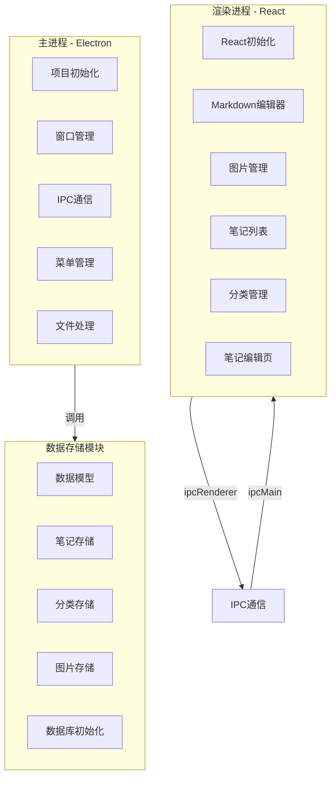
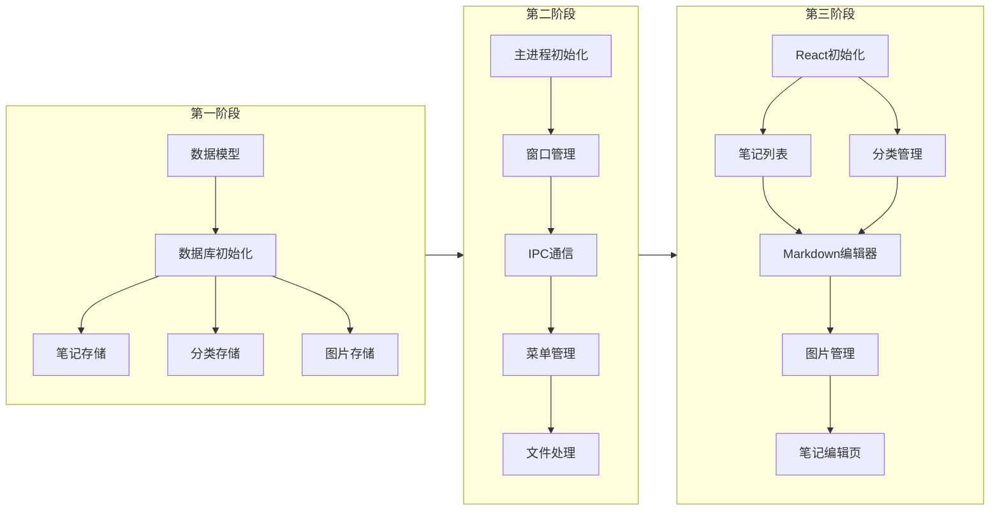

# 记事本桌面应用开发计划

## 项目概述

| 属性 | 值 |
|------|-----|
| 项目名称 | 记事本 |
| 应用类型 | 桌面应用 (Windows/macOS/Linux) |
| 技术栈 | Electron + React + TypeScript |
| 核心功能 | Markdown编辑、图片插入、笔记管理、分类管理 |
| 代码路径 | `/example/nodepade` |

## 系统架构



## 目录结构

```
/example/nodepade/
├── package.json                    # 项目配置
├── electron-builder.yml            # 打包配置
├── tsconfig.json                   # TypeScript配置
│
├── main/                           # 主进程代码
│   ├── main.ts                     # 主进程入口
│   ├── window.ts                   # 窗口管理
│   ├── menu.ts                     # 菜单管理
│   ├── fileHandlers.ts             # 文件处理
│   ├── ipc/                        # IPC通信
│   │   ├── channels.ts             # 通道定义
│   │   └── handlers.ts             # 处理函数
│   └── database/                   # 数据存储
│       ├── init.ts                 # 数据库初始化
│       ├── migration.ts            # 数据迁移
│       ├── models.ts               # 数据模型
│       ├── types.ts                # 类型定义
│       ├── store.ts                # 存储基类
│       ├── noteStore.ts            # 笔记存储
│       ├── categoryStore.ts        # 分类存储
│       └── imageStore.ts           # 图片存储
│
├── src/                            # 渲染进程代码
│   ├── index.tsx                   # React入口
│   ├── App.tsx                     # 根组件
│   ├── index.html                  # HTML模板
│   ├── index.css                   # 全局样式
│   │
│   ├── components/                 # UI组件
│   │   ├── MarkdownEditor.tsx      # Markdown编辑器
│   │   ├── ImageManager.tsx        # 图片管理
│   │   ├── NoteList.tsx            # 笔记列表
│   │   ├── Sidebar.tsx             # 侧边栏
│   │   └── CategoryTree.tsx        # 分类树
│   │
│   ├── pages/                      # 页面组件
│   │   └── NoteEditor.tsx          # 笔记编辑页
│   │
│   ├── hooks/                      # 自定义Hooks
│   │   └── useNote.ts              # 笔记操作Hook
│   │
│   ├── utils/                      # 工具函数
│   │   └── imageUtils.ts           # 图片处理
│   │
│   └── types/                      # 类型定义
│       ├── note.ts                 # 笔记类型
│       └── category.ts             # 分类类型
│
├── images/                         # 图片存储目录
│
└── resources/                      # 应用资源
    ├── icon.ico                    # Windows图标
    └── icon.png                    # macOS/Linux图标
```

## 模块详情

### 1. 主进程模块

| 任务 | 状态 | 代码路径 | 描述 |
|------|------|----------|------|
| 项目初始化 | ready | `/example/nodepade/package.json` | Electron项目搭建和打包配置 |
| 窗口管理 | ready | `main/window.ts` | BrowserWindow创建和管理 |
| IPC通信 | ready | `main/ipc/` | 主进程与渲染进程通信 |
| 菜单管理 | ready | `main/menu.ts` | 应用菜单和系统托盘 |
| 文件处理 | ready | `main/fileHandlers.ts` | 导入导出功能 |

**主进程依赖：**
- electron - Electron框架
- better-sqlite3 - SQLite数据库（或lowdb）
- electron-builder - 打包工具

### 2. 渲染进程模块

| 任务 | 状态 | 代码路径 | 描述 |
|------|------|----------|------|
| React初始化 | ready | `src/index.tsx` | React应用入口和路由 |
| Markdown编辑器 | ready | `src/components/MarkdownEditor.tsx` | Markdown编辑和预览 |
| 图片管理 | ready | `src/components/ImageManager.tsx` | 图片上传和插入 |
| 笔记列表 | ready | `src/components/NoteList.tsx` | 笔记列表展示 |
| 分类管理 | ready | `src/components/CategoryTree.tsx` | 分类树形管理 |
| 笔记编辑页 | ready | `src/pages/NoteEditor.tsx` | 笔记编辑页面 |

**渲染进程依赖：**
- react - UI框架
- react-router-dom - 路由
- @uiw/react-md-editor - Markdown编辑器
- tailwindcss - 样式框架

### 3. 数据存储模块

| 任务 | 状态 | 代码路径 | 描述 |
|------|------|----------|------|
| 数据模型 | ready | `main/database/models.ts` | Note和Category模型 |
| 笔记存储 | ready | `main/database/noteStore.ts` | 笔记CRUD操作 |
| 分类存储 | ready | `main/database/categoryStore.ts` | 分类CRUD操作 |
| 图片存储 | ready | `main/database/imageStore.ts` | 图片文件存储 |
| 数据库初始化 | ready | `main/database/init.ts` | 数据库初始化和迁移 |

## 数据模型设计

```typescript
// 笔记模型
interface Note {
  id: string;
  title: string;
  content: string;           // Markdown内容
  categoryId: string | null; // 关联分类
  images: string[];          // 关联图片路径列表
  createdAt: Date;
  updatedAt: Date;
}

// 分类模型
interface Category {
  id: string;
  name: string;
  parentId: string | null;   // 支持树形结构
  createdAt: Date;
}

// 图片信息
interface ImageInfo {
  id: string;
  filename: string;
  originalName: string;
  path: string;              // 本地存储路径
  size: number;
  createdAt: Date;
}
```

## IPC 通信接口

### 渲染进程 → 主进程

| 通道 | 参数 | 返回值 | 描述 |
|------|------|--------|------|
| `get-notes` | {keyword?, categoryId?} | Note[] | 获取笔记列表 |
| `get-note` | {id} | Note | 获取单个笔记 |
| `save-note` | Note | Note | 保存笔记 |
| `delete-note` | {id} | void | 删除笔记 |
| `get-categories` | - | Category[] | 获取分类列表 |
| `save-category` | Category | Category | 保存分类 |
| `delete-category` | {id} | void | 删除分类 |
| `save-image` | {buffer, filename} | {path} | 保存图片 |
| `delete-image` | {path} | void | 删除图片 |
| `export-note` | {id, format} | {path} | 导出笔记 |
| `import-file` | {path} | Note | 导入文件 |

## 开发顺序建议



## 任务依赖关系

### 数据存储任务依赖
- 数据模型 → 笔记存储/分类存储/图片存储
- 数据库初始化 → 所有存储服务

### 主进程任务依赖
- 项目初始化 → 窗口管理
- 窗口管理 → IPC通信
- IPC通信 → 菜单管理/文件处理

### 渲染进程任务依赖
- React初始化 → 所有组件
- Markdown编辑器 → 笔记编辑页
- 图片管理 → 笔记编辑页
- 笔记列表 → 笔记编辑页
- 分类管理 → 笔记编辑页

## 打包发布

### 支持平台
- Windows (x64, ia32)
- macOS (x64, arm64)
- Linux (x64)

### 打包命令
```bash
# 开发模式
npm start

# 打包当前平台
npm run build

# 打包所有平台
npm run build:all
```

## 测试计划

1. **单元测试**
   - 数据存储CRUD操作
   - IPC通信正确性

2. **集成测试**
   - 笔记创建→编辑→保存→删除流程
   - 图片插入→显示→删除流程
   - 分类管理流程

3. **端到端测试**
   - 完整用户操作流程
   - 跨平台兼容性测试

---

*此计划已同步到 AITDD 系统中，可通过 MCP 工具进行任务管理和进度跟踪。*
