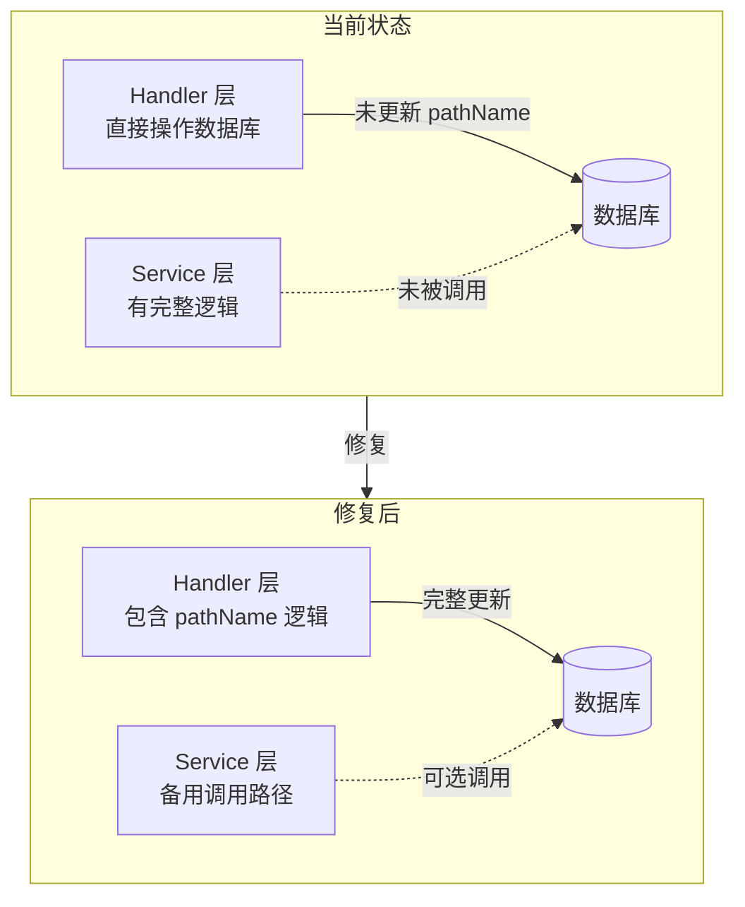

# pathName 字段一致性保障方案

## 概述

pathName 字段是 AITDD 系统中用于唯一标识资源的路径名称，其格式设计如下：
- **项目**: `{projectName}` (例如: `PYQT6Calculator`)
- **模块**: `{projectPathName}/{moduleName}` (例如: `PYQT6Calculator/主界面模块`)
- **任务**: `{modulePathName}/{taskName}` (例如: `PYQT6Calculator/主界面模块/主窗口框架`)

本文档分析当前系统对 pathName 一致性的处理情况，并提出改进方案。

---

## 一、现状分析

### 场景 1：父对象 name 更改时

#### 1.1 项目名称变更 → 模块和任务 pathName 更新

| 层级 | 文件 | 状态 | 说明 |
|------|------|------|------|
| Handler | [`project.go:UpdateProject()`](backend/internal/api/handlers/project.go:167) | ✅ 已处理 | 名称变更时调用 `cascadeUpdateProjectPathName()` |
| Handler | [`project.go:cascadeUpdateProjectPathName()`](backend/internal/api/handlers/project.go:236) | ✅ 已处理 | 级联更新模块 pathName |
| Handler | [`project.go:cascadeUpdateModulePathName()`](backend/internal/api/handlers/project.go:261) | ✅ 已处理 | 级联更新任务 pathName |

**结论**: 项目名称变更的级联更新**已完整实现**。

#### 1.2 模块名称变更 → 任务 pathName 更新

| 层级 | 文件 | 状态 | 说明 |
|------|------|------|------|
| Handler | [`module.go:UpdateModule()`](backend/internal/api/handlers/module.go:125) | ❌ 未处理 | 直接更新 name，未同步 pathName |
| Handler | [`module.go:UpdateModuleByPathName()`](backend/internal/api/handlers/module.go:537) | ❌ 未处理 | 同上 |
| Service | [`module_service.go:UpdateModule()`](backend/internal/services/module_service.go:103) | ✅ 已处理 | 名称变更时更新 pathName 并级联更新任务 |
| Service | [`module_service.go:cascadeUpdateModulePathName()`](backend/internal/services/module_service.go:162) | ✅ 已处理 | 异步级联更新任务 pathName |

**问题**: Handler 层和 Service 层存在**逻辑不一致**。Handler 层直接操作数据库，绕过了 Service 层的 pathName 更新逻辑。

---

### 场景 2：当前对象 name 变化时

#### 2.1 模块 name 变化 → 模块 pathName 更新

| 层级 | 文件 | 状态 | 说明 |
|------|------|------|------|
| Handler | [`module.go:UpdateModule()`](backend/internal/api/handlers/module.go:125) | ❌ 未处理 | 只更新 name，不更新 pathName |
| Service | [`module_service.go:UpdateModule()`](backend/internal/services/module_service.go:103) | ✅ 已处理 | 检测 name 变化并更新 pathName |

**问题**: Handler 层未实现 pathName 同步更新。

#### 2.2 任务 name 变化 → 任务 pathName 更新

| 层级 | 文件 | 状态 | 说明 |
|------|------|------|------|
| Handler | [`task.go:UpdateTask()`](backend/internal/api/handlers/task.go:148) | ❌ 未处理 | 只更新 name，不更新 pathName |
| Handler | [`task.go:UpdateTaskByPathName()`](backend/internal/api/handlers/task.go:435) | ❌ 未处理 | 同上 |
| Service | [`task_service.go:UpdateTask()`](backend/internal/services/task_service.go:106) | ✅ 已处理 | 检测 name 变化并更新 pathName |

**问题**: Handler 层未实现 pathName 同步更新。

---

### 场景 3：Task 移动到别的模块时

| 层级 | 文件 | 状态 | 说明 |
|------|------|------|------|
| Handler | [`task.go:UpdateTask()`](backend/internal/api/handlers/task.go:148) | ❌ 未处理 | 可更新 moduleId，但不更新 pathName |
| Service | [`task_service.go:UpdateTask()`](backend/internal/services/task_service.go:106) | ❌ 未处理 | 只处理 name 变化，未处理 moduleId 变化 |

**问题**: **完全未实现**任务移动时的 pathName 更新逻辑。

---

### 场景 4：数据导入导出时

#### 4.1 数据导入

| 组件 | 文件 | 状态 | 说明 |
|------|------|------|------|
| 导入脚本 | [`import-aitdd-data.js`](scripts/import-aitdd-data.js) | ✅ 依赖API | 通过 API 创建数据，pathName 由后端生成 |

**结论**: 导入脚本依赖后端 API 的 pathName 生成逻辑，**无需额外处理**。

#### 4.2 数据导出

| 组件 | 状态 | 说明 |
|------|------|------|
| 导出功能 | ⚠️ 未发现 | 系统暂无专门的导出功能 |

---

### 场景 5：项目名称更改时

与场景 1.1 相同，**已完整实现**。

---

## 二、问题清单

### 高优先级问题

| 编号 | 问题 | 影响范围 | 风险等级 |
|------|------|----------|----------|
| P1 | Handler 层 UpdateModule 未同步更新 pathName | 模块名称变更 | 🔴 高 |
| P2 | Handler 层 UpdateTask 未同步更新 pathName | 任务名称变更 | 🔴 高 |
| P3 | 任务移动到其他模块时 pathName 未更新 | 任务模块迁移 | 🔴 高 |

### 中优先级问题

| 编号 | 问题 | 影响范围 | 风险等级 |
|------|------|----------|----------|
| M1 | Handler 层与 Service 层逻辑不一致 | 代码维护 | 🟡 中 |
| M2 | 缺少 pathName 唯一性校验的统一处理 | 数据完整性 | 🟡 中 |

### 低优先级问题

| 编号 | 问题 | 影响范围 | 风险等级 |
|------|------|----------|----------|
| L1 | 缺少数据导出时的 pathName 完整性保障 | 数据备份 | 🟢 低 |

---

## 三、解决方案

### 方案 A：统一到 Handler 层处理（推荐）

**原则**: 最少改动，保持现有架构

#### A1. 修复 module.go 的 UpdateModule 函数

```go
// 在 UpdateModule 函数中添加 pathName 更新逻辑
func UpdateModule(c *gin.Context) {
    // ... 现有代码 ...
    
    nameChanged := false
    if req.Name != nil && *req.Name != module.Name {
        module.Name = *req.Name
        
        // 获取项目信息以生成新的 pathName
        var project models.Project
        if err := database.DB.First(&project, "id = ?", module.ProjectID).Error; err == nil {
            basePathName := fmt.Sprintf("%s/%s", project.PathName, *req.Name)
            pathName := basePathName
            suffix := 1
            for {
                var count int64
                database.DB.Model(&models.Module{}).Where("path_name = ? AND id != ?", pathName, module.ID).Count(&count)
                if count == 0 {
                    break
                }
                pathName = fmt.Sprintf("%s-%d", basePathName, suffix)
                suffix++
            }
            module.PathName = pathName
            nameChanged = true
        }
    }
    
    // ... 保存 module ...
    
    // 如果名称改变，级联更新任务的 pathName
    if nameChanged {
        go cascadeUpdateModulePathName(module.ID, module.PathName)
    }
}
```

#### A2. 修复 task.go 的 UpdateTask 函数

```go
// 在 UpdateTask 函数中添加 pathName 更新逻辑
func UpdateTask(c *gin.Context) {
    // ... 现有代码 ...
    
    // 处理 name 变化
    if req.Name != nil && *req.Name != task.Name {
        task.Name = *req.Name
        // 重新生成 pathName
        var module models.Module
        if err := database.DB.First(&module, "id = ?", task.ModuleID).Error; err == nil {
            basePathName := fmt.Sprintf("%s/%s", module.PathName, *req.Name)
            pathName := basePathName
            suffix := 1
            for {
                var count int64
                database.DB.Model(&models.Task{}).Where("path_name = ? AND id != ?", pathName, task.ID).Count(&count)
                if count == 0 {
                    break
                }
                pathName = fmt.Sprintf("%s-%d", basePathName, suffix)
                suffix++
            }
            task.PathName = pathName
        }
    }
    
    // 处理 moduleId 变化（任务移动）
    if req.ModuleID != nil && *req.ModuleID != task.ModuleID {
        task.ModuleID = *req.ModuleID
        // 重新生成 pathName
        var module models.Module
        if err := database.DB.First(&module, "id = ?", *req.ModuleID).Error; err == nil {
            basePathName := fmt.Sprintf("%s/%s", module.PathName, task.Name)
            pathName := basePathName
            suffix := 1
            for {
                var count int64
                database.DB.Model(&models.Task{}).Where("path_name = ? AND id != ?", pathName, task.ID).Count(&count)
                if count == 0 {
                    break
                }
                pathName = fmt.Sprintf("%s-%d", basePathName, suffix)
                suffix++
            }
            task.PathName = pathName
        }
    }
    
    // ... 保存 task ...
}
```

#### A3. 同步修复 UpdateModuleByPathName 和 UpdateTaskByPathName

这两个函数需要与 UpdateModule 和 UpdateTask 保持一致的逻辑。

---

### 方案 B：Handler 层调用 Service 层（备选）

**原则**: 统一业务逻辑到 Service 层

修改 Handler 层，使其调用 Service 层的方法而非直接操作数据库。

**优点**:
- 业务逻辑集中管理
- 代码复用性更好

**缺点**:
- 改动较大
- 需要修改多个 Handler 函数的调用方式

---

### 方案 C：使用数据库触发器（不推荐）

**原则**: 在数据库层面保障一致性

**缺点**:
- 增加数据库依赖
- 难以调试和维护
- 与应用层逻辑分离

---

## 四、实施计划

### 阶段 1：紧急修复（P1-P3）

| 步骤 | 任务 | 涉及文件 | 优先级 |
|------|------|----------|--------|
| 1.1 | 修复 UpdateModule 的 pathName 更新 | `handlers/module.go` | P1 |
| 1.2 | 修复 UpdateModuleByPathName 的 pathName 更新 | `handlers/module.go` | P1 |
| 1.3 | 修复 UpdateTask 的 pathName 更新 | `handlers/task.go` | P2 |
| 1.4 | 修复 UpdateTaskByPathName 的 pathName 更新 | `handlers/task.go` | P2 |
| 1.5 | 添加任务移动时的 pathName 更新 | `handlers/task.go` | P3 |

### 阶段 2：代码重构（M1-M2）

| 步骤 | 任务 | 涉及文件 | 优先级 |
|------|------|----------|--------|
| 2.1 | 提取公共的 pathName 生成函数 | 新建 `services/pathname_service.go` | M1 |
| 2.2 | 统一 Handler 层和 Service 层的调用 | `handlers/*.go` | M1 |
| 2.3 | 添加 pathName 唯一性校验 | `services/pathname_service.go` | M2 |

### 阶段 3：增强功能（L1）

| 步骤 | 任务 | 涉及文件 | 优先级 |
|------|------|----------|--------|
| 3.1 | 实现数据导出功能 | 新建 `scripts/export-aitdd-data.js` | L1 |
| 3.2 | 添加 pathName 完整性校验脚本 | 新建 `scripts/verify-pathname.js` | L1 |

---

## 五、测试用例

### 测试用例 1：项目名称变更级联更新

**前置条件**:
- 存在项目 P1，pathName = `P1`
- 存在模块 M1，pathName = `P1/M1`
- 存在任务 T1，pathName = `P1/M1/T1`

**操作**: 将项目 P1 的 name 更改为 `P1-New`

**预期结果**:
- 项目 pathName = `P1-New`
- 模块 M1 pathName = `P1-New/M1`
- 任务 T1 pathName = `P1-New/M1/T1`

### 测试用例 2：模块名称变更级联更新

**前置条件**:
- 存在模块 M1，pathName = `P1/M1`
- 存在任务 T1，pathName = `P1/M1/T1`

**操作**: 将模块 M1 的 name 更改为 `M1-New`

**预期结果**:
- 模块 M1 pathName = `P1/M1-New`
- 任务 T1 pathName = `P1/M1-New/T1`

### 测试用例 3：任务名称变更

**前置条件**:
- 存在任务 T1，pathName = `P1/M1/T1`

**操作**: 将任务 T1 的 name 更改为 `T1-New`

**预期结果**:
- 任务 T1 pathName = `P1/M1/T1-New`

### 测试用例 4：任务移动到其他模块

**前置条件**:
- 存在模块 M1，pathName = `P1/M1`
- 存在模块 M2，pathName = `P1/M2`
- 存在任务 T1，moduleId = M1.ID，pathName = `P1/M1/T1`

**操作**: 将任务 T1 的 moduleId 更改为 M2.ID

**预期结果**:
- 任务 T1 pathName = `P1/M2/T1`

### 测试用例 5：pathName 唯一性保障

**前置条件**:
- 存在模块 M1，pathName = `P1/M1`

**操作**: 创建新模块，name = `M1`

**预期结果**:
- 新模块 pathName = `P1/M1-1`（自动添加后缀）

### 测试用例 6：数据导入后 pathName 一致性

**前置条件**:
- 准备包含项目、模块、任务的 JSON 数据文件

**操作**: 使用 `import-aitdd-data.js` 导入数据

**预期结果**:
- 所有资源的 pathName 格式正确
- pathName 与层级关系一致

---

## 六、架构图



---

## 七、风险评估

| 风险 | 可能性 | 影响 | 缓解措施 |
|------|--------|------|----------|
| 修复过程中引入新 bug | 中 | 高 | 完整的单元测试和集成测试 |
| 现有数据 pathName 不一致 | 低 | 中 | 提供数据修复脚本 |
| 并发更新导致 pathName 冲突 | 低 | 中 | 使用数据库事务 |

---

## 八、附录：关键代码位置

### Handler 层

| 文件 | 函数 | 行号 | 说明 |
|------|------|------|------|
| `backend/internal/api/handlers/project.go` | `UpdateProject` | 167-234 | ✅ 已实现级联更新 |
| `backend/internal/api/handlers/project.go` | `cascadeUpdateProjectPathName` | 236-259 | 级联更新模块 |
| `backend/internal/api/handlers/project.go` | `cascadeUpdateModulePathName` | 261-281 | 级联更新任务 |
| `backend/internal/api/handlers/module.go` | `UpdateModule` | 125-190 | ❌ 需要修复 |
| `backend/internal/api/handlers/module.go` | `UpdateModuleByPathName` | 537-602 | ❌ 需要修复 |
| `backend/internal/api/handlers/task.go` | `UpdateTask` | 148-241 | ❌ 需要修复 |
| `backend/internal/api/handlers/task.go` | `UpdateTaskByPathName` | 435-528 | ❌ 需要修复 |

### Service 层

| 文件 | 函数 | 行号 | 说明 |
|------|------|------|------|
| `backend/internal/services/module_service.go` | `UpdateModule` | 103-160 | ✅ 已实现 |
| `backend/internal/services/module_service.go` | `cascadeUpdateModulePathName` | 162-182 | ✅ 已实现 |
| `backend/internal/services/task_service.go` | `UpdateTask` | 106-155 | ⚠️ 需增加 moduleId 变化处理 |

---

## 九、总结

当前系统对 pathName 一致性的处理存在以下问题：

1. **Handler 层与 Service 层逻辑不一致**：Service 层已实现完整的 pathName 更新逻辑，但 Handler 层直接操作数据库时绕过了这些逻辑。

2. **任务移动场景完全未处理**：当任务从一个模块移动到另一个模块时，pathName 不会自动更新。

3. **建议采用方案 A**：在 Handler 层添加 pathName 更新逻辑，这是最少改动的方案，能快速解决当前问题。

建议按照实施计划的阶段 1 先完成紧急修复，然后根据需要进行代码重构。
