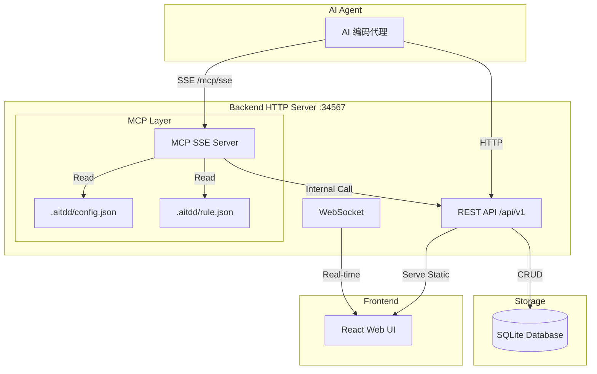

# AITDD 项目路线图

**生成日期**: 2026-03-04  
**版本**: 1.0.0

---

## 一、项目概述

### 1.1 项目简介

AITDD（AI-Driven Test-Driven Development）是一个**AI辅助可视化任务治理系统**，通过 MCP（Model Context Protocol）接口供第三方 AI 编程软件调用，提供本地 SQLite 数据库存储和 React 前端可视化界面。

### 1.2 核心价值

- **AI 驱动开发**: 通过 MCP 协议与 AI 编码代理（Claude、Cursor、KiloCode 等）无缝集成
- **可视化任务管理**: React Flow 提供的图形化界面展示模块和任务依赖关系
- **契约驱动**: 基于上下游契约的任务依赖管理
- **测试驱动**: 内置测试用例管理和测试结果追踪

### 1.3 系统架构



---

## 二、技术栈总结

### 2.1 后端技术栈

| 技术 | 版本 | 用途 |
|------|------|------|
| Go | 1.21+ | 主要编程语言 |
| Gin | 1.9+ | HTTP Web 框架 |
| GORM | 1.25+ | ORM 数据库操作 |
| SQLite | 3.x | 嵌入式数据库 |
| Cobra | 1.8+ | CLI 命令行框架 |
| mcp-go | 0.x | MCP 协议实现库 |

### 2.2 前端技术栈

| 技术 | 版本 | 用途 |
|------|------|------|
| React | 18.2+ | UI 框架 |
| TypeScript | 5.3+ | 类型安全 |
| Vite | 5.0+ | 构建工具 |
| Ant Design | 5.12+ | UI 组件库 |
| TailwindCSS | 3.4+ | CSS 框架 |
| React Flow | 11.11+ | 图形化流程图 |
| Zustand | 4.4+ | 状态管理 |
| React Query | 5.17+ | 数据请求缓存 |

### 2.3 MCP 工具分类

| 类别 | 工具数量 | 主要功能 |
|------|---------|---------|
| 项目上下文 | 2 | init_project, get_context |
| 信息查询 | 3 | query_module, query_task, query_project_index_tree |
| 验证检查 | 3 | check_dependencies, check_contract_alignment, check_task_readiness |
| 节点操作 | 3 | create_module/task/project, modify_module/task, delete_node |
| 依赖管理 | 3 | create_dependency, delete_dependency, query_dependencies |
| 问答系统 | 4 | create_issue, reply_issue, resolve_issue, query_issues |
| 锁管理 | 2 | acquire_lock, release_lock |
| 编译接口 | 2 | compile_static, compile_dynamic |
| 配置规则 | 4 | get/update_config, get/update_rule |
| 状态管理 | 1 | get_status |

---

## 三、当前状态分析

### 3.1 已完成功能

#### 后端功能

| 功能模块 | 状态 | 说明 |
|---------|------|------|
| REST API | ✅ 完成 | 完整的 CRUD API |
| MCP SSE 服务器 | ✅ 完成 | 27 个 MCP 工具 |
| 项目管理 | ✅ 完成 | 多项目支持 |
| 模块管理 | ✅ 完成 | 层级模块结构 |
| 任务管理 | ✅ 完成 | 任务状态流转 |
| 依赖管理 | ✅ 完成 | 模块/任务依赖 |
| 锁定机制 | ✅ 完成 | 资源锁定/解锁 |
| 问题追踪 | ✅ 完成 | Issue 系统 |
| 编译检查 | ✅ 完成 | 静态/动态编译 |
| 变更历史 | ✅ 完成 | Prompt 版本管理 |
| WebSocket | ✅ 完成 | 实时通知 |

#### 前端功能

| 功能模块 | 状态 | 说明 |
|---------|------|------|
| 仪表板 | ✅ 完成 | 项目统计概览 |
| 模块树视图 | ✅ 完成 | 层级树展示 |
| 模块图形视图 | ✅ 完成 | React Flow 图形化 |
| 任务详情 | ✅ 完成 | 任务编辑表单 |
| 契约编辑器 | ✅ 完成 | 上游/下游契约 |
| 依赖列表 | ✅ 完成 | 依赖关系展示 |
| 锁定状态 | ✅ 完成 | 锁定按钮/状态 |
| 通知系统 | ✅ 完成 | 通知下拉列表 |

### 3.2 代码统计

```
后端代码:
- Go 文件: 50+ 个
- 代码行数: 约 15,000+ 行
- 测试文件: 8+ 个

前端代码:
- TypeScript 文件: 40+ 个
- 代码行数: 约 12,000+ 行
- 组件数: 30+ 个
```

### 3.3 数据库模型

| 模型 | 表名 | 主要字段 |
|------|------|---------|
| Project | projects | id, name, pathName, constitution |
| Module | modules | id, projectId, name, pathName, status, prompt |
| Task | tasks | id, moduleId, name, pathName, status, prompt, tests |
| ModuleDependency | module_dependencies | 上游/下游模块关系 |
| TaskDependency | task_dependencies | 上游/下游任务关系 |
| Issue | issues | 问题追踪 |
| Notification | notifications | 通知消息 |
| PromptVersion | prompt_versions | Prompt 版本历史 |
| ChangeHistory | change_histories | 变更记录 |

---

## 四、待开发功能列表

### 4.1 高优先级

| 功能 | 描述 | 影响范围 |
|------|------|---------|
| 静态编译增强 | 优化静态编译输出格式，增加更多检查项 | MCP 工具 |
| 契约对齐检查优化 | 增强上下游契约对比算法 | MCP 工具 |
| 批量操作性能 | 优化大批量创建/修改操作性能 | 后端 API |
| 前端错误边界 | 添加 React Error Boundary 处理 | 前端 UI |

### 4.2 中优先级

| 功能 | 描述 | 影响范围 |
|------|------|---------|
| 模块位置持久化 | 图形视图中模块位置的自动保存 | 前端 + 后端 |
| 路径名一致性 | 确保 pathName 在重命名时保持一致 | 后端 API |
| 测试覆盖率计算 | 基于测试用例自动计算覆盖率 | 后端服务 |
| 导入导出功能 | 项目数据的 JSON 导入导出 | 后端 API |

### 4.3 低优先级

| 功能 | 描述 | 影响范围 |
|------|------|---------|
| 多语言支持 | 前端国际化 i18n | 前端 UI |
| 暗色主题 | 支持暗色模式切换 | 前端 UI |
| 移动端适配 | 响应式布局优化 | 前端 UI |
| 性能监控 | 添加性能指标收集 | 后端服务 |

---

## 五、开发计划

### 5.1 阶段一：稳定性增强

**目标**: 提升系统稳定性和可靠性

- [ ] 完善单元测试覆盖
- [ ] 添加集成测试
- [ ] 优化错误处理
- [ ] 增强日志记录

### 5.2 阶段二：功能完善

**目标**: 完善核心功能

- [ ] 静态编译输出格式优化
- [ ] 契约检查算法增强
- [ ] 批量操作性能优化
- [ ] 模块位置持久化

### 5.3 阶段三：用户体验

**目标**: 提升用户体验

- [ ] 前端性能优化
- [ ] UI/UX 改进
- [ ] 键盘快捷键支持
- [ ] 操作撤销/重做

### 5.4 阶段四：扩展性

**目标**: 增强系统扩展性

- [ ] 插件系统设计
- [ ] API 扩展机制
- [ ] 自定义规则引擎
- [ ] 第三方集成接口

---

## 六、潜在风险和改进建议

### 6.1 技术风险

| 风险 | 影响 | 缓解措施 |
|------|------|---------|
| SQLite 并发限制 | 高并发场景性能下降 | 考虑 PostgreSQL 支持 |
| MCP 协议变更 | AI Agent 兼容性 | 版本控制 + 向后兼容 |
| 前端包体积 | 加载性能 | 代码分割 + 懒加载 |

### 6.2 改进建议

#### 后端改进

1. **添加 API 限流**: 防止滥用和资源耗尽
2. **数据库迁移工具**: 自动化数据库版本管理
3. **缓存层**: 添加 Redis 支持提升查询性能
4. **API 文档**: 集成 Swagger/OpenAPI 文档

#### 前端改进

1. **状态管理优化**: 减少 Zustand store 数量
2. **组件库抽象**: 提取通用业务组件
3. **E2E 测试**: 添加 Playwright/Cypress 测试
4. **性能监控**: 集成 Web Vitals 监控

#### MCP 改进

1. **工具分类**: 考虑将 27 个工具进一步分组
2. **错误码规范**: 定义统一的错误码体系
3. **批量操作**: 增加更多批量操作接口
4. **缓存策略**: 优化频繁查询的缓存

### 6.3 文档完善

| 文档类型 | 当前状态 | 改进建议 |
|---------|---------|---------|
| API 文档 | 基础 | 添加更多示例 |
| MCP 工具文档 | 完善 | 添加使用场景 |
| 开发指南 | 基础 | 添加架构说明 |
| 部署文档 | 缺失 | 添加生产部署指南 |

---

## 七、附录

### 7.1 相关文档索引

| 文档 | 路径 | 说明 |
|------|------|------|
| MCP 设计文档 | [plans/mcp-design.md](mcp-design.md) | MCP 完整实现方案 |
| MCP 使用指南 | [docs/mcp-guide.md](../docs/mcp-guide.md) | MCP 配置和使用 |
| 数据库模型 | [docs/database-models.md](../docs/database-models.md) | 数据模型定义 |
| 静态编译修复 | [plans/static-compile-fix-plan.md](static-compile-fix-plan.md) | 编译检查修复 |
| 契约检查修复 | [plans/contract-check-fix-plan.md](contract-check-fix-plan.md) | 契约对齐修复 |

### 7.2 关键文件路径

```
backend/
├── cmd/aitdd/main.go          # 程序入口
├── internal/
│   ├── api/routes.go          # API 路由定义
│   ├── mcp/server.go          # MCP 服务器
│   ├── mcp/tools_get.go       # 查询工具
│   ├── mcp/tools_modify.go    # 修改工具
│   ├── mcp/tools_other.go     # 其他工具
│   ├── models/                # 数据模型
│   └── services/              # 业务服务

frontend/
├── src/App.tsx                # 应用入口
├── src/features/              # 功能模块
│   ├── dashboard/             # 仪表板
│   ├── modules/               # 模块管理
│   └── tasks/                 # 任务管理
└── src/stores/                # 状态管理
```

### 7.3 版本历史

| 版本 | 日期 | 主要变更 |
|------|------|---------|
| 1.0.0 | 2026-03-04 | 初始路线图发布 |

---

**维护者**: AITDD 开发团队  
**最后更新**: 2026-03-04
