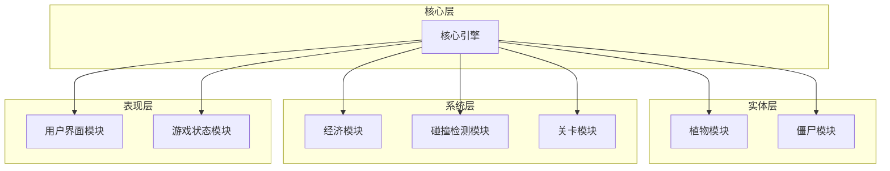
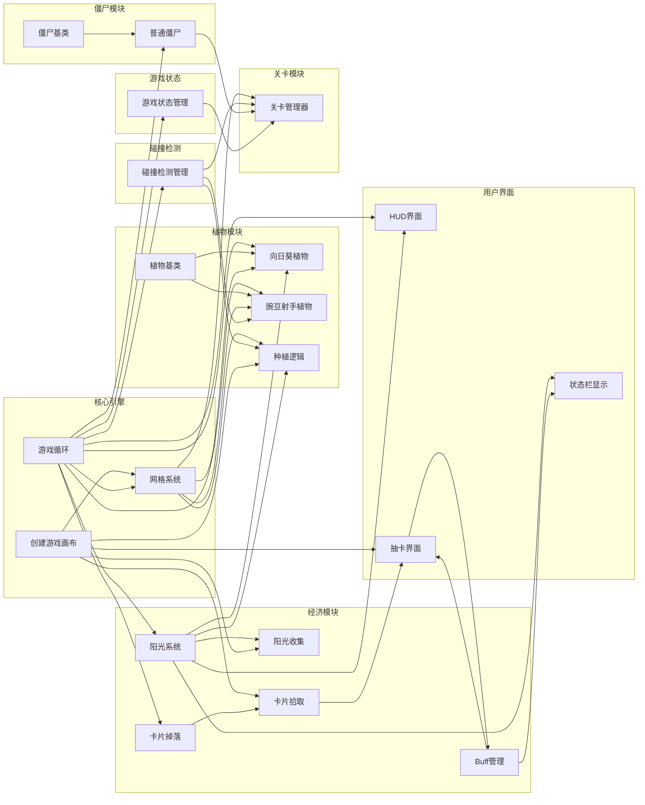

# 植物大战僵尸Web游戏项目规划分析报告

## 📊 项目概览

| 属性 | 值 |
|------|-----|
| 项目名称 | Plants vs Zombies Web Game |
| 项目ID | 5111d718-86b9-4bca-bd84-1677a5094ee3 |
| 模块数量 | 8个 |
| 任务数量 | 20个 |
| 所有任务状态 | ready（待开发） |

---

## 🏗️ 模块架构分析

### 模块分布图

### 模块详情

| 模块名称 | 描述 | 任务数 | 状态 |
|----------|------|--------|------|
| 核心引擎 | 游戏循环、画布管理、网格系统等基础功能 | 3 | designing |
| 植物模块 | 所有植物类及其逻辑 | 4 | designing |
| 僵尸模块 | 所有僵尸类及其逻辑 | 2 | designing |
| 经济模块 | 阳光计数、卡片掉落、背包管理、Buff效果 | 5 | designing |
| 碰撞检测模块 | 豌豆与僵尸、僵尸与植物的碰撞 | 1 | designing |
| 关卡模块 | 关卡数据、僵尸波次生成 | 1 | designing |
| 用户界面模块 | HUD、菜单、抽卡界面、状态栏 | 3 | designing |
| 游戏状态模块 | 游戏进行中、胜利、失败状态 | 1 | designing |

---

## 📋 任务清单与依赖关系

### 1. 核心引擎模块 (3个任务)

| 任务名称 | 描述 | 上游依赖 | 下游契约 |
|----------|------|----------|----------|
| 创建游戏画布 | 创建Canvas元素，提供上下文和尺寸方法 | 无 | getCanvas, getContext, getWidth, getHeight, clear |
| 游戏循环 | 基于requestAnimationFrame的游戏循环 | 无 | registerUpdate, registerRender, start, stop |
| 网格系统 | 画布网格划分，行列转换 | task-canvas | getCellAt, getCellBounds, getRows, getCols, getCellCenter |

### 2. 植物模块 (4个任务)

| 任务名称 | 描述 | 上游依赖 | 下游契约 |
|----------|------|----------|----------|
| 植物基类 | 所有植物的基类 | 无 | constructor, takeDamage, update, render, getRow/getCol |
| 向日葵植物 | 定期产生阳光 | task-plant-base, task-sun, task-game-loop, task-grid | constructor |
| 豌豆射手植物 | 定期发射豌豆攻击僵尸 | task-plant-base, task-collision, task-game-loop, task-grid | constructor |
| 种植逻辑 | 点击网格种植植物 | task-grid, task-sun, task-collision, task-canvas, task-sunflower, task-peashooter | registerPlantType |

### 3. 僵尸模块 (2个任务)

| 任务名称 | 描述 | 上游依赖 | 下游契约 |
|----------|------|----------|----------|
| 僵尸基类 | 所有僵尸的基类 | 无 | constructor, takeDamage, update, render, getRow/getCol |
| 普通僵尸 | 继承ZombieBase | task-zombie-base, task-game-loop | constructor |

### 4. 经济模块 (5个任务)

| 任务名称 | 描述 | 上游依赖 | 下游契约 |
|----------|------|----------|----------|
| 阳光系统 | 阳光对象、生成和收集逻辑 | task-game-loop | addSun, tryCollectSun, getSunCount, addSunCount, spendSun |
| 阳光收集 | 点击收集阳光 | task-sun, task-canvas | 无 |
| 卡片掉落 | 怪物死亡后掉落卡片 | task-game-loop, task-monster | getDroppedCards, removeCard, tryPickupCard |
| 卡片拾取 | 拾取掉落卡片到背包 | task-card-drop, task-canvas | getCardInventory, useCard, getCardCount |
| Buff管理 | Buff系统管理 | task-gacha-ui | getActiveBuffs, onBuffChange, calculateDamageBonus, calculateAttackSpeedBonus |

### 5. 碰撞检测模块 (1个任务)

| 任务名称 | 描述 | 上游依赖 | 下游契约 |
|----------|------|----------|----------|
| 碰撞检测管理 | 豌豆、僵尸、植物的碰撞 | task-game-loop | addPea, addZombie, addPlant, removePlant, getZombies, getPlants, update |

### 6. 关卡模块 (1个任务)

| 任务名称 | 描述 | 上游依赖 | 下游契约 |
|----------|------|----------|----------|
| 关卡管理器 | 关卡数据，僵尸波次生成 | task-game-loop, task-collision, task-normal-zombie, task-game-state, task-grid | startLevel, getWaveInfo |

### 7. 用户界面模块 (3个任务)

| 任务名称 | 描述 | 上游依赖 | 下游契约 |
|----------|------|----------|----------|
| HUD界面 | 显示阳光、波次、游戏状态 | task-game-loop, task-sun, task-level-manager, task-game-state | render |
| 抽卡界面 | 三选一抽卡界面 | task-card-pickup, task-canvas, task-buff-manager | getSelectedBuff, onGachaClose |
| 状态栏显示 | 窗口状态栏显示 | task-sun, task-card-pickup, task-buff-manager | updateStatus, showNotification |

### 8. 游戏状态模块 (1个任务)

| 任务名称 | 描述 | 上游依赖 | 下游契约 |
|----------|------|----------|----------|
| 游戏状态管理 | 游戏整体状态管理 | task-game-loop | setState, getState |

---

## 🔗 任务依赖关系图

---

## 📈 开发优先级建议

### 第一阶段：基础设施 (优先级最高)

这些任务是整个游戏的基础，必须首先完成：

1. **创建游戏画布** - 无依赖，可立即开始
2. **游戏循环** - 无依赖，可立即开始
3. **植物基类** - 无依赖，可立即开始
4. **僵尸基类** - 无依赖，可立即开始

### 第二阶段：核心系统

依赖第一阶段完成的任务：

1. **网格系统** - 依赖：创建游戏画布
2. **阳光系统** - 依赖：游戏循环
3. **碰撞检测管理** - 依赖：游戏循环

### 第三阶段：游戏实体

依赖第二阶段完成的任务：

1. **向日葵植物** - 依赖：植物基类、阳光系统、网格系统、游戏循环
2. **豌豆射手植物** - 依赖：植物基类、碰撞检测管理、网格系统、游戏循环
3. **普通僵尸** - 依赖：僵尸基类、游戏循环

### 第四阶段：游戏逻辑

1. **种植逻辑** - 依赖：网格系统、阳光系统、碰撞检测管理、向日葵、豌豆射手
2. **阳光收集** - 依赖：阳光系统、创建游戏画布
3. **关卡管理器** - 依赖：游戏循环、碰撞检测管理、普通僵尸、游戏状态管理、网格系统
4. **游戏状态管理** - 依赖：游戏循环

### 第五阶段：经济扩展

1. **卡片掉落** - 依赖：游戏循环
2. **卡片拾取** - 依赖：卡片掉落、创建游戏画布
3. **抽卡界面** - 依赖：卡片拾取、创建游戏画布、Buff管理
4. **Buff管理** - 依赖：抽卡界面

### 第六阶段：用户界面

1. **HUD界面** - 依赖：游戏循环、阳光系统、关卡管理器、游戏状态管理
2. **状态栏显示** - 依赖：阳光系统、卡片拾取、Buff管理

---

## ✅ 已修复的问题

### 1. 循环依赖问题（已修复）

**原问题**：Buff管理 和 抽卡界面 存在循环依赖
- Buff管理 依赖 抽卡界面的 getSelectedBuff 和 onGachaClose
- 抽卡界面 依赖 Buff管理的 getAvailableBuffs

**修复方案**：
- Buff管理 现在无上游依赖，提供 `getAvailableBuffs()` 和 `addBuff()` 接口
- 抽卡界面 依赖 Buff管理，选择Buff后直接调用 `addBuff()` 添加
- 依赖关系变为单向：Buff管理 → 抽卡界面

### 2. 缺失的任务接口（已修复）

| 原缺失功能 | 修复方案 |
|----------|----------|
| 怪物死亡事件 | 在碰撞检测管理任务中添加 `onZombieDeath(callback)` 接口 |
| getAvailableBuffs | 在Buff管理任务中添加 `getAvailableBuffs()` 接口 |
| task-monster引用 | 卡片掉落任务改为依赖 task-collision 的 `onZombieDeath` 事件 |

### 3. 修复后的任务变更

| 任务名称 | 变更类型 | 主要变更 |
|----------|----------|----------|
| Buff管理 | 重新创建 | 添加 `getAvailableBuffs()` 接口，移除上游依赖 |
| 抽卡界面 | 重新创建 | 改为调用 `addBuff()` 添加选中的Buff |
| 碰撞检测管理 | 重新创建 | 添加 `onZombieDeath()` 事件接口 |
| 卡片掉落 | 重新创建 | 依赖改为 task-collision 的死亡事件 |

---

## ⚠️ 待改进项

### 1. 模块依赖未定义

当前系统显示模块间没有定义依赖关系，但实际上任务之间存在跨模块依赖。建议：

- 在模块级别明确定义依赖关系
- 便于理解模块间的耦合程度

### 2. 测试覆盖率为0

所有模块的测试覆盖率均为0%，建议：

- 为每个任务添加单元测试用例
- 在prompt中明确测试要求

---

## 📊 统计摘要

### 任务状态分布

| 状态 | 数量 | 百分比 |
|------|------|--------|
| ready | 20 | 100% |
| in_progress | 0 | 0% |
| completed | 0 | 0% |
| blocked | 0 | 0% |

### 模块任务分布

### 依赖深度分析

| 层级 | 任务 |
|------|------|
| 0层（无依赖） | 创建游戏画布、游戏循环、植物基类、僵尸基类 |
| 1层 | 网格系统、阳光系统、碰撞检测管理、游戏状态管理、卡片掉落 |
| 2层 | 向日葵植物、普通僵尸、阳光收集、关卡管理器 |
| 3层 | 豌豆射手植物、卡片拾取、HUD界面 |
| 4层 | 种植逻辑、抽卡界面 |
| 5层 | Buff管理、状态栏显示 |

---

## 🎯 下一步行动建议

1. **立即开始**：无依赖的4个基础任务可以并行开发
2. **解决循环依赖**：重构Buff管理和抽卡界面的依赖关系
3. **补充缺失任务**：添加怪物死亡事件处理
4. **定义模块依赖**：在模块级别明确依赖关系
5. **添加测试用例**：为每个任务定义测试场景

---

*报告生成时间：2026-02-27 02:36 CST*
*项目：Plants vs Zombies Web Game*
