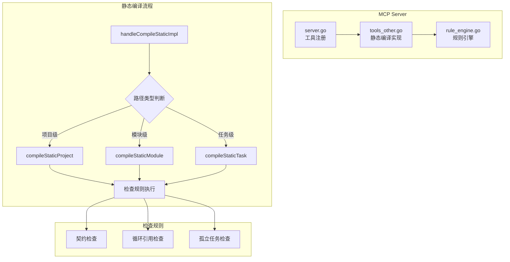
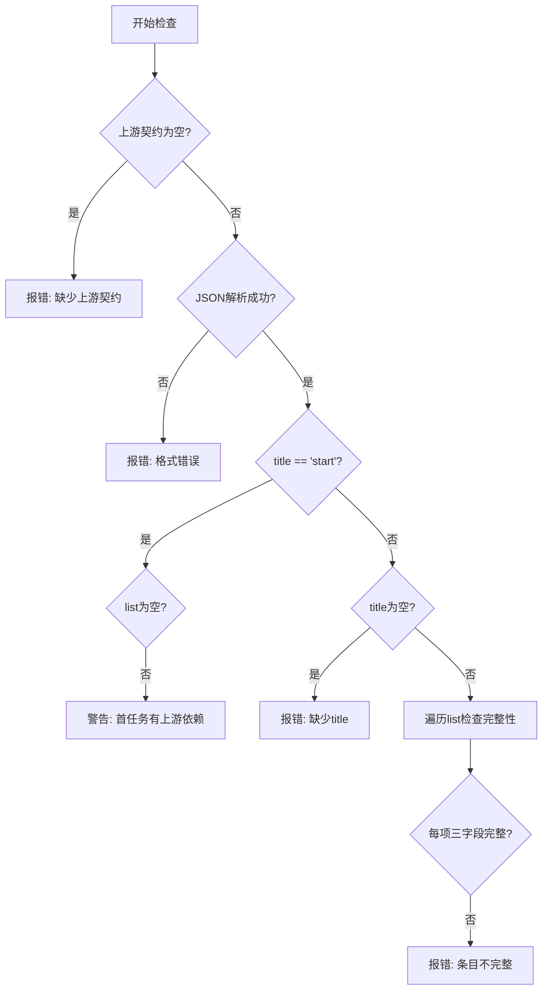
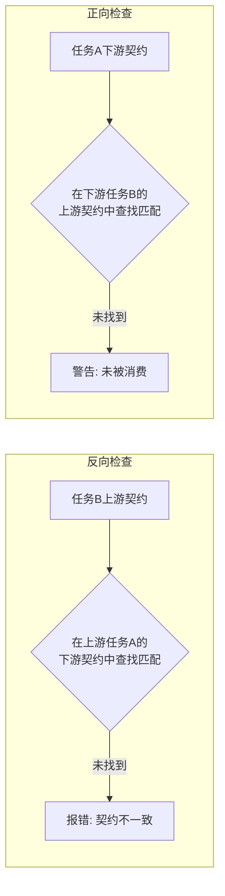
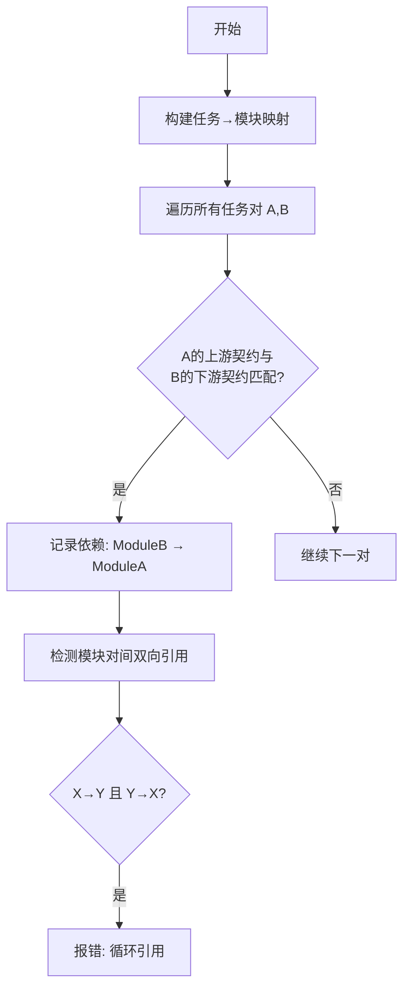
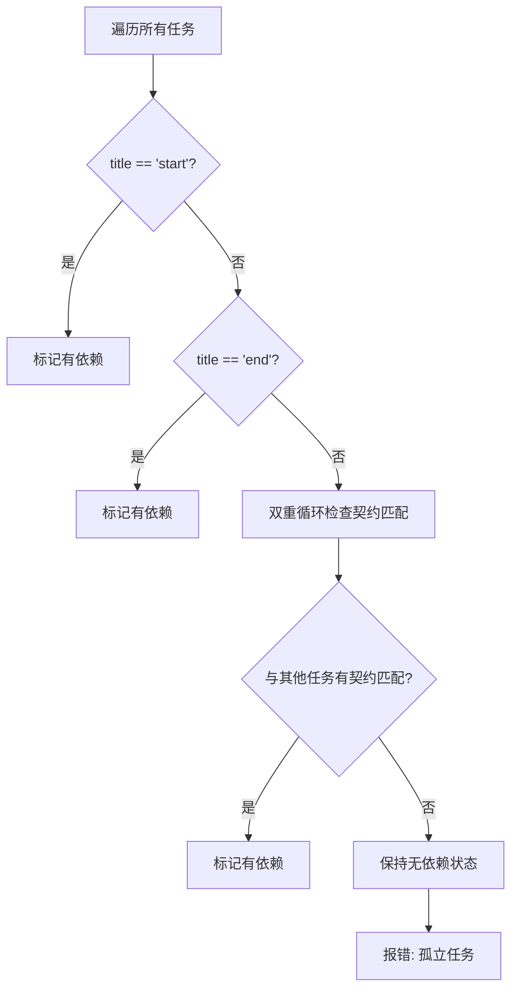
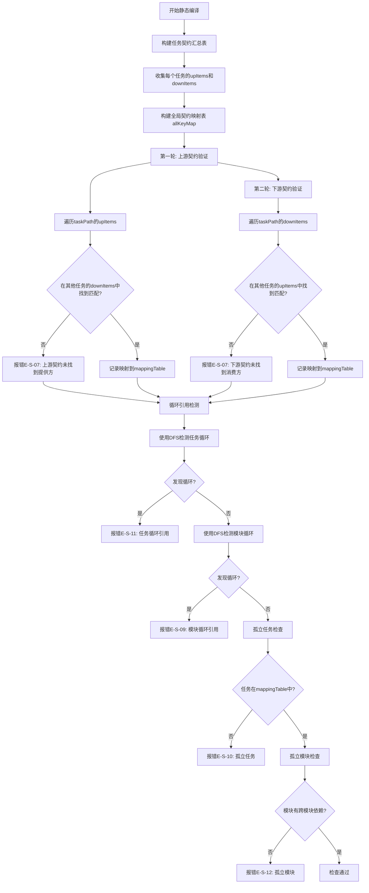

# MCP AITDD 静态编译代码逻辑分析报告

## 文档信息
- 创建日期: 2026-03-04
- 更新日期: 2026-03-04
- 状态: 已更新
- 关联文档: [static-compile-improvement-plan.md](static-compile-improvement-plan.md)

---

## 1. 架构概览



## 2. 入口函数和调用链

### 2.1 主入口函数

| 文件 | 函数 | 行号 | 说明 |
|------|------|------|------|
| [`server.go`](backend/internal/mcp/server.go:341) | `registerCompileTools()` | 339-353 | 注册 `compile_static` 工具 |
| [`server.go`](backend/internal/mcp/server.go:611) | `handleCompileStatic()` | 611-613 | MCP 工具处理入口 |
| [`tools_other.go`](backend/internal/mcp/tools_other.go:1575) | `handleCompileStaticImpl()` | 1575-1644 | 静态编译核心实现 |

### 2.2 调用链

```
handleCompileStaticImpl()
├── 路径类型判断 (len(pathParts))
│   ├── =1 → compileStaticProject()     [项目级]
│   ├── =2 → compileStaticModule()      [模块级]
│   └── >2 → compileStaticTask()        [任务级]
│
├── compileStaticProject() [1646-1737]
│   ├── 获取所有模块
│   ├── compileStaticModuleWithTasks() → 收集所有任务
│   ├── checkContractConsistency()      [E-S-07]
│   ├── checkModuleCircularReference()  [E-S-09]
│   ├── checkModuleCrossDependency()    [E-S-09]
│   ├── checkOrphanTask()               [E-S-10]
│   └── updateTaskDependencies()        [更新依赖]
│
├── compileStaticModuleWithTasks() [1886-2045]
│   ├── 获取模块信息
│   ├── 获取模块下所有任务
│   └── compileStaticTaskFromData() → 逐个检查任务
│
└── compileStaticTaskFromData() [2094-2203]
    ├── 统计任务状态
    ├── checkUpstreamContract()         [E-S-05]
    ├── checkDownstreamContract()       [E-S-06]
    └── checkStatusAnomaly()            [E-S-08]
```

## 3. 契约检查逻辑

### 3.1 数据结构

```go
// ContractDetailItem 契约条目 [1487-1492]
type ContractDetailItem struct {
    Label       string `json:"label"`       // 契约标签
    ContractAPI string `json:"contract_api"` // API签名
    From        string `json:"from"`         // 来源任务标识
}

// ContractDetail 契约详情 [1494-1498]
type ContractDetail struct {
    Title string                `json:"title"` // "start"/"end" 或描述
    List  []ContractDetailItem `json:"list"`  // 契约条目列表
}
```

### 3.2 检查规则实现

#### E-S-05: 上游契约检查 [`checkUpstreamContract()`](backend/internal/mcp/tools_other.go:2205)



**核心逻辑**:
1. 检查 `upstreamContractDetail` 是否为空
2. 验证 JSON 格式是否正确
3. 特殊处理: `title == "start"` 表示首个任务
4. 检查每个条目的 `label`, `contract_api`, `from` 三字段完整性

#### E-S-06: 下游契约检查 [`checkDownstreamContract()`](backend/internal/mcp/tools_other.go:2289)

与上游契约检查对称，特殊标记为 `title == "end"` 表示末尾任务。

#### E-S-07: 契约一致性检查 [`checkContractConsistency()`](backend/internal/mcp/tools_other.go:2508)

**双向检查机制**:



**契约匹配函数** [`contractsMatch()`](backend/internal/mcp/tools_other.go:2436):
```go
func contractsMatch(c1, c2 ContractDetailItem) bool {
    return c1.Label == c2.Label &&
        c1.ContractAPI == c2.ContractAPI &&
        c1.From == c2.From
}
```

**关键点**:
- **反向检查**: 验证"我依赖的人是否承认依赖关系" → 找不到报 **错误**
- **正向检查**: 验证"依赖我的人是否声明了依赖关系" → 找不到报 **警告**（可能是内部接口）

## 4. 循环引用检查逻辑

### 4.1 模块循环引用检查 [`checkModuleCircularReference()`](backend/internal/mcp/tools_other.go:3352)

**算法**: 双重 for 循环 + 契约三字段匹配



**核心代码逻辑**:
```go
// 1. 构建模块间引用关系图
for _, taskA := range allTasks {
    for _, taskB := range allTasks {
        if moduleA != moduleB {
            // 检查 A 的上游契约是否与 B 的下游契约匹配
            if contractsMatch(upstreamItem, downstreamItem) {
                key := moduleB + "->" + moduleA
                moduleReferences[key] = append(moduleReferences[key], ...)
            }
        }
    }
}

// 2. 检测双向引用
for i := 0; i < len(modules); i++ {
    for j := i + 1; j < len(modules); j++ {
        if hasXToY && hasYToX {
            // 报错: 循环引用
        }
    }
}
```

### 4.2 孤立任务检查 [`checkOrphanTask()`](backend/internal/mcp/tools_other.go:3484)

**规则**: 任务必须有上游依赖或下游被依赖（除非是起点/终点任务）



### 4.3 模块跨模块依赖检查 [`checkModuleCrossDependency()`](backend/internal/mcp/tools_other.go:3211)

**规则**: 每个模块必须至少有一个跨模块的依赖

## 5. 输出逻辑

### 5.1 数据结构

```go
// CompileStaticResult 内部结果 [1457-1469]
type CompileStaticResult struct {
    Success         bool           `json:"success"`
    TotalModules    int            `json:"totalModules"`
    TotalTasks      int            `json:"totalTasks"`
    CompletedTasks  int            `json:"completedTasks"`
    InProgressTasks int            `json:"inProgressTasks"`
    ReadyTasks      int            `json:"readyTasks"`
    ErrorCount      int            `json:"errorCount"`
    WarningCount    int            `json:"warningCount"`
    Errors          []CompileIssue `json:"errors"`
    Warnings        []CompileIssue `json:"warnings"`
}

// CompileStaticOutput 最终输出 [1471-1485]
type CompileStaticOutput struct {
    Success         bool                                  `json:"success"`
    PathName        string                                `json:"pathName,omitempty"`
    TotalModules    int                                   `json:"totalModules"`
    TotalTasks      int                                   `json:"totalTasks"`
    // ... 统计字段
    Module          map[string]CompileStaticResourceIssues `json:"module,omitempty"`
    Task            map[string]CompileStaticResourceIssues `json:"task,omitempty"`
    Message         string                                `json:"message"`
}

// CompileStaticResourceIssues 按资源分组 [1451-1455]
type CompileStaticResourceIssues struct {
    Error   []CompileStaticIssue `json:"error,omitempty"`
    Warning []CompileStaticIssue `json:"warning,omitempty"`
}
```

### 5.2 分组函数 [`groupIssuesByResource()`](backend/internal/mcp/tools_other.go:1512)

将错误和警告按资源路径（模块/任务）分组:
1. 遍历所有错误和警告
2. 根据 `ResourceType` 和 `ResourcePathName` 分类
3. 删除没有问题的资源条目

### 5.3 输出格式示例

```json
{
  "success": false,
  "pathName": "MyProject",
  "totalModules": 3,
  "totalTasks": 10,
  "completedTasks": 5,
  "inProgressTasks": 2,
  "readyTasks": 3,
  "errorCount": 2,
  "warningCount": 1,
  "module": {
    "MyProject/用户管理": {
      "error": [{"ruleId": "E-S-09", "ruleName": "模块循环引用错误", "message": "...", "suggestion": "..."}]
    }
  },
  "task": {
    "MyProject/用户管理/登录功能": {
      "error": [{"ruleId": "E-S-05", "ruleName": "上游契约缺失", "message": "...", "suggestion": "..."}],
      "warning": [{"ruleId": "W-S-02", "ruleName": "下游契约未被消费", "message": "...", "suggestion": "..."}]
    }
  },
  "message": "静态编译失败，发现 2 个错误"
}
```

## 6. 错误处理机制

### 6.1 错误级别

| 级别 | 说明 | 影响 |
|------|------|------|
| `error` | 必须修复的问题 | `success = false` |
| `warning` | 建议修复的问题 | 不影响 success |
| `info` | 提示信息 | 仅作为建议 |

### 6.2 规则ID体系

| 规则ID | 名称 | 级别 | 检查位置 | 变更说明 |
|--------|------|------|----------|----------|
| E-S-00 | 项目/模块结构检查 | error | API调用失败 | - |
| E-S-05 | 上游契约缺失/格式错误 | error | checkUpstreamContract | - |
| E-S-06 | 下游契约缺失/格式错误 | error | checkDownstreamContract | - |
| E-S-07 | 契约不一致 | error | checkContractConsistency | **已更新**: 统一正向和反向检查都报错误 |
| E-S-08 | 已完成任务存在Bug | error | checkStatusAnomaly | - |
| E-S-09 | 模块循环引用 | error | checkModuleCircularReference | **已重构**: 使用DFS检测 |
| E-S-10 | 孤立任务错误 | error | checkOrphanTask | **已更新**: 使用契约映射表检测 |
| E-S-11 | 任务循环引用 | error | detectTaskCycle | **新增** |
| E-S-12 | 孤立模块错误 | error | checkOrphanModule | **新增** |
| ~~W-S-02~~ | ~~下游契约未被消费~~ | ~~warning~~ | - | **已删除** |
| W-S-03 | 首个任务存在上游依赖 | warning | checkUpstreamContract | - |
| W-S-04 | 末尾任务存在下游输出 | warning | checkDownstreamContract | - |
| W-S-07 | 依赖关系已更新 | warning | updateTaskDependencies | - |

### 6.3 新增数据结构

```go
// UpDownContractItems 任务契约汇总结构
type UpDownContractItems struct {
    TaskPathName string               `json:"taskPathName"`
    UpItems      []ContractDetailItem `json:"upItems"`   // 上游提供的契约
    DownItems    []ContractDetailItem `json:"downItems"` // 下游需要的契约
}

// ContractMapping 契约映射关系
type ContractMapping struct {
    FromTask     string             `json:"fromTask"`     // 提供方任务路径
    ToTask       string             `json:"toTask"`       // 消费方任务路径
    ContractItem ContractDetailItem `json:"contractItem"` // 契约条目
}
```

### 6.4 新检查流程



## 7. 发现的潜在问题和改进建议

### 7.1 性能问题

1. **双重循环复杂度**: [`checkModuleCircularReference()`](backend/internal/mcp/tools_other.go:3387) 和 [`checkOrphanTask()`](backend/internal/mcp/tools_other.go:3504) 使用 O(n²) 算法
   - **建议**: 对于大型项目，考虑使用图算法优化

2. **重复解析**: 契约 JSON 在多个检查函数中重复解析
   - **建议**: 在 `compileStaticProject` 级别预解析所有契约

### 7.2 代码质量问题

1. **已废弃函数**: [`findTaskPathByName()`](backend/internal/mcp/tools_other.go:2405) 标记为 Deprecated 但仍保留
   - **建议**: 完全移除或添加明确的使用警告

2. **错误处理不一致**: 部分API调用失败时静默返回
   - **建议**: 统一错误处理策略

### 7.3 规则引擎集成

[`rule_engine.go`](backend/internal/mcp/rule_engine.go) 定义了规则配置，但静态编译实际使用硬编码规则
- **建议**: 将静态编译规则与规则引擎配置关联，实现可配置化

### 7.4 依赖更新时机

[`updateTaskDependencies()`](backend/internal/mcp/tools_other.go:1740) 只在 `ErrorCount == 0` 时执行
- **建议**: 考虑即使有错误也更新部分有效依赖

## 8. 总结

静态编译系统实现了完整的契约检查和依赖验证机制:

- **契约检查**: 支持上游/下游契约完整性检查和双向一致性验证
- **循环引用**: 基于契约三字段匹配检测模块间循环依赖
- **孤立任务**: 检测没有任何依赖关系的任务
- **输出格式**: 按资源路径分组的 JSON 格式，便于前端展示

核心设计原则是 **契约三字段匹配** (`label`, `contract_api`, `from`)，确保任务间依赖关系的准确性和一致性。
