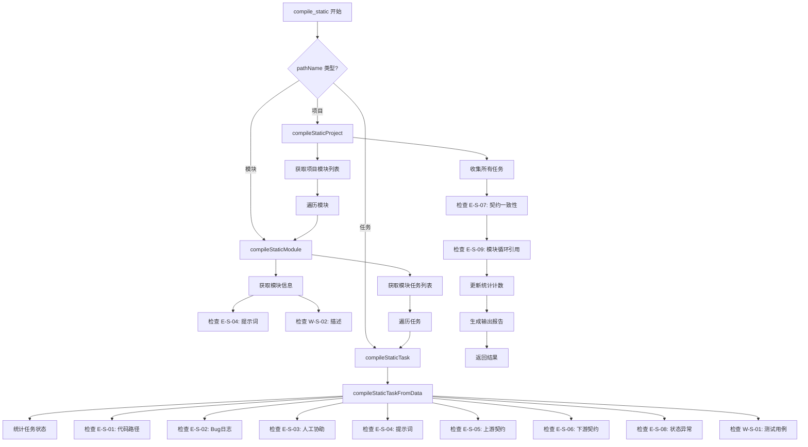
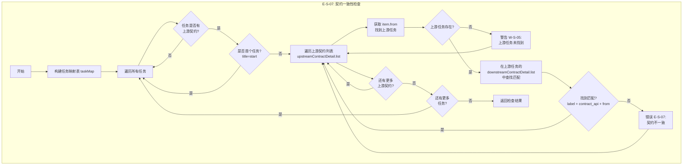
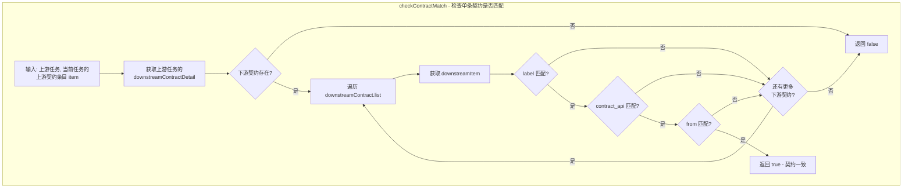

# 静态编译功能修复方案

## 1. 问题分析

### 1.1 当前问题概述

`compile_static` MCP 工具存在以下严重问题：

1. **计数器全部为0** - `totalModules`、`totalTasks`、`completedTasks` 等统计计数器返回值全部为0
2. **未检测到任何错误** - 即使数据存在问题，也未报告任何编译错误或警告

### 1.2 根本原因分析

通过代码审查 [`tools_other.go`](backend/internal/mcp/tools_other.go:1452) 发现以下问题：

#### 问题1: API响应解析失败

```go
// 当前代码 - 第1546-1560行
var modulesData struct {
    Data []map[string]interface{} `json:"data"`
}
if err := json.NewDecoder(modulesResp.Body).Decode(&modulesData); err != nil {
    // 解析失败时只添加错误，但继续执行
    result.Errors = append(result.Errors, CompileIssue{...})
    return  // 这里正确返回了
}
```

**问题**：API返回的数据结构可能与预期不符。需要验证实际API响应格式。

#### 问题2: 任务数据解析失败

```go
// 当前代码 - 第1652-1657行
var tasksData struct {
    Data []map[string]interface{} `json:"data"`
}
if err := json.NewDecoder(tasksResp.Body).Decode(&tasksData); err != nil {
    return  // 静默返回，没有错误处理
}
```

**问题**：解析失败时静默返回，不添加任何错误信息。

#### 问题3: BugLog检查逻辑错误

```go
// 当前代码 - 第1737-1750行
bugLog, _ := task["bugLog"].(string)
if bugLog != "" && bugLog != "[]" {
    // 只检查是否为空数组，未考虑对象格式
}
```

**问题**：`bugLog` 实际格式为 `{"static":[],"dynamic":[]}`，当前检查逻辑无法正确处理。

#### 问题4: 缺少契约检查规则

当前代码完全没有实现：
- E-S-05: 上游契约检查
- E-S-06: 下游契约检查
- E-S-07: 契约一致性检查
- E-S-08: 状态异常检查

---

## 2. 修复方案

### 2.1 数据结构定义

#### 2.1.1 契约详情结构

```go
// ContractDetailItem 契约条目
type ContractDetailItem struct {
    Label       string `json:"label"`
    ContractAPI string `json:"contract_api"`
    From        string `json:"from"`
}

// ContractDetail 契约详情
type ContractDetail struct {
    Title string                `json:"title"`
    List  []ContractDetailItem `json:"list"`
}
```

#### 2.1.2 BugLog结构修复

```go
// BugLog Bug日志结构
type BugLog struct {
    Static  []string `json:"static"`
    Dynamic []string `json:"dynamic"`
}

// HasErrors 检查是否存在错误
func (b *BugLog) HasErrors() bool {
    return len(b.Static) > 0 || len(b.Dynamic) > 0
}
```

### 2.2 检查规则实现

#### 2.2.1 E-S-05: 上游契约检查

```go
// checkUpstreamContract 检查上游契约
func (s *MCPServer) checkUpstreamContract(task map[string]interface{}, taskPathName string, result *CompileStaticResult) {
    taskName, _ := task["name"].(string)
    upstreamContractStr, _ := task["upstreamContractDetail"].(string)
    
    // 首个任务标记检查
    if upstreamContractStr == "" {
        result.Errors = append(result.Errors, CompileIssue{
            RuleID:           "E-S-05",
            RuleName:         "上游契约缺失",
            ResourceType:     "task",
            ResourceName:     taskName,
            ResourcePathName: taskPathName,
            Message:          fmt.Sprintf("任务 [%s] 缺少上游契约定义", taskName),
            Suggestion:       "首个任务应设置 title 为 'start'，其他任务需定义上游依赖",
            Severity:         "error",
        })
        return
    }

    var upstreamContract ContractDetail
    if err := json.Unmarshal([]byte(upstreamContractStr), &upstreamContract); err != nil {
        result.Errors = append(result.Errors, CompileIssue{
            RuleID:           "E-S-05",
            RuleName:         "上游契约格式错误",
            ResourceType:     "task",
            ResourceName:     taskName,
            ResourcePathName: taskPathName,
            Message:          fmt.Sprintf("任务 [%s] 上游契约JSON解析失败: %v", taskName, err),
            Suggestion:       "请检查 upstreamContractDetail 的JSON格式",
            Severity:         "error",
        })
        return
    }

    // 检查是否为首个任务（无上游依赖）
    if upstreamContract.Title == "start" {
        // 首个任务，list 应为空
        if len(upstreamContract.List) > 0 {
            result.Warnings = append(result.Warnings, CompileIssue{
                RuleID:           "W-S-03",
                RuleName:         "首个任务存在上游依赖",
                ResourceType:     "task",
                ResourceName:     taskName,
                ResourcePathName: taskPathName,
                Message:          fmt.Sprintf("任务 [%s] 标记为首个任务但存在上游依赖", taskName),
                Suggestion:       "请确认是否为首任务，若是则清空list",
                Severity:         "warning",
            })
        }
        return
    }

    // 非首个任务必须有 title 和 list
    if upstreamContract.Title == "" {
        result.Errors = append(result.Errors, CompileIssue{
            RuleID:           "E-S-05",
            RuleName:         "上游契约标题缺失",
            ResourceType:     "task",
            ResourceName:     taskName,
            ResourcePathName: taskPathName,
            Message:          fmt.Sprintf("任务 [%s] 上游契约缺少 title", taskName),
            Suggestion:       "请添加描述性的 title，如 '依赖xxx提供'",
            Severity:         "error",
        })
    }

    // 检查 list 中每个条目的完整性
    for i, item := range upstreamContract.List {
        if item.Label == "" || item.ContractAPI == "" || item.From == "" {
            result.Errors = append(result.Errors, CompileIssue{
                RuleID:           "E-S-05",
                RuleName:         "上游契约条目不完整",
                ResourceType:     "task",
                ResourceName:     taskName,
                ResourcePathName: taskPathName,
                Message:          fmt.Sprintf("任务 [%s] 上游契约第%d条缺少必要字段", taskName, i+1),
                Suggestion:       "每个条目需包含 label, contract_api, from 三个字段",
                Severity:         "error",
            })
        }
    }
}
```

#### 2.2.2 E-S-06: 下游契约检查

```go
// checkDownstreamContract 检查下游契约
func (s *MCPServer) checkDownstreamContract(task map[string]interface{}, taskPathName string, result *CompileStaticResult) {
    taskName, _ := task["name"].(string)
    downstreamContractStr, _ := task["downstreamContractDetail"].(string)

    if downstreamContractStr == "" {
        result.Errors = append(result.Errors, CompileIssue{
            RuleID:           "E-S-06",
            RuleName:         "下游契约缺失",
            ResourceType:     "task",
            ResourceName:     taskName,
            ResourcePathName: taskPathName,
            Message:          fmt.Sprintf("任务 [%s] 缺少下游契约定义", taskName),
            Suggestion:       "末尾任务应设置 title 为 'end'，其他任务需定义下游输出",
            Severity:         "error",
        })
        return
    }

    var downstreamContract ContractDetail
    if err := json.Unmarshal([]byte(downstreamContractStr), &downstreamContract); err != nil {
        result.Errors = append(result.Errors, CompileIssue{
            RuleID:           "E-S-06",
            RuleName:         "下游契约格式错误",
            ResourceType:     "task",
            ResourceName:     taskName,
            ResourcePathName: taskPathName,
            Message:          fmt.Sprintf("任务 [%s] 下游契约JSON解析失败: %v", taskName, err),
            Suggestion:       "请检查 downstreamContractDetail 的JSON格式",
            Severity:         "error",
        })
        return
    }

    // 检查是否为末尾任务（无下游依赖）
    if downstreamContract.Title == "end" {
        if len(downstreamContract.List) > 0 {
            result.Warnings = append(result.Warnings, CompileIssue{
                RuleID:           "W-S-04",
                RuleName:         "末尾任务存在下游输出",
                ResourceType:     "task",
                ResourceName:     taskName,
                ResourcePathName: taskPathName,
                Message:          fmt.Sprintf("任务 [%s] 标记为末尾任务但存在下游输出", taskName),
                Suggestion:       "请确认是否为末尾任务，若是则清空list",
                Severity:         "warning",
            })
        }
        return
    }

    // 非末尾任务必须有 title 和 list
    if downstreamContract.Title == "" {
        result.Errors = append(result.Errors, CompileIssue{
            RuleID:           "E-S-06",
            RuleName:         "下游契约标题缺失",
            ResourceType:     "task",
            ResourceName:     taskName,
            ResourcePathName: taskPathName,
            Message:          fmt.Sprintf("任务 [%s] 下游契约缺少 title", taskName),
            Suggestion:       "请添加描述性的 title，如 '为下游任务提供以下接口'",
            Severity:         "error",
        })
    }

    // 检查 list 中每个条目的完整性
    for i, item := range downstreamContract.List {
        if item.Label == "" || item.ContractAPI == "" || item.From == "" {
            result.Errors = append(result.Errors, CompileIssue{
                RuleID:           "E-S-06",
                RuleName:         "下游契约条目不完整",
                ResourceType:     "task",
                ResourceName:     taskName,
                ResourcePathName: taskPathName,
                Message:          fmt.Sprintf("任务 [%s] 下游契约第%d条缺少必要字段", taskName, i+1),
                Suggestion:       "每个条目需包含 label, contract_api, from 三个字段",
                Severity:         "error",
            })
        }
    }
}
```

#### 2.2.3 E-S-07: 契约一致性检查

> **核心原则**：需要双向检查
>
> - **反向检查（上游→下游）**：验证"我依赖的人是否承认依赖关系"
> - **正向检查（下游→上游）**：验证"依赖我的人是否声明了依赖关系"
>
> 两者的检查目的不同，不能互相替代。

##### 检查逻辑说明

**反向检查（上游→下游）**：遍历每个任务的上游契约列表 `upstreamContractDetail.list`

```
对于当前任务的每一条上游契约 item:
    1. 获取 item.from（表示该契约来自哪个上游任务，如 "task-history-storage"）
    2. 找到名为 item.from 的任务（如 task-history-storage）
    3. 在该上游任务的 downstreamContractDetail.list 中查找：
       是否存在一条契约 downstreamItem，满足：
       - downstreamItem.label == item.label
       - downstreamItem.contract_api == item.contract_api
       - downstreamItem.from == item.from（都表示契约来源）
    4. 如果找不到匹配项，则报错：契约不一致
```

**正向检查（下游→上游）**：遍历每个任务的下游契约列表 `downstreamContractDetail.list`

> **重要**：下游契约的 `from` 字段表示**当前任务自己**的 pathName，不是下游任务的 pathName。
> 因此正向检查需要遍历所有任务，找到上游契约中 `from` 字段等于当前任务 pathName 的任务（即依赖当前任务的下游任务）。

```
对于当前任务 A 的每一条下游契约 item:
    1. item.from = A（当前任务自己的 pathName，表示这条契约由 A 提供）
    2. 遍历所有任务，找到上游契约中 from = A 的任务（即依赖 A 的下游任务）
    3. 在这些下游任务的上游契约中查找匹配项：
       是否存在一条契约 upstreamItem，满足：
       - upstreamItem.label == item.label
       - upstreamItem.contract_api == item.contract_api
       - upstreamItem.from == A（当前任务的 pathName）
    4. 如果找不到匹配项，则报错：下游任务未声明对当前任务的依赖
```

##### 示例

**任务 B（task-history-panel）的上游契约：**
```json
{
  "label": "获取历史数据",
  "contract_api": "get_history(limit: int, offset: int) -> List[Record]",
  "from": "task-history-storage"
}
```

**检查步骤：**
1. `from: "task-history-storage"` → 找到任务 task-history-storage
2. 在 task-history-storage 的 `downstreamContractDetail.list` 中查找匹配项
3. 匹配条件：label、contract_api、from 三字段全部相同

**task-history-storage 的下游契约（正确情况）：**
```json
{
  "label": "获取历史数据",
  "contract_api": "get_history(limit: int, offset: int) -> List[Record]",
  "from": "task-history-storage"
}
```
→ 匹配成功！

##### 代码实现

```go
// checkContractConsistency 检查契约一致性（双向检查）
// 反向检查：遍历每个任务的上游契约，在上游任务的下游契约中查找匹配
// 正向检查：遍历每个任务的下游契约，在下游任务的上游契约中查找匹配
// 需要在所有任务数据加载完成后执行
func (s *MCPServer) checkContractConsistency(allTasks []map[string]interface{}, result *CompileStaticResult) {
    // 构建任务路径到任务的映射
    taskMap := make(map[string]map[string]interface{})
    for _, task := range allTasks {
        pathName, _ := task["pathName"].(string)
        taskMap[pathName] = task
    }

    // ==================== 反向检查（上游→下游）====================
    // 验证"我依赖的人是否承认依赖关系"
    for _, task := range allTasks {
        taskName, _ := task["name"].(string)
        taskPathName, _ := task["pathName"].(string)

        upstreamContractStr, _ := task["upstreamContractDetail"].(string)
        if upstreamContractStr == "" {
            continue
        }

        var upstreamContract ContractDetail
        if err := json.Unmarshal([]byte(upstreamContractStr), &upstreamContract); err != nil {
            continue // 格式错误已在E-S-05中报告
        }

        // 跳过首个任务（title 为 "start"）
        if upstreamContract.Title == "start" {
            continue
        }

        // 遍历上游契约列表中的每一条契约
        for _, upstreamItem := range upstreamContract.List {
            // 1. 获取 item.from，找到对应的上游任务
            upstreamTaskPathName := upstreamItem.From
            
            // 2. 查找上游任务
            upstreamTask, exists := taskMap[upstreamTaskPathName]
            if !exists {
                // 尝试使用辅助函数查找（支持任务名称匹配）
                upstreamTaskPath := findTaskPathByName(taskMap, upstreamTaskPathName, taskPathName)
                if upstreamTaskPath == "" {
                    result.Warnings = append(result.Warnings, CompileIssue{
                        RuleID:           "W-S-05",
                        RuleName:         "上游任务未找到",
                        ResourceType:     "task",
                        ResourceName:     taskName,
                        ResourcePathName: taskPathName,
                        Message:          fmt.Sprintf("任务 [%s] 引用的上游任务 '%s' 不存在", taskName, upstreamItem.From),
                        Suggestion:       "请检查 from 字段是否正确",
                        Severity:         "warning",
                    })
                    continue
                }
                upstreamTask = taskMap[upstreamTaskPath]
            }

            // 3. 在上游任务的下游契约列表中查找匹配项
            if !checkContractMatchInDownstream(upstreamTask, upstreamItem) {
                // 4. 找不到匹配项，报错
                result.Errors = append(result.Errors, CompileIssue{
                    RuleID:           "E-S-07",
                    RuleName:         "契约不一致-反向",
                    ResourceType:     "task",
                    ResourceName:     taskName,
                    ResourcePathName: taskPathName,
                    Message:          fmt.Sprintf("任务 [%s] 的上游契约条目 '%s' 在上游任务 '%s' 的下游契约中未找到匹配项",
                        taskName, upstreamItem.Label, upstreamItem.From),
                    Suggestion:       fmt.Sprintf("期望格式: {\"label\": \"%s\", \"contract_api\": \"%s\", \"from\": \"%s\"}",
                        upstreamItem.Label, upstreamItem.ContractAPI, upstreamItem.From),
                    Severity:         "error",
                })
            }
        }
    }

    // ==================== 正向检查（下游→上游）====================
    // 验证"依赖我的人是否声明了依赖关系"
    // 重要：下游契约的 from 字段表示当前任务自己的 pathName，不是下游任务的 pathName
    // 因此需要遍历所有任务，找到上游契约中 from 字段等于当前任务 pathName 的任务
    for _, task := range allTasks {
        taskName, _ := task["name"].(string)
        taskPathName, _ := task["pathName"].(string)

        downstreamContractStr, _ := task["downstreamContractDetail"].(string)
        if downstreamContractStr == "" {
            continue
        }

        var downstreamContract ContractDetail
        if err := json.Unmarshal([]byte(downstreamContractStr), &downstreamContract); err != nil {
            continue // 格式错误已在E-S-06中报告
        }

        // 跳过末尾任务（title 为 "end"）
        if downstreamContract.Title == "end" {
            continue
        }

        // 遍历下游契约列表中的每一条契约
        for _, downstreamItem := range downstreamContract.List {
            // 验证 from 字段是否为当前任务的 pathName
            // 下游契约的 from 字段应该等于当前任务的 pathName
            if downstreamItem.From != taskPathName {
                // from 字段不是当前任务，记录警告（这可能是一个配置错误）
                result.Warnings = append(result.Warnings, CompileIssue{
                    RuleID:           "W-S-07",
                    RuleName:         "下游契约from字段异常",
                    ResourceType:     "task",
                    ResourceName:     taskName,
                    ResourcePathName: taskPathName,
                    Message:          fmt.Sprintf("任务 [%s] 的下游契约条目 '%s' 的 from 字段 '%s' 不等于当前任务 pathName '%s'",
                        taskName, downstreamItem.Label, downstreamItem.From, taskPathName),
                    Suggestion:       "下游契约的 from 字段应该等于当前任务的 pathName",
                    Severity:         "warning",
                })
            }
            
            // 遍历所有任务，找到上游契约中 from 字段等于当前任务 pathName 的任务
            // 这些任务就是依赖当前任务的下游任务
            foundDownstreamTask := false
            for _, potentialDownstreamTask := range allTasks {
                // 跳过自己
                potentialTaskPathName, _ := potentialDownstreamTask["pathName"].(string)
                if potentialTaskPathName == taskPathName {
                    continue
                }
                
                // 检查该任务的上游契约中是否有 from = 当前任务 pathName 的条目
                if checkTaskHasUpstreamContractFrom(potentialDownstreamTask, taskPathName) {
                    // 找到了依赖当前任务的下游任务
                    foundDownstreamTask = true
                    
                    // 在该下游任务的上游契约中查找匹配项
                    if !checkContractMatchInUpstream(potentialDownstreamTask, downstreamItem, taskPathName) {
                        // 找不到匹配项，报错
                        downstreamTaskName, _ := potentialDownstreamTask["name"].(string)
                        result.Errors = append(result.Errors, CompileIssue{
                            RuleID:           "E-S-07",
                            RuleName:         "契约不一致-正向",
                            ResourceType:     "task",
                            ResourceName:     taskName,
                            ResourcePathName: taskPathName,
                            Message:          fmt.Sprintf("任务 [%s] 的下游契约条目 '%s' 在下游任务 '%s' 的上游契约中未找到匹配项",
                                taskName, downstreamItem.Label, downstreamTaskName),
                            Suggestion:       fmt.Sprintf("下游任务 [%s] 需要添加上游依赖: {\"label\": \"%s\", \"contract_api\": \"%s\", \"from\": \"%s\"}",
                                downstreamTaskName, downstreamItem.Label, downstreamItem.ContractAPI, taskPathName),
                            Severity:         "error",
                        })
                    }
                }
            }
            
            // 如果没有找到任何依赖当前任务的下游任务，记录信息（这可能是正常的，比如任务是末尾任务）
            _ = foundDownstreamTask // 用于调试，不强制要求有下游任务
        }
    }
}

// checkTaskHasUpstreamContractFrom 检查任务的上游契约中是否有 from 字段等于指定 pathName 的条目
func checkTaskHasUpstreamContractFrom(task map[string]interface{}, fromPathName string) bool {
    upstreamContractStr, _ := task["upstreamContractDetail"].(string)
    if upstreamContractStr == "" {
        return false
    }

    var upstreamContract ContractDetail
    if err := json.Unmarshal([]byte(upstreamContractStr), &upstreamContract); err != nil {
        return false
    }

    for _, item := range upstreamContract.List {
        if item.From == fromPathName {
            return true
        }
    }
    return false
}

// findTaskPathByName 根据任务名称或路径查找任务路径
func findTaskPathByName(taskMap map[string]map[string]interface{}, from string, currentTaskPath string) string {
    // 首先尝试直接匹配 pathName
    if _, exists := taskMap[from]; exists {
        return from
    }

    // 尝试在同一模块下查找任务名称
    currentParts := strings.Split(currentTaskPath, "/")
    if len(currentParts) >= 2 {
        modulePath := currentParts[0] + "/" + currentParts[1]
        // 尝试构建完整路径
        possiblePath := modulePath + "/" + from
        if _, exists := taskMap[possiblePath]; exists {
            return possiblePath
        }
    }

    // 遍历所有任务查找匹配的名称
    for pathName, task := range taskMap {
        name, _ := task["name"].(string)
        if name == from {
            return pathName
        }
    }

    return ""
}

// checkContractMatchInDownstream 检查契约条目是否在上游任务的下游契约中存在匹配（反向检查用）
// 参数:
//   - upstreamTask: 上游任务数据
//   - item: 当前任务的上游契约条目（来自 upstreamContractDetail.list）
// 返回值:
//   - bool: true 表示找到匹配，false 表示未找到匹配
func checkContractMatchInDownstream(upstreamTask map[string]interface{}, item ContractDetailItem) bool {
    downstreamContractStr, _ := upstreamTask["downstreamContractDetail"].(string)
    if downstreamContractStr == "" {
        return false
    }

    var downstreamContract ContractDetail
    if err := json.Unmarshal([]byte(downstreamContractStr), &downstreamContract); err != nil {
        return false
    }

    // 在上游任务的下游契约列表中查找匹配项
    // 三个字段必须全部匹配：
    // 1. label 必须完全相同
    // 2. contract_api 必须完全相同
    // 3. from 必须完全相同（都表示这条契约来自哪个任务）
    for _, downstreamItem := range downstreamContract.List {
        if item.Label == downstreamItem.Label &&
           item.ContractAPI == downstreamItem.ContractAPI &&
           item.From == downstreamItem.From {
            return true
        }
    }

    return false
}

// checkContractMatchInUpstream 检查契约条目是否在下游任务的上游契约中存在匹配（正向检查用）
// 参数:
//   - downstreamTask: 下游任务数据
//   - item: 当前任务的下游契约条目（来自 downstreamContractDetail.list）
//   - currentTaskPathName: 当前任务的 pathName（用于匹配 from 字段）
// 返回值:
//   - bool: true 表示找到匹配，false 表示未找到匹配
func checkContractMatchInUpstream(downstreamTask map[string]interface{}, item ContractDetailItem, currentTaskPathName string) bool {
    upstreamContractStr, _ := downstreamTask["upstreamContractDetail"].(string)
    if upstreamContractStr == "" {
        return false
    }

    var upstreamContract ContractDetail
    if err := json.Unmarshal([]byte(upstreamContractStr), &upstreamContract); err != nil {
        return false
    }

    // 在下游任务的上游契约列表中查找匹配项
    // 三个字段必须全部匹配：
    // 1. label 必须完全相同
    // 2. contract_api 必须完全相同
    // 3. from 必须等于当前任务的 pathName（因为 from 表示契约来源）
    for _, upstreamItem := range upstreamContract.List {
        if item.Label == upstreamItem.Label &&
           item.ContractAPI == upstreamItem.ContractAPI &&
           upstreamItem.From == currentTaskPathName {
            return true
        }
    }

    return false
}
```

#### 2.2.4 E-S-08: 状态异常检查

```go
// checkStatusAnomaly 检查状态异常
func (s *MCPServer) checkStatusAnomaly(task map[string]interface{}, taskPathName string, result *CompileStaticResult) {
    taskName, _ := task["name"].(string)
    status, _ := task["status"].(string)

    // 只检查已完成状态的任务
    if status != "completed" {
        return
    }

    // 检查 bugLog
    bugLogStr, _ := task["bugLog"].(string)
    if bugLogStr != "" && bugLogStr != "{}" && bugLogStr != "null" {
        var bugLog BugLog
        if err := json.Unmarshal([]byte(bugLogStr), &bugLog); err == nil {
            if bugLog.HasErrors() {
                result.Errors = append(result.Errors, CompileIssue{
                    RuleID:           "E-S-08",
                    RuleName:         "已完成任务存在Bug",
                    ResourceType:     "task",
                    ResourceName:     taskName,
                    ResourcePathName: taskPathName,
                    Message:          fmt.Sprintf("任务 [%s] 已完成但存在未解决的Bug - static: %d, dynamic: %d",
                        taskName, len(bugLog.Static), len(bugLog.Dynamic)),
                    Suggestion:       "请解决Bug后清除日志或将状态改为非完成状态",
                    Severity:         "error",
                })
            }
        }
    }
}
```

### 2.3 修复 compileStaticProject

```go
// compileStaticProject 项目级别静态编译（修复版）
func (s *MCPServer) compileStaticProject(projectPathName string, includeWarnings bool, result *CompileStaticResult) {
    // 获取项目下所有模块
    modulesResp, err := http.Get(fmt.Sprintf("%s/projects/by-path/%s/modules", s.getApiURL(), projectPathName))
    if err != nil {
        result.Errors = append(result.Errors, CompileIssue{
            RuleID:           "E-S-00",
            RuleName:         "项目结构检查",
            ResourceType:     "project",
            ResourceName:     projectPathName,
            ResourcePathName: projectPathName,
            Message:          "获取项目模块失败: " + err.Error(),
            Severity:         "error",
        })
        return
    }
    defer modulesResp.Body.Close()

    // 先读取响应体
    body, err := io.ReadAll(modulesResp.Body)
    if err != nil {
        result.Errors = append(result.Errors, CompileIssue{
            RuleID:           "E-S-00",
            RuleName:         "项目结构检查",
            ResourceType:     "project",
            ResourceName:     projectPathName,
            ResourcePathName: projectPathName,
            Message:          "读取项目模块响应失败: " + err.Error(),
            Severity:         "error",
        })
        return
    }

    // 尝试多种数据结构解析
    var modules []map[string]interface{}
    
    // 尝试格式1: {"data": [...]}
    var dataWrapper struct {
        Data []map[string]interface{} `json:"data"`
    }
    if err := json.Unmarshal(body, &dataWrapper); err == nil && len(dataWrapper.Data) > 0 {
        modules = dataWrapper.Data
    } else {
        // 尝试格式2: 直接数组 [...]
        if err := json.Unmarshal(body, &modules); err != nil {
            result.Errors = append(result.Errors, CompileIssue{
                RuleID:           "E-S-00",
                RuleName:         "项目结构检查",
                ResourceType:     "project",
                ResourceName:     projectPathName,
                ResourcePathName: projectPathName,
                Message:          fmt.Sprintf("解析项目模块失败，响应内容: %s", string(body)),
                Severity:         "error",
            })
            return
        }
    }

    result.TotalModules = len(modules)

    // 收集所有任务用于契约一致性检查
    var allTasks []map[string]interface{}

    // 遍历每个模块进行编译
    for _, module := range modules {
        modulePathName, _ := module["pathName"].(string)
        moduleTasks := s.compileStaticModuleWithTasks(modulePathName, includeWarnings, result)
        allTasks = append(allTasks, moduleTasks...)
    }

    // 执行契约一致性检查
    s.checkContractConsistency(allTasks, result)
}
```

### 2.4 修复 compileStaticModule

```go
// compileStaticModuleWithTasks 模块级别静态编译，返回任务列表
func (s *MCPServer) compileStaticModuleWithTasks(modulePathName string, includeWarnings bool, result *CompileStaticResult) []map[string]interface{} {
    var allTasks []map[string]interface{}

    // 获取模块信息
    moduleResp, err := http.Get(fmt.Sprintf("%s/modules/by-path/%s", s.getApiURL(), modulePathName))
    if err != nil {
        result.Errors = append(result.Errors, CompileIssue{
            RuleID:           "E-S-00",
            RuleName:         "模块结构检查",
            ResourceType:     "module",
            ResourcePathName: modulePathName,
            Message:          "获取模块信息失败: " + err.Error(),
            Severity:         "error",
        })
        return allTasks
    }
    defer moduleResp.Body.Close()

    body, err := io.ReadAll(moduleResp.Body)
    if err != nil {
        result.Errors = append(result.Errors, CompileIssue{
            RuleID:           "E-S-00",
            RuleName:         "模块结构检查",
            ResourceType:     "module",
            ResourcePathName: modulePathName,
            Message:          "读取模块信息失败: " + err.Error(),
            Severity:         "error",
        })
        return allTasks
    }

    var module map[string]interface{}
    if err := json.Unmarshal(body, &module); err != nil {
        result.Errors = append(result.Errors, CompileIssue{
            RuleID:           "E-S-00",
            RuleName:         "模块结构检查",
            ResourceType:     "module",
            ResourcePathName: modulePathName,
            Message:          fmt.Sprintf("解析模块信息失败: %v, 响应: %s", err, string(body)),
            Severity:         "error",
        })
        return allTasks
    }

    moduleName, _ := module["name"].(string)
    moduleID, _ := module["id"].(string)

    // E-S-04: 检查模块提示词
    prompt, _ := module["prompt"].(string)
    if prompt == "" {
        result.Errors = append(result.Errors, CompileIssue{
            RuleID:           "E-S-04",
            RuleName:         "提示词为空",
            ResourceType:     "module",
            ResourceName:     moduleName,
            ResourcePathName: modulePathName,
            Message:          fmt.Sprintf("模块 [%s] 提示词为空", moduleName),
            Suggestion:       "请为模块添加提示词",
            Severity:         "error",
        })
    }

    // W-S-02: 检查模块描述
    if includeWarnings {
        description, _ := module["description"].(string)
        if description == "" {
            result.Warnings = append(result.Warnings, CompileIssue{
                RuleID:           "W-S-02",
                RuleName:         "模块描述为空",
                ResourceType:     "module",
                ResourceName:     moduleName,
                ResourcePathName: modulePathName,
                Message:          fmt.Sprintf("模块 [%s] 描述为空", moduleName),
                Suggestion:       "建议添加模块描述",
                Severity:         "warning",
            })
        }
    }

    // 获取模块下的任务
    tasksResp, err := http.Get(fmt.Sprintf("%s/modules/%s/tasks", s.getApiURL(), moduleID))
    if err != nil {
        result.Errors = append(result.Errors, CompileIssue{
            RuleID:           "E-S-00",
            RuleName:         "模块任务检查",
            ResourceType:     "module",
            ResourceName:     moduleName,
            ResourcePathName: modulePathName,
            Message:          "获取模块任务失败: " + err.Error(),
            Severity:         "error",
        })
        return allTasks
    }
    defer tasksResp.Body.Close()

    tasksBody, err := io.ReadAll(tasksResp.Body)
    if err != nil {
        result.Errors = append(result.Errors, CompileIssue{
            RuleID:           "E-S-00",
            RuleName:         "模块任务检查",
            ResourceType:     "module",
            ResourceName:     moduleName,
            ResourcePathName: modulePathName,
            Message:          "读取模块任务失败: " + err.Error(),
            Severity:         "error",
        })
        return allTasks
    }

    // 尝试多种数据结构解析
    var tasks []map[string]interface{}
    
    var tasksWrapper struct {
        Data []map[string]interface{} `json:"data"`
    }
    if err := json.Unmarshal(tasksBody, &tasksWrapper); err == nil && len(tasksWrapper.Data) > 0 {
        tasks = tasksWrapper.Data
    } else {
        if err := json.Unmarshal(tasksBody, &tasks); err != nil {
            // 记录警告但不阻止流程
            result.Warnings = append(result.Warnings, CompileIssue{
                RuleID:           "W-S-06",
                RuleName:         "任务列表解析失败",
                ResourceType:     "module",
                ResourceName:     moduleName,
                ResourcePathName: modulePathName,
                Message:          fmt.Sprintf("解析模块任务列表失败: %v", err),
                Suggestion:       "请检查API返回格式",
                Severity:         "warning",
            })
            return allTasks
        }
    }

    // 遍历任务进行编译
    for _, task := range tasks {
        s.compileStaticTaskFromData(task, modulePathName, moduleName, includeWarnings, result)
        allTasks = append(allTasks, task)
    }

    return allTasks
}
```

### 2.5 修复 compileStaticTaskFromData

```go
// compileStaticTaskFromData 从任务数据编译（修复版）
func (s *MCPServer) compileStaticTaskFromData(task map[string]interface{}, modulePathName, moduleName string, includeWarnings bool, result *CompileStaticResult) {
    result.TotalTasks++

    taskName, _ := task["name"].(string)
    taskPathName, _ := task["pathName"].(string)
    status, _ := task["status"].(string)

    // 统计任务状态
    switch status {
    case "completed":
        result.CompletedTasks++
    case "in_progress":
        result.InProgressTasks++
    case "ready":
        result.ReadyTasks++
    }

    // E-S-01: 检查代码路径
    codePaths, _ := task["codePaths"].(string)
    if codePaths == "" || codePaths == "[]" || codePaths == "null" {
        result.Errors = append(result.Errors, CompileIssue{
            RuleID:           "E-S-01",
            RuleName:         "代码路径为空",
            ResourceType:     "task",
            ResourceName:     taskName,
            ResourcePathName: taskPathName,
            Message:          fmt.Sprintf("任务 [%s] 代码路径为空", taskName),
            Suggestion:       "请为任务添加代码路径",
            Severity:         "error",
        })
    }

    // E-S-02: 检查 Bug 日志
    bugLogStr, _ := task["bugLog"].(string)
    if bugLogStr != "" && bugLogStr != "{}" && bugLogStr != "null" {
        var bugLog BugLog
        if err := json.Unmarshal([]byte(bugLogStr), &bugLog); err == nil {
            if bugLog.HasErrors() {
                result.Errors = append(result.Errors, CompileIssue{
                    RuleID:           "E-S-02",
                    RuleName:         "存在Bug日志",
                    ResourceType:     "task",
                    ResourceName:     taskName,
                    ResourcePathName: taskPathName,
                    Message:          fmt.Sprintf("任务 [%s] 存在未解决的Bug - static: %d, dynamic: %d",
                        taskName, len(bugLog.Static), len(bugLog.Dynamic)),
                    Suggestion:       "请解决Bug后清除日志",
                    Severity:         "error",
                })
            }
        }
    }

    // E-S-03: 检查人工协助
    humanAssistance, _ := task["humanAssistance"].(string)
    if humanAssistance != "" && humanAssistance != "{}" && humanAssistance != "null" {
        result.Errors = append(result.Errors, CompileIssue{
            RuleID:           "E-S-03",
            RuleName:         "需要人工协助",
            ResourceType:     "task",
            ResourceName:     taskName,
            ResourcePathName: taskPathName,
            Message:          fmt.Sprintf("任务 [%s] 需要人工协助", taskName),
            Suggestion:       "请处理人工协助请求",
            Severity:         "error",
        })
    }

    // E-S-04: 检查提示词
    prompt, _ := task["prompt"].(string)
    if prompt == "" {
        result.Errors = append(result.Errors, CompileIssue{
            RuleID:           "E-S-04",
            RuleName:         "提示词为空",
            ResourceType:     "task",
            ResourceName:     taskName,
            ResourcePathName: taskPathName,
            Message:          fmt.Sprintf("任务 [%s] 提示词为空", taskName),
            Suggestion:       "请为任务添加提示词",
            Severity:         "error",
        })
    }

    // E-S-05: 检查上游契约
    s.checkUpstreamContract(task, taskPathName, result)

    // E-S-06: 检查下游契约
    s.checkDownstreamContract(task, taskPathName, result)

    // E-S-08: 检查状态异常
    s.checkStatusAnomaly(task, taskPathName, result)

    // W-S-01: 检查测试用例
    if includeWarnings {
        tests, _ := task["tests"].(string)
        if tests == "" || tests == "[]" || tests == "null" {
            result.Warnings = append(result.Warnings, CompileIssue{
                RuleID:           "W-S-01",
                RuleName:         "测试用例为空",
                ResourceType:     "task",
                ResourceName:     taskName,
                ResourcePathName: taskPathName,
                Message:          fmt.Sprintf("任务 [%s] 未定义测试用例", taskName),
                Suggestion:       "建议添加测试用例",
                Severity:         "warning",
            })
        }
    }
}
```

---

## 3. 实现步骤

### 步骤1: 添加数据结构定义

在 [`tools_other.go`](backend/internal/mcp/tools_other.go:1420) 的编译接口实现部分添加：

1. `ContractDetailItem` 结构体
2. `ContractDetail` 结构体
3. `BugLog` 结构体及 `HasErrors()` 方法

### 步骤2: 实现契约检查函数

添加以下新函数：

1. `checkUpstreamContract()` - E-S-05
2. `checkDownstreamContract()` - E-S-06
3. `checkContractConsistency()` - E-S-07
4. `checkStatusAnomaly()` - E-S-08
5. `findTaskPathByName()` - 辅助函数
6. `checkContractMatch()` - 辅助函数

### 步骤3: 修复现有函数

1. 修复 `compileStaticProject()`:
   - 改进API响应解析逻辑
   - 添加多种数据格式支持
   - 添加调试日志

2. 修复 `compileStaticModule()`:
   - 重命名为 `compileStaticModuleWithTasks()` 返回任务列表
   - 改进错误处理
   - 添加响应体读取和解析

3. 修复 `compileStaticTaskFromData()`:
   - 修复 BugLog 检查逻辑
   - 添加契约检查调用
   - 添加状态异常检查

### 步骤4: 更新测试用例

在 [`tools_other_test.go`](backend/internal/mcp/tools_other_test.go) 中添加：

1. 契约格式验证测试
2. 契约一致性检查测试
3. BugLog格式测试
4. 状态异常检查测试

---

## 4. 测试用例

### 4.1 单元测试

```go
func TestCheckUpstreamContract(t *testing.T) {
    tests := []struct {
        name          string
        task          map[string]interface{}
        expectError   bool
        errorRuleID   string
    }{
        {
            name: "首个任务-正确标记",
            task: map[string]interface{}{
                "name": "task-1",
                "pathName": "proj/mod/task-1",
                "upstreamContractDetail": `{"title":"start","list":[]}`,
            },
            expectError: false,
        },
        {
            name: "缺少上游契约",
            task: map[string]interface{}{
                "name": "task-2",
                "pathName": "proj/mod/task-2",
                "upstreamContractDetail": "",
            },
            expectError: true,
            errorRuleID: "E-S-05",
        },
        {
            name: "上游契约格式错误",
            task: map[string]interface{}{
                "name": "task-3",
                "pathName": "proj/mod/task-3",
                "upstreamContractDetail": "invalid json",
            },
            expectError: true,
            errorRuleID: "E-S-05",
        },
        {
            name: "上游契约条目不完整",
            task: map[string]interface{}{
                "name": "task-4",
                "pathName": "proj/mod/task-4",
                "upstreamContractDetail": `{"title":"依赖xxx","list":[{"label":"xxx"}]}`,
            },
            expectError: true,
            errorRuleID: "E-S-05",
        },
    }

    for _, tt := range tests {
        t.Run(tt.name, func(t *testing.T) {
            result := &CompileStaticResult{}
            server := &MCPServer{}
            server.checkUpstreamContract(tt.task, tt.task["pathName"].(string), result)
            
            if tt.expectError {
                assert.Equal(t, 1, len(result.Errors))
                assert.Equal(t, tt.errorRuleID, result.Errors[0].RuleID)
            } else {
                assert.Equal(t, 0, len(result.Errors))
            }
        })
    }
}

func TestBugLogHasErrors(t *testing.T) {
    tests := []struct {
        name     string
        bugLog   BugLog
        expected bool
    }{
        {"空日志", BugLog{}, false},
        {"只有static错误", BugLog{Static: []string{"error1"}}, true},
        {"只有dynamic错误", BugLog{Dynamic: []string{"error1"}}, true},
        {"两者都有错误", BugLog{Static: []string{"e1"}, Dynamic: []string{"e2"}}, true},
    }

    for _, tt := range tests {
        t.Run(tt.name, func(t *testing.T) {
            assert.Equal(t, tt.expected, tt.bugLog.HasErrors())
        })
    }
}

func TestCheckContractMatch(t *testing.T) {
    tests := []struct {
        name          string
        upstreamTask  map[string]interface{}
        item          ContractDetailItem
        expected      bool
    }{
        {
            name: "契约完全匹配 - 单条契约",
            upstreamTask: map[string]interface{}{
                "downstreamContractDetail": `{
                    "title": "为下游任务提供以下接口",
                    "list": [
                        {
                            "label": "获取历史数据",
                            "contract_api": "get_history(limit: int, offset: int) -> List[Record]",
                            "from": "task-history-storage"
                        }
                    ]
                }`,
            },
            item: ContractDetailItem{
                Label:       "获取历史数据",
                ContractAPI: "get_history(limit: int, offset: int) -> List[Record]",
                From:        "task-history-storage",
            },
            expected: true,
        },
        {
            name: "契约完全匹配 - 多条契约中找到匹配",
            upstreamTask: map[string]interface{}{
                "downstreamContractDetail": `{
                    "title": "为下游任务提供以下接口",
                    "list": [
                        {
                            "label": "保存历史数据",
                            "contract_api": "save_history(record: Record) -> void",
                            "from": "task-history-storage"
                        },
                        {
                            "label": "获取历史数据",
                            "contract_api": "get_history(limit: int, offset: int) -> List[Record]",
                            "from": "task-history-storage"
                        },
                        {
                            "label": "清空历史",
                            "contract_api": "clear_history() -> void",
                            "from": "task-history-storage"
                        }
                    ]
                }`,
            },
            item: ContractDetailItem{
                Label:       "获取历史数据",
                ContractAPI: "get_history(limit: int, offset: int) -> List[Record]",
                From:        "task-history-storage",
            },
            expected: true,
        },
        {
            name: "label不匹配",
            upstreamTask: map[string]interface{}{
                "downstreamContractDetail": `{
                    "title": "为下游任务提供以下接口",
                    "list": [
                        {
                            "label": "获取其他数据",
                            "contract_api": "get_history(limit: int, offset: int) -> List[Record]",
                            "from": "task-history-storage"
                        }
                    ]
                }`,
            },
            item: ContractDetailItem{
                Label:       "获取历史数据",
                ContractAPI: "get_history(limit: int, offset: int) -> List[Record]",
                From:        "task-history-storage",
            },
            expected: false,
        },
        {
            name: "contract_api不匹配",
            upstreamTask: map[string]interface{}{
                "downstreamContractDetail": `{
                    "title": "为下游任务提供以下接口",
                    "list": [
                        {
                            "label": "获取历史数据",
                            "contract_api": "get_other() -> List[Record]",
                            "from": "task-history-storage"
                        }
                    ]
                }`,
            },
            item: ContractDetailItem{
                Label:       "获取历史数据",
                ContractAPI: "get_history(limit: int, offset: int) -> List[Record]",
                From:        "task-history-storage",
            },
            expected: false,
        },
        {
            name: "from字段不匹配",
            upstreamTask: map[string]interface{}{
                "downstreamContractDetail": `{
                    "title": "为下游任务提供以下接口",
                    "list": [
                        {
                            "label": "获取历史数据",
                            "contract_api": "get_history(limit: int, offset: int) -> List[Record]",
                            "from": "task-other"
                        }
                    ]
                }`,
            },
            item: ContractDetailItem{
                Label:       "获取历史数据",
                ContractAPI: "get_history(limit: int, offset: int) -> List[Record]",
                From:        "task-history-storage",  // 期望来自 task-history-storage，但下游契约中是 task-other
            },
            expected: false,
        },
        {
            name: "下游契约为空",
            upstreamTask: map[string]interface{}{
                "downstreamContractDetail": "",
            },
            item: ContractDetailItem{
                Label:       "获取历史数据",
                ContractAPI: "get_history(limit: int, offset: int) -> List[Record]",
                From:        "task-history-storage",
            },
            expected: false,
        },
        {
            name: "下游契约list为空",
            upstreamTask: map[string]interface{}{
                "downstreamContractDetail": `{
                    "title": "为下游任务提供以下接口",
                    "list": []
                }`,
            },
            item: ContractDetailItem{
                Label:       "获取历史数据",
                ContractAPI: "get_history(limit: int, offset: int) -> List[Record]",
                From:        "task-history-storage",
            },
            expected: false,
        },
    }

    for _, tt := range tests {
        t.Run(tt.name, func(t *testing.T) {
            result := checkContractMatch(tt.upstreamTask, tt.item)
            assert.Equal(t, tt.expected, result)
        })
    }
}

func TestCheckContractConsistency(t *testing.T) {
    tests := []struct {
        name            string
        allTasks        []map[string]interface{}
        expectedErrors  int
        errorRuleID     string
    }{
        {
            name: "契约一致 - 单条契约匹配",
            allTasks: []map[string]interface{}{
                {
                    "name": "task-history-storage",
                    "pathName": "proj/mod/task-history-storage",
                    "downstreamContractDetail": `{
                        "title": "为下游任务提供以下接口",
                        "list": [
                            {
                                "label": "获取历史数据",
                                "contract_api": "get_history(limit: int, offset: int) -> List[Record]",
                                "from": "task-history-storage"
                            }
                        ]
                    }`,
                },
                {
                    "name": "task-history-panel",
                    "pathName": "proj/mod/task-history-panel",
                    "upstreamContractDetail": `{
                        "title": "依赖 task-history-storage 提供",
                        "list": [
                            {
                                "label": "获取历史数据",
                                "contract_api": "get_history(limit: int, offset: int) -> List[Record]",
                                "from": "task-history-storage"
                            }
                        ]
                    }`,
                },
            },
            expectedErrors: 0,
        },
        {
            name: "契约不一致 - 上游任务缺少对应下游契约",
            allTasks: []map[string]interface{}{
                {
                    "name": "task-history-storage",
                    "pathName": "proj/mod/task-history-storage",
                    "downstreamContractDetail": `{
                        "title": "为下游任务提供以下接口",
                        "list": [
                            {
                                "label": "保存历史数据",
                                "contract_api": "save_history(record: Record) -> void",
                                "from": "task-history-storage"
                            }
                        ]
                    }`,
                },
                {
                    "name": "task-history-panel",
                    "pathName": "proj/mod/task-history-panel",
                    "upstreamContractDetail": `{
                        "title": "依赖 task-history-storage 提供",
                        "list": [
                            {
                                "label": "获取历史数据",
                                "contract_api": "get_history(limit: int, offset: int) -> List[Record]",
                                "from": "task-history-storage"
                            }
                        ]
                    }`,
                },
            },
            expectedErrors: 1,
            errorRuleID:    "E-S-07",
        },
        {
            name: "多任务多契约 - 全部匹配",
            allTasks: []map[string]interface{}{
                {
                    "name": "task-history-storage",
                    "pathName": "proj/mod/task-history-storage",
                    "downstreamContractDetail": `{
                        "title": "为下游任务提供以下接口",
                        "list": [
                            {"label": "获取历史数据", "contract_api": "get_history(...)", "from": "task-history-storage"},
                            {"label": "搜索历史", "contract_api": "search_history(...)", "from": "task-history-storage"}
                        ]
                    }`,
                },
                {
                    "name": "task-display",
                    "pathName": "proj/mod/task-display",
                    "downstreamContractDetail": `{
                        "title": "为下游任务提供以下接口",
                        "list": [
                            {"label": "双击历史时设置表达式", "contract_api": "setExpression(...)", "from": "task-display"}
                        ]
                    }`,
                },
                {
                    "name": "task-history-panel",
                    "pathName": "proj/mod/task-history-panel",
                    "upstreamContractDetail": `{
                        "title": "依赖多个任务提供",
                        "list": [
                            {"label": "获取历史数据", "contract_api": "get_history(...)", "from": "task-history-storage"},
                            {"label": "搜索历史", "contract_api": "search_history(...)", "from": "task-history-storage"},
                            {"label": "双击历史时设置表达式", "contract_api": "setExpression(...)", "from": "task-display"}
                        ]
                    }`,
                },
            },
            expectedErrors: 0,
        },
        {
            name: "首个任务跳过检查",
            allTasks: []map[string]interface{}{
                {
                    "name": "task-first",
                    "pathName": "proj/mod/task-first",
                    "upstreamContractDetail": `{
                        "title": "start",
                        "list": []
                    }`,
                },
            },
            expectedErrors: 0,
        },
    }

    for _, tt := range tests {
        t.Run(tt.name, func(t *testing.T) {
            result := &CompileStaticResult{}
            server := &MCPServer{}
            server.checkContractConsistency(tt.allTasks, result)
            
            assert.Equal(t, tt.expectedErrors, len(result.Errors))
            if tt.expectedErrors > 0 && tt.errorRuleID != "" {
                assert.Equal(t, tt.errorRuleID, result.Errors[0].RuleID)
            }
        })
    }
}
```

### 4.2 集成测试场景

| 场景 | 输入 | 预期结果 |
|------|------|----------|
| 正常项目 | 完整的项目数据，所有字段正确 | success: true, 无错误 |
| 首任务无契约 | 第一个任务 upstreamContractDetail.title="start" | success: true |
| 末任务无契约 | 最后一个任务 downstreamContractDetail.title="end" | success: true |
| 契约不一致 | 任务B的上游契约与任务A的下游契约不匹配 | E-S-07 错误 |
| 已完成有Bug | status="completed" 且 bugLog 非空 | E-S-08 错误 |
| 空代码路径 | codePaths 为空或 "[]" | E-S-01 错误 |
| 空提示词 | prompt 为空 | E-S-04 错误 |

---

## 5. 风险评估

### 5.1 潜在影响

| 风险 | 影响 | 缓解措施 |
|------|------|----------|
| API响应格式变化 | 可能导致解析失败 | 添加多种格式支持，详细错误日志 |
| 旧数据格式不兼容 | BugLog旧格式解析失败 | 支持新旧两种格式 |
| 性能影响 | 大项目编译时间增加 | 契约一致性检查可异步执行 |
| 误报错误 | 正常数据被标记为错误 | 完善测试用例，添加白名单机制 |

### 5.2 兼容性考虑

1. **向后兼容**: 保留对旧 BugLog 数组格式的支持
2. **API兼容**: 支持两种API响应格式（包装和直接数组）
3. **配置兼容**: 新增警告规则不影响现有错误规则

### 5.3 回滚方案

如果修复导致严重问题：

1. 通过配置开关禁用新检查规则
2. 保留原有检查逻辑作为fallback
3. 添加版本标记区分新旧实现

---

## 6. 检查规则汇总

### 6.1 错误规则 (Error)

| 规则ID | 规则名称 | 检查对象 | 说明 |
|--------|----------|----------|------|
| E-S-01 | 代码路径为空 | Task | codePaths 为空或 "[]" |
| E-S-02 | 存在Bug日志 | Task | bugLog 包含错误记录 |
| E-S-03 | 需要人工协助 | Task | humanAssistance 非空 |
| E-S-04 | 提示词为空 | Module/Task | prompt 为空 |
| E-S-05 | 上游契约检查 | Task | upstreamContractDetail 格式或内容错误 |
| E-S-06 | 下游契约检查 | Task | downstreamContractDetail 格式或内容错误 |
| E-S-07 | 契约一致性 | Task | 上下游契约不匹配 |
| E-S-08 | 状态异常 | Task | completed 状态但存在 bug |
| E-S-09 | 模块循环引用错误 | Project/Module | 跨模块任务引用形成循环依赖 |

### 6.2 警告规则 (Warning)

| 规则ID | 规则名称 | 检查对象 | 说明 |
|--------|----------|----------|------|
| W-S-01 | 测试用例为空 | Task | tests 为空或 "[]" |
| W-S-02 | 模块描述为空 | Module | description 为空 |
| W-S-03 | 首任务存在上游依赖 | Task | title="start" 但 list 非空 |
| W-S-04 | 末任务存在下游输出 | Task | title="end" 但 list 非空 |
| W-S-05 | 上游任务未找到 | Task | from 字段引用的任务不存在 |
| W-S-06 | 任务列表解析失败 | Module | API返回格式异常 |
| W-S-07 | 下游契约from字段异常 | Task | 下游契约的 from 字段不等于当前任务的 pathName |

---

## 7. 流程图

### 7.1 静态编译主流程



### 7.2 E-S-07 契约一致性检查流程



### 7.3 单条契约匹配流程



---

## 8. 附录

### 8.1 契约一致性检查规则详解（E-S-07）

#### 8.1.1 核心原则

> **需要双向检查**
>
> 契约一致性检查必须进行双向验证，因为单向检查无法发现所有不一致情况：
> - **反向检查（上游→下游）**：遍历任务的上游契约，验证上游任务的下游契约中有对应声明
> - **正向检查（下游→上游）**：遍历任务的下游契约，验证下游任务的上游契约中有对应引用
>
> 两者的检查目的不同，不能互相替代。

#### 8.1.2 检查场景

对于任务链 A → B → C：

```
任务 A (上游)          任务 B (当前)          任务 C (下游)
    │                      │                      │
    │ downstreamContract   │                      │
    │ ─────────────────>   │ upstreamContract     │
    │                      │ <─────────────────   │
    │                      │                      │
```

**双向检查说明：**

1. **反向检查（上游→下游）**：验证"我依赖的人是否承认依赖关系"
   - 检查 B 的上游契约是否在 A 的下游契约中找到匹配
   - 检查 C 的上游契约是否在 B 的下游契约中找到匹配

2. **正向检查（下游→上游）**：验证"依赖我的人是否声明了依赖关系"
   - 检查 B 的下游契约是否在 C 的上游契约中找到匹配
   - 检查 A 的下游契约是否在 B 的上游契约中找到匹配

#### 8.1.3 契约数据结构

**重要：契约是列表结构，包含多条契约条目**

**任务 B（task-history-panel）的上游契约（upstreamContractDetail）：**
```json
{
  "title": "依赖多个任务提供",
  "list": [
    {
      "label": "获取历史数据",
      "contract_api": "get_history(limit: int, offset: int) -> List[Record]",
      "from": "task-history-storage"
    },
    {
      "label": "搜索历史",
      "contract_api": "search_history(keyword: str) -> List[Record]",
      "from": "task-history-storage"
    },
    {
      "label": "双击历史时设置表达式",
      "contract_api": "setExpression(expr: str) -> void",
      "from": "task-display"
    }
  ]
}
```

**任务 A（task-history-storage）的下游契约（downstreamContractDetail）：**
```json
{
  "title": "为下游任务提供以下接口",
  "list": [
    {
      "label": "获取历史数据",
      "contract_api": "get_history(limit: int, offset: int) -> List[Record]",
      "from": "task-history-storage"
    },
    {
      "label": "搜索历史",
      "contract_api": "search_history(keyword: str) -> List[Record]",
      "from": "task-history-storage"
    }
  ]
}
```

#### 8.1.4 检查逻辑

**反向检查（上游→下游）**：验证"我依赖的人是否承认依赖关系"

```
对于任务 B 的每一条上游契约 item:
    1. 获取 item.from（表示该契约来自哪个上游任务，如 "task-history-storage"）
    2. 找到名为 item.from 的任务（如 task-history-storage）
    3. 在该上游任务的 downstreamContractDetail.list 中查找：
       是否存在一条契约 downstreamItem，满足：
       - downstreamItem.label == item.label
       - downstreamItem.contract_api == item.contract_api
       - downstreamItem.from == item.from（都表示契约来源）
    4. 如果找不到匹配项，则报错：契约不一致
```

**正向检查（下游→上游）**：验证"依赖我的人是否声明了依赖关系"

> **重要**：下游契约的 `from` 字段表示**当前任务自己**的 pathName，不是下游任务的 pathName。

```
对于当前任务 A 的每一条下游契约 item:
    1. item.from = A（当前任务自己的 pathName，表示这条契约由 A 提供）
    2. 遍历所有任务，找到上游契约中 from = A 的任务（即依赖 A 的下游任务）
    3. 在这些下游任务的上游契约中查找匹配项：
       是否存在一条契约 upstreamItem，满足：
       - upstreamItem.label == item.label
       - upstreamItem.contract_api == item.contract_api
       - upstreamItem.from == A（当前任务的 pathName）
    4. 如果找不到匹配项，则报错：下游任务未声明对当前任务的依赖
```

#### 8.1.5 匹配规则

检查任务 B 的上游契约时，需要在任务 A 的下游契约列表中找到**完全匹配**的项：

| 字段 | 匹配要求 | 说明 |
|------|----------|------|
| `label` | 必须完全相同 | 契约条目的描述标签 |
| `contract_api` | 必须完全相同 | 契约的API签名 |
| `from` | 必须完全相同 | 都表示这条契约来自哪个任务 |

#### 8.1.6 from 字段说明

`from` 字段在上下游契约中含义相同，都表示**这条契约来自哪个任务**：

| 契约类型 | `from` 含义 | 示例值 |
|----------|-------------|--------|
| 上游契约（upstreamContractDetail） | 契约来自哪个上游任务 | `"task-history-storage"` |
| 下游契约（downstreamContractDetail） | 契约来自当前任务自己 | `"task-history-storage"` |

**验证逻辑：**
- 任务 B 的上游契约中 `from: "task-history-storage"` 表示该契约来自任务 task-history-storage
- 任务 A（task-history-storage）的下游契约中 `from: "task-history-storage"` 也表示该契约来自任务 A（即 A 自己）
- 检查时：`item.From == downstreamItem.From`（两者必须相等）

#### 8.1.7 示例验证过程

```
当前任务: task-history-panel
当前任务的上游契约条目: {
    label: "获取历史数据",
    contract_api: "get_history(limit: int, offset: int) -> List[Record]",
    from: "task-history-storage"
}

步骤:
1. 读取 item.from = "task-history-storage"
2. 找到上游任务 task-history-storage
3. 在 task-history-storage 的 downstreamContractDetail.list 中查找匹配

上游任务 task-history-storage 的下游契约条目: {
    label: "获取历史数据",
    contract_api: "get_history(limit: int, offset: int) -> List[Record]",
    from: "task-history-storage"
}

验证条件:
1. label 匹配: "获取历史数据" == "获取历史数据" ✓
2. contract_api 匹配: "get_history(...)" == "get_history(...)" ✓
3. from 匹配: "task-history-storage" == "task-history-storage" ✓

结果: 契约一致
```

#### 8.1.8 错误信息格式

**反向检查错误**（上游任务的下游契约缺少声明）：

```
E-S-07: 契约不一致-反向 - 任务 "task-history-panel" 的上游契约 "获取历史数据" 在上游任务 "task-history-storage" 的下游契约中未找到匹配项
期望格式: {"label": "获取历史数据", "contract_api": "get_history(...)", "from": "task-history-storage"}
```

**正向检查错误**（下游任务的上游契约缺少声明）：

```
E-S-07: 契约不一致-正向 - 任务 "task-history-storage" 的下游契约条目 "获取历史数据" 在下游任务 "task-history-panel" 的上游契约中未找到匹配项
下游任务 [task-history-panel] 需要添加上游依赖: {"label": "获取历史数据", "contract_api": "get_history(...)", "from": "task-history-storage"}
```

#### 8.1.9 为什么双向检查是必要的

**场景说明**：假设有一个计算器项目，包含三个任务：

```
任务 A（计算接口）→ 任务 B（数字解析）
                 → 任务 C（运算执行）
```

**问题数据**：

任务 A（task-calculator-provider）的下游契约声明了要为 B 和 C 提供接口：
```json
{
  "downstreamContractDetail": {
    "title": "为下游任务提供接口",
    "list": [
      { "label": "数字解析", "contract_api": "parse_number(str) -> float", "from": "task-calculator-provider" },
      { "label": "运算执行", "contract_api": "calculate(op, a, b) -> float", "from": "task-calculator-provider" }
    ]
  }
}
```

> **注意**：下游契约的 `from` 字段等于当前任务 A 的 pathName（`task-calculator-provider`），表示这些接口由 A 提供。

但任务 B（task-number-parser）和 C（task-calculator）的上游契约**漏写**了对 A 的引用：
```json
// task-number-parser 的上游契约（错误：缺少对 A 的引用）
{
  "upstreamContractDetail": {
    "title": "start",  // 错误：应该是依赖 task-calculator-provider
    "list": []
  }
}
```

**单向检查的问题**：

如果只进行反向检查（上游→下游）：
1. 检查任务 B 的上游契约 → 标记为 "start"，跳过检查
2. 检查任务 C 的上游契约 → 标记为 "start"，跳过检查
3. **结果**：检查通过，但实际上数据不一致！

**双向检查的正确结果**：

增加正向检查（下游→上游）：
1. 遍历任务 A 的下游契约，`from` 字段为 `task-calculator-provider`（A 自己）
2. 遍历所有任务，找到上游契约中 `from = task-calculator-provider` 的任务（即依赖 A 的下游任务）
3. 发现任务 B 和 C 的上游契约中都没有 `from = task-calculator-provider` 的条目
4. **结果**：正确发现数据不一致！

> **正向检查的关键**：下游契约的 `from` 字段是当前任务自己的 pathName，需要通过遍历所有任务的上游契约来找到依赖当前任务的下游任务。

**结论**：反向检查验证"我依赖的人承认依赖"，正向检查验证"依赖我的人声明了依赖"。两者检查的是不同方向的问题，不能互相替代。

### 8.2 契约数据格式示例

#### 8.2.1 首个任务（无上游依赖）

```json
{
  "upstreamContractDetail": {
    "title": "start",
    "list": []
  }
}
```

#### 8.2.2 中间任务（依赖多个上游任务）

**任务: task-history-panel**

```json
{
  "upstreamContractDetail": {
    "title": "依赖多个任务提供",
    "list": [
      {
        "label": "获取历史数据",
        "contract_api": "get_history(limit: int, offset: int) -> List[Record]",
        "from": "task-history-storage"
      },
      {
        "label": "搜索历史",
        "contract_api": "search_history(keyword: str) -> List[Record]",
        "from": "task-history-storage"
      },
      {
        "label": "双击历史时设置表达式",
        "contract_api": "setExpression(expr: str) -> void",
        "from": "task-display"
      }
    ]
  },
  "downstreamContractDetail": {
    "title": "为下游任务提供以下接口",
    "list": [
      {
        "label": "历史记录点击信号",
        "contract_api": "history_clicked: Signal(str)",
        "from": "task-history-panel"
      }
    ]
  }
}
```

**对应的上游任务: task-history-storage**

```json
{
  "downstreamContractDetail": {
    "title": "为下游任务提供以下接口",
    "list": [
      {
        "label": "获取历史数据",
        "contract_api": "get_history(limit: int, offset: int) -> List[Record]",
        "from": "task-history-storage"
      },
      {
        "label": "搜索历史",
        "contract_api": "search_history(keyword: str) -> List[Record]",
        "from": "task-history-storage"
      }
    ]
  }
}
```

**对应的上游任务: task-display**

```json
{
  "downstreamContractDetail": {
    "title": "为下游任务提供以下接口",
    "list": [
      {
        "label": "双击历史时设置表达式",
        "contract_api": "setExpression(expr: str) -> void",
        "from": "task-display"
      }
    ]
  }
}
```

#### 8.2.3 末尾任务（无下游依赖）

```json
{
  "downstreamContractDetail": {
    "title": "end",
    "list": []
  }
}
```

#### 8.2.4 契约一致性检查示例

**检查 task-history-panel 的第一条上游契约：**

```
上游契约条目:
{
  "label": "获取历史数据",
  "contract_api": "get_history(limit: int, offset: int) -> List[Record]",
  "from": "task-history-storage"
}

检查步骤:
1. from = "task-history-storage" → 找到任务 task-history-storage
2. 在 task-history-storage 的 downstreamContractDetail.list 中查找
3. 找到匹配项: label="获取历史数据", contract_api="get_history(...)", from="task-history-storage"
4. 三字段全部匹配 → 契约一致 ✓
```

### 8.3 BugLog 数据格式

```json
{
  "static": ["静态编译错误1", "静态编译错误2"],
  "dynamic": ["AI推理错误1"]
}
```

### 8.4 模块循环引用检查规则详解（E-S-09）

#### 8.4.1 核心原则

在多模块项目中，跨模块的任务引用必须保持单向传递，避免形成循环依赖。循环引用会导致：
- 编译顺序无法确定
- 任务执行死锁
- 模块间耦合度过高

#### 8.4.2 检查场景

假设存在两个模块 X 和 Y：

**模块 X 的任务链：**
```
A → B → C
```

**模块 Y 的任务链：**
```
D → E → F
```

#### 8.4.3 正确的跨模块引用（单向传递）

当跨模块任务引用形成单向依赖时，称为 **X → Y**：

```
模块X: A → B → C
         ↓     ↓
模块Y: D → E → F
```

示例引用：
- A → E（X 的任务引用 Y 的任务）
- C → D（X 的任务引用 Y 的任务）
- A → F（X 的任务引用 Y 的任务）

这种情况下，所有跨模块引用都是从 X 模块指向 Y 模块，方向一致，**检查通过**。

#### 8.4.4 错误的循环引用

当出现双向跨模块引用时，形成循环依赖：

```
模块X: A → B → C
         ↓     ↑
模块Y: D → E → F
```

示例引用：
- A → E（X → Y 的引用）
- D → B（Y → X 的引用）

这种情况下：
- X 模块的任务 A 依赖 Y 模块的任务 E
- Y 模块的任务 D 依赖 X 模块的任务 B

两个模块之间形成了循环引用，**检查失败**，报告 E-S-09 错误。

#### 8.4.5 解决方案

当检测到循环引用时，推荐引入第三方模块 W 作为共享依赖：

```
         模块W（共享层）
          ↑    ↑
          │    │
模块X: A → B → C    模块Y: D → E → F
```

将循环依赖的任务共同提取到 W 模块中，X 和 Y 都依赖 W，从而打破循环。

#### 8.4.6 检测算法

1. 构建模块间依赖图：
   - 遍历所有任务的 codePaths
   - 识别跨模块引用
   - 记录引用方向（X → Y 或 Y → X）

2. 检测循环：
   - 对于任意两个模块 X 和 Y
   - 如果同时存在 X → Y 和 Y → X 的引用
   - 则报告 E-S-09 错误

3. 错误信息格式：
```json
{
  "ruleId": "E-S-09",
  "ruleName": "模块循环引用错误",
  "severity": "error",
  "details": {
    "moduleX": "模块X名称",
    "moduleY": "模块Y名称",
    "xToYReferences": [
      {"task": "A", "references": "E"}
    ],
    "yToXReferences": [
      {"task": "D", "references": "B"}
    ],
    "suggestion": "建议引入第三方共享模块来打破循环依赖"
  }
}
```

#### 8.4.7 示例验证过程

**输入数据：**
- 模块 X（ID: 1）包含任务 A（ID: 101）、B（ID: 102）、C（ID: 103）
- 模块 Y（ID: 2）包含任务 D（ID: 201）、E（ID: 202）、F（ID: 203）

**任务依赖关系：**
- 任务 A 的 codePaths 包含任务 E 的引用
- 任务 D 的 codePaths 包含任务 B 的引用

**检测过程：**
1. 分析任务 A：发现跨模块引用 101 → 202（X → Y）
2. 分析任务 D：发现跨模块引用 201 → 102（Y → X）
3. 构建模块依赖图：X ↔ Y（双向）
4. 检测到循环依赖

**输出结果：**
```
[E-S-09] 模块循环引用错误
- 模块 "X" 和模块 "Y" 之间存在循环引用
- X → Y 引用：A → E
- Y → X 引用：D → B
- 建议：引入共享模块来打破循环依赖
```

---

## 9. 测试计划

### 9.1 测试环境准备

#### 9.1.1 启动后端服务

```bash
# 方式1: 使用批处理脚本启动（推荐）
cd X:/AITDD
start-backend.bat

# 方式2: 手动启动
cd X:/AITDD/backend
go run cmd/aitdd/main.go serve --port 8080

# 验证服务是否启动成功
curl http://localhost:8080/api/health
# 预期返回: {"status": "ok"}
```

#### 9.1.2 准备测试数据库

```bash
# 方式1: 清空现有数据库（谨慎使用）
cd X:/AITDD
clear-database.bat

# 方式2: 使用独立测试数据库
# 修改 backend/cmd/aitdd/main.go 中的数据库配置
# 或设置环境变量
set AITDD_DB_PATH=X:/AITDD/test-data/test.db

# 初始化测试数据库结构
cd X:/AITDD/backend
go run cmd/aitdd/main.go init
```

#### 9.1.3 调用 compile_static API

**通过 MCP 工具调用：**

```json
// MCP 请求
{
  "method": "tools/call",
  "params": {
    "name": "compile_static",
    "arguments": {
      "pathName": "TestProject",
      "includeWarnings": true
    }
  }
}
```

**通过 HTTP API 调用：**

```bash
# 编译整个项目
curl -X POST http://localhost:8080/api/mcp/compile_static \
  -H "Content-Type: application/json" \
  -d '{"pathName": "TestProject", "includeWarnings": true}'

# 编译单个模块
curl -X POST http://localhost:8080/api/mcp/compile_static \
  -H "Content-Type: application/json" \
  -d '{"pathName": "TestProject/Module1", "includeWarnings": true}'

# 编译单个任务
curl -X POST http://localhost:8080/api/mcp/compile_static \
  -H "Content-Type: application/json" \
  -d '{"pathName": "TestProject/Module1/Task1", "includeWarnings": true}'
```

---

### 9.2 测试数据准备

#### 9.2.1 测试项目结构

```
TestProject (项目)
├── 模块A-用户管理 (ModuleA-UserMgmt)
│   ├── task-a1-用户注册 (首任务)
│   ├── task-a2-用户登录 (中间任务)
│   └── task-a3-权限验证 (末任务)
│
├── 模块B-数据存储 (ModuleB-DataStorage)
│   ├── task-b1-数据库连接 (首任务)
│   ├── task-b2-CRUD操作 (中间任务，契约不一致场景)
│   └── task-b3-数据备份 (末任务)
│
└── 模块C-测试异常 (ModuleC-TestAnomalies)
    ├── task-c1-空代码路径 (错误场景)
    ├── task-c2-存在Bug日志 (错误场景)
    └── task-c3-已完成有Bug (状态异常场景)
```

#### 9.2.2 创建测试项目的 MCP 脚本

```json
// 步骤1: 创建项目
{
  "method": "tools/call",
  "params": {
    "name": "create_project",
    "arguments": {
      "operations": [
        {
          "name": "测试项目",
          "pathName": "TestProject",
          "data": {
            "description": "用于静态编译测试的完整测试项目"
          }
        }
      ]
    }
  }
}

// 步骤2: 创建模块
{
  "method": "tools/call",
  "params": {
    "name": "create_module",
    "arguments": {
      "operations": [
        {
          "parentPath": "TestProject",
          "name": "模块A-用户管理",
          "data": {
            "description": "用户注册、登录和权限管理功能",
            "prompt": "实现用户管理模块，包括注册、登录和权限验证功能",
            "status": "developing"
          }
        },
        {
          "parentPath": "TestProject",
          "name": "模块B-数据存储",
          "data": {
            "description": "数据持久化和备份功能",
            "prompt": "实现数据存储模块，包括数据库连接、CRUD操作和数据备份",
            "status": "developing"
          }
        },
        {
          "parentPath": "TestProject",
          "name": "模块C-测试异常",
          "data": {
            "description": "用于测试各种错误场景的模块",
            "prompt": "测试模块，包含各种异常场景",
            "status": "developing"
          }
        }
      ]
    }
  }
}

// 步骤3: 创建任务 - 模块A
{
  "method": "tools/call",
  "params": {
    "name": "create_task",
    "arguments": {
      "operations": [
        {
          "parentPath": "TestProject/模块A-用户管理",
          "name": "task-a1-用户注册",
          "data": {
            "description": "实现用户注册功能",
            "prompt": "实现用户注册API，包括表单验证和密码加密",
            "status": "completed",
            "codePaths": "[\"src/user/register.ts\"]",
            "tests": "[{\"target\": \"注册成功\", \"api\": \"register(validData) -> success\"}]",
            "upstreamContractDetail": "{\"title\":\"start\",\"list\":[]}",
            "downstreamContractDetail": "{\"title\":\"为下游任务提供用户数据\",\"list\":[{\"label\":\"获取用户信息\",\"contract_api\":\"get_user(id: string) -> User\",\"from\":\"task-a1-用户注册\"}]}"
          }
        },
        {
          "parentPath": "TestProject/模块A-用户管理",
          "name": "task-a2-用户登录",
          "data": {
            "description": "实现用户登录功能",
            "prompt": "实现用户登录API，包括密码验证和Token生成",
            "status": "in_progress",
            "codePaths": "[\"src/user/login.ts\"]",
            "tests": "[{\"target\": \"登录成功\", \"api\": \"login(validCredentials) -> token\"}]",
            "upstreamContractDetail": "{\"title\":\"依赖task-a1提供用户数据\",\"list\":[{\"label\":\"获取用户信息\",\"contract_api\":\"get_user(id: string) -> User\",\"from\":\"task-a1-用户注册\"}]}",
            "downstreamContractDetail": "{\"title\":\"为下游任务提供认证状态\",\"list\":[{\"label\":\"验证Token\",\"contract_api\":\"verify_token(token: string) -> bool\",\"from\":\"task-a2-用户登录\"}]}"
          }
        },
        {
          "parentPath": "TestProject/模块A-用户管理",
          "name": "task-a3-权限验证",
          "data": {
            "description": "实现权限验证功能",
            "prompt": "实现基于角色的权限验证",
            "status": "ready",
            "codePaths": "[\"src/user/permission.ts\"]",
            "tests": "[{\"target\": \"权限检查\", \"api\": \"check_permission(user, resource) -> bool\"}]",
            "upstreamContractDetail": "{\"title\":\"依赖task-a2提供认证状态\",\"list\":[{\"label\":\"验证Token\",\"contract_api\":\"verify_token(token: string) -> bool\",\"from\":\"task-a2-用户登录\"}]}",
            "downstreamContractDetail": "{\"title\":\"end\",\"list\":[]}"
          }
        }
      ]
    }
  }
}

// 步骤4: 创建任务 - 模块B（包含契约不一致场景）
{
  "method": "tools/call",
  "params": {
    "name": "create_task",
    "arguments": {
      "operations": [
        {
          "parentPath": "TestProject/模块B-数据存储",
          "name": "task-b1-数据库连接",
          "data": {
            "description": "建立数据库连接池",
            "prompt": "实现数据库连接池管理",
            "status": "completed",
            "codePaths": "[\"src/db/connection.ts\"]",
            "tests": "[{\"target\": \"连接成功\", \"api\": \"connect(config) -> Connection\"}]",
            "upstreamContractDetail": "{\"title\":\"start\",\"list\":[]}",
            "downstreamContractDetail": "{\"title\":\"为下游任务提供数据库连接\",\"list\":[{\"label\":\"获取连接\",\"contract_api\":\"get_connection() -> Connection\",\"from\":\"task-b1-数据库连接\"}]}"
          }
        },
        {
          "parentPath": "TestProject/模块B-数据存储",
          "name": "task-b2-CRUD操作",
          "data": {
            "description": "实现CRUD基础操作",
            "prompt": "实现通用的CRUD操作接口",
            "status": "in_progress",
            "codePaths": "[\"src/db/crud.ts\"]",
            "tests": "[{\"target\": \"创建记录\", \"api\": \"create(data) -> Record\"}]",
            "upstreamContractDetail": "{\"title\":\"依赖task-b1提供连接\",\"list\":[{\"label\":\"获取连接\",\"contract_api\":\"get_connection() -> Connection\",\"from\":\"task-b1-数据库连接\"},{\"label\":\"不存在的契约\",\"contract_api\":\"nonexistent_api() -> void\",\"from\":\"task-b1-数据库连接\"}]}",
            "downstreamContractDetail": "{\"title\":\"为下游任务提供数据操作\",\"list\":[{\"label\":\"查询数据\",\"contract_api\":\"query(table, filter) -> List[Record]\",\"from\":\"task-b2-CRUD操作\"}]}"
          }
        },
        {
          "parentPath": "TestProject/模块B-数据存储",
          "name": "task-b3-数据备份",
          "data": {
            "description": "实现数据备份功能",
            "prompt": "实现定时数据备份",
            "status": "ready",
            "codePaths": "[\"src/db/backup.ts\"]",
            "tests": "[]",
            "upstreamContractDetail": "{\"title\":\"依赖task-b2提供数据操作\",\"list\":[{\"label\":\"查询数据\",\"contract_api\":\"query(table, filter) -> List[Record]\",\"from\":\"task-b2-CRUD操作\"}]}",
            "downstreamContractDetail": "{\"title\":\"end\",\"list\":[]}"
          }
        }
      ]
    }
  }
}

// 步骤5: 创建任务 - 模块C（错误场景）
{
  "method": "tools/call",
  "params": {
    "name": "create_task",
    "arguments": {
      "operations": [
        {
          "parentPath": "TestProject/模块C-测试异常",
          "name": "task-c1-空代码路径",
          "data": {
            "description": "测试空代码路径错误",
            "prompt": "此任务用于测试E-S-01规则",
            "status": "ready",
            "codePaths": "",
            "tests": "[]",
            "upstreamContractDetail": "{\"title\":\"start\",\"list\":[]}",
            "downstreamContractDetail": "{\"title\":\"end\",\"list\":[]}"
          }
        },
        {
          "parentPath": "TestProject/模块C-测试异常",
          "name": "task-c2-存在Bug日志",
          "data": {
            "description": "测试Bug日志错误",
            "prompt": "此任务用于测试E-S-02规则",
            "status": "in_progress",
            "codePaths": "[\"src/test/bug.ts\"]",
            "tests": "[]",
            "bugLog": "{\"static\":[\"静态错误1\"],\"dynamic\":[]}",
            "upstreamContractDetail": "{\"title\":\"start\",\"list\":[]}",
            "downstreamContractDetail": "{\"title\":\"end\",\"list\":[]}"
          }
        },
        {
          "parentPath": "TestProject/模块C-测试异常",
          "name": "task-c3-已完成有Bug",
          "data": {
            "description": "测试状态异常错误",
            "prompt": "此任务用于测试E-S-08规则",
            "status": "completed",
            "codePaths": "[\"src/test/completed-bug.ts\"]",
            "tests": "[]",
            "bugLog": "{\"static\":[],\"dynamic\":[\"动态错误1\"]}",
            "upstreamContractDetail": "{\"title\":\"start\",\"list\":[]}",
            "downstreamContractDetail": "{\"title\":\"end\",\"list\":[]}"
          }
        }
      ]
    }
  }
}
```

#### 9.2.3 测试项目数据概览

| 模块 | 任务 | 场景类型 | 预期错误规则 |
|------|------|----------|--------------|
| 模块A | task-a1 | 首任务（正确） | 无 |
| 模块A | task-a2 | 中间任务（正确） | 无 |
| 模块A | task-a3 | 末任务（正确） | W-S-01（tests为空） |
| 模块B | task-b1 | 首任务（正确） | 无 |
| 模块B | task-b2 | 契约不一致 | E-S-07 |
| 模块B | task-b3 | 末任务（tests为空） | W-S-01 |
| 模块C | task-c1 | 空代码路径 | E-S-01 |
| 模块C | task-c2 | 存在Bug日志 | E-S-02 |
| 模块C | task-c3 | 已完成有Bug | E-S-08 |

---

### 9.3 测试用例表

#### 9.3.1 错误规则测试用例

| 测试ID | 规则ID | 测试场景 | 输入数据 | 预期结果 |
|--------|--------|----------|----------|----------|
| T-01 | E-S-01 | codePaths为空字符串 | task.codePaths = "" | error: 代码路径为空 |
| T-02 | E-S-01 | codePaths为空数组字符串 | task.codePaths = "[]" | error: 代码路径为空 |
| T-03 | E-S-01 | codePaths为null | task.codePaths = "null" | error: 代码路径为空 |
| T-04 | E-S-02 | bugLog有静态错误 | bugLog = "{\"static\":[\"错误1\"],\"dynamic\":[]}" | error: 存在Bug日志 |
| T-05 | E-S-02 | bugLog有动态错误 | bugLog = "{\"static\":[],\"dynamic\":[\"错误1\"]}" | error: 存在Bug日志 |
| T-06 | E-S-02 | bugLog两者都有错误 | bugLog = "{\"static\":[\"s1\"],\"dynamic\":[\"d1\"]}" | error: 存在Bug日志 |
| T-07 | E-S-03 | humanAssistance不为空对象 | humanAssistance = "{\"need\": true}" | error: 需要人工协助 |
| T-08 | E-S-03 | humanAssistance有具体内容 | humanAssistance = "{\"question\": \"如何处理?\"}" | error: 需要人工协助 |
| T-09 | E-S-04 | 任务prompt为空 | task.prompt = "" | error: 提示词为空 |
| T-10 | E-S-04 | 模块prompt为空 | module.prompt = "" | error: 提示词为空 |
| T-11 | E-S-05 | 上游契约为空字符串 | upstreamContractDetail = "" | error: 上游契约缺失 |
| T-12 | E-S-05 | 上游契约JSON格式错误 | upstreamContractDetail = "invalid json" | error: 上游契约格式错误 |
| T-13 | E-S-05 | 首任务标记正确 | upstreamContractDetail = "{\"title\":\"start\",\"list\":[]}" | 通过 |
| T-14 | E-S-05 | 上游契约缺少title | upstreamContractDetail = "{\"list\":[]}" | error: 上游契约标题缺失 |
| T-15 | E-S-05 | 上游契约条目缺少字段 | upstreamContractDetail = "{\"title\":\"test\",\"list\":[{\"label\":\"xxx\"}]}" | error: 上游契约条目不完整 |
| T-16 | E-S-06 | 下游契约为空字符串 | downstreamContractDetail = "" | error: 下游契约缺失 |
| T-17 | E-S-06 | 下游契约JSON格式错误 | downstreamContractDetail = "invalid json" | error: 下游契约格式错误 |
| T-18 | E-S-06 | 末任务标记正确 | downstreamContractDetail = "{\"title\":\"end\",\"list\":[]}" | 通过 |
| T-19 | E-S-06 | 下游契约缺少title | downstreamContractDetail = "{\"list\":[]}" | error: 下游契约标题缺失 |
| T-20 | E-S-06 | 下游契约条目缺少字段 | downstreamContractDetail = "{\"title\":\"test\",\"list\":[{\"label\":\"xxx\"}]}" | error: 下游契约条目不完整 |
| T-21 | E-S-07 | 契约三字段全部匹配 | label, contract_api, from都相同 | 通过 |
| T-22 | E-S-07 | 契约label不匹配 | label不同 | error: 契约不一致 |
| T-23 | E-S-07 | 契约contract_api不匹配 | contract_api不同 | error: 契约不一致 |
| T-24 | E-S-07 | 契约from不匹配 | from不同 | error: 契约不一致 |
| T-25 | E-S-07 | 上游任务不存在 | from引用不存在的任务 | warning: 上游任务未找到 |
| T-26 | E-S-08 | completed状态有静态bug | status="completed", bugLog.static非空 | error: 已完成任务存在Bug |
| T-27 | E-S-08 | completed状态有动态bug | status="completed", bugLog.dynamic非空 | error: 已完成任务存在Bug |
| T-28 | E-S-08 | in_progress状态有bug | status="in_progress", bugLog非空 | 通过（不检查非完成状态） |

#### 9.3.2 警告规则测试用例

| 测试ID | 规则ID | 测试场景 | 输入数据 | 预期结果 |
|--------|--------|----------|----------|----------|
| T-29 | W-S-01 | tests为空字符串 | task.tests = "" | warning: 测试用例为空 |
| T-30 | W-S-01 | tests为空数组 | task.tests = "[]" | warning: 测试用例为空 |
| T-31 | W-S-01 | tests为null | task.tests = "null" | warning: 测试用例为空 |
| T-32 | W-S-01 | tests有内容 | task.tests = "[{\"target\": \"xxx\"}]" | 通过 |
| T-33 | W-S-02 | 模块description为空 | module.description = "" | warning: 模块描述为空 |
| T-34 | W-S-02 | 模块description有内容 | module.description = "xxx" | 通过 |
| T-35 | W-S-03 | 首任务list非空 | title="start", list有内容 | warning: 首个任务存在上游依赖 |
| T-36 | W-S-04 | 末任务list非空 | title="end", list有内容 | warning: 末尾任务存在下游输出 |
| T-37 | W-S-05 | from引用不存在的任务 | from="nonexistent-task" | warning: 上游任务未找到 |

---

### 9.4 测试步骤

#### 9.4.1 测试前准备

```bash
# 1. 确保后端服务已停止
taskkill /F /IM aitdd.exe 2>nul

# 2. 清空测试数据库
del /Q X:\AITDD\test-data\test.db 2>nul

# 3. 启动后端服务
cd X:\AITDD
start-backend.bat

# 4. 等待服务启动
timeout /t 5

# 5. 验证服务状态
curl http://localhost:8080/api/health
```

#### 9.4.2 执行测试

**步骤1: 创建测试项目**

按照 9.2.2 节的 MCP 脚本依次执行创建操作。

**步骤2: 执行静态编译**

```bash
# 编译整个测试项目
curl -X POST http://localhost:8080/api/mcp/compile_static \
  -H "Content-Type: application/json" \
  -d '{"pathName": "TestProject", "includeWarnings": true}'
```

**步骤3: 验证编译结果**

检查返回的编译报告，确认：
- `totalModules` = 3
- `totalTasks` = 9
- `completedTasks` = 2（task-a1, task-b1）
- `inProgressTasks` = 2（task-a2, task-b2）
- `readyTasks` = 5（task-a3, task-b3, task-c1, task-c2, task-c3）

**步骤4: 验证错误检测**

确认以下错误被正确检测：

| 预期错误 | 对应任务 | 规则ID |
|----------|----------|--------|
| 代码路径为空 | task-c1 | E-S-01 |
| 存在Bug日志 | task-c2 | E-S-02 |
| 契约不一致 | task-b2 | E-S-07 |
| 已完成任务存在Bug | task-c3 | E-S-08 |

**步骤5: 验证警告检测**

确认以下警告被正确检测（当 `includeWarnings: true`）：

| 预期警告 | 对应任务 | 规则ID |
|----------|----------|--------|
| 测试用例为空 | task-a3, task-b3 | W-S-01 |

#### 9.4.3 单个规则验证测试

针对每个规则进行独立验证：

```bash
# 测试 E-S-01: 创建空代码路径任务
curl -X POST http://localhost:8080/api/mcp/compile_static \
  -H "Content-Type: application/json" \
  -d '{"pathName": "TestProject/模块C-测试异常/task-c1-空代码路径", "includeWarnings": true}'

# 预期: errors 包含 E-S-01 错误
```

```bash
# 测试 E-S-07: 测试契约不一致
curl -X POST http://localhost:8080/api/mcp/compile_static \
  -H "Content-Type: application/json" \
  -d '{"pathName": "TestProject/模块B-数据存储", "includeWarnings": true}'

# 预期: errors 包含 E-S-07 错误（task-b2 引用了不存在的契约）
```

---

### 9.5 预期输出格式

#### 9.5.1 成功编译输出（无错误）

```json
{
  "success": true,
  "totalModules": 1,
  "totalTasks": 3,
  "completedTasks": 1,
  "inProgressTasks": 1,
  "readyTasks": 1,
  "errors": [],
  "warnings": [
    {
      "ruleId": "W-S-01",
      "ruleName": "测试用例为空",
      "resourceType": "task",
      "resourceName": "task-a3-权限验证",
      "resourcePathName": "TestProject/模块A-用户管理/task-a3-权限验证",
      "message": "任务 [task-a3-权限验证] 未定义测试用例",
      "suggestion": "建议添加测试用例",
      "severity": "warning"
    }
  ]
}
```

#### 9.5.2 失败编译输出（有错误）

```json
{
  "success": false,
  "totalModules": 1,
  "totalTasks": 3,
  "completedTasks": 0,
  "inProgressTasks": 1,
  "readyTasks": 2,
  "errors": [
    {
      "ruleId": "E-S-01",
      "ruleName": "代码路径为空",
      "resourceType": "task",
      "resourceName": "task-c1-空代码路径",
      "resourcePathName": "TestProject/模块C-测试异常/task-c1-空代码路径",
      "message": "任务 [task-c1-空代码路径] 代码路径为空",
      "suggestion": "请为任务添加代码路径",
      "severity": "error"
    },
    {
      "ruleId": "E-S-02",
      "ruleName": "存在Bug日志",
      "resourceType": "task",
      "resourceName": "task-c2-存在Bug日志",
      "resourcePathName": "TestProject/模块C-测试异常/task-c2-存在Bug日志",
      "message": "任务 [task-c2-存在Bug日志] 存在未解决的Bug - static: 1, dynamic: 0",
      "suggestion": "请解决Bug后清除日志",
      "severity": "error"
    },
    {
      "ruleId": "E-S-07",
      "ruleName": "契约不一致",
      "resourceType": "task",
      "resourceName": "task-b2-CRUD操作",
      "resourcePathName": "TestProject/模块B-数据存储/task-b2-CRUD操作",
      "message": "任务 [task-b2-CRUD操作] 的上游契约条目 '不存在的契约' 在上游任务 'task-b1-数据库连接' 的下游契约中未找到匹配项",
      "suggestion": "期望格式: {\"label\": \"不存在的契约\", \"contract_api\": \"nonexistent_api() -> void\", \"from\": \"task-b1-数据库连接\"}",
      "severity": "error"
    },
    {
      "ruleId": "E-S-08",
      "ruleName": "已完成任务存在Bug",
      "resourceType": "task",
      "resourceName": "task-c3-已完成有Bug",
      "resourcePathName": "TestProject/模块C-测试异常/task-c3-已完成有Bug",
      "message": "任务 [task-c3-已完成有Bug] 已完成但存在未解决的Bug - static: 0, dynamic: 1",
      "suggestion": "请解决Bug后清除日志或将状态改为非完成状态",
      "severity": "error"
    }
  ],
  "warnings": [
    {
      "ruleId": "W-S-01",
      "ruleName": "测试用例为空",
      "resourceType": "task",
      "resourceName": "task-b3-数据备份",
      "resourcePathName": "TestProject/模块B-数据存储/task-b3-数据备份",
      "message": "任务 [task-b3-数据备份] 未定义测试用例",
      "suggestion": "建议添加测试用例",
      "severity": "warning"
    }
  ]
}
```

#### 9.5.3 完整项目编译输出示例

```json
{
  "success": false,
  "totalModules": 3,
  "totalTasks": 9,
  "completedTasks": 2,
  "inProgressTasks": 2,
  "readyTasks": 5,
  "errors": [
    {
      "ruleId": "E-S-01",
      "ruleName": "代码路径为空",
      "resourceType": "task",
      "resourceName": "task-c1-空代码路径",
      "resourcePathName": "TestProject/模块C-测试异常/task-c1-空代码路径",
      "message": "任务 [task-c1-空代码路径] 代码路径为空",
      "suggestion": "请为任务添加代码路径",
      "severity": "error"
    },
    {
      "ruleId": "E-S-02",
      "ruleName": "存在Bug日志",
      "resourceType": "task",
      "resourceName": "task-c2-存在Bug日志",
      "resourcePathName": "TestProject/模块C-测试异常/task-c2-存在Bug日志",
      "message": "任务 [task-c2-存在Bug日志] 存在未解决的Bug - static: 1, dynamic: 0",
      "suggestion": "请解决Bug后清除日志",
      "severity": "error"
    },
    {
      "ruleId": "E-S-07",
      "ruleName": "契约不一致",
      "resourceType": "task",
      "resourceName": "task-b2-CRUD操作",
      "resourcePathName": "TestProject/模块B-数据存储/task-b2-CRUD操作",
      "message": "任务 [task-b2-CRUD操作] 的上游契约条目 '不存在的契约' 在上游任务 'task-b1-数据库连接' 的下游契约中未找到匹配项",
      "suggestion": "期望格式: {\"label\": \"不存在的契约\", \"contract_api\": \"nonexistent_api() -> void\", \"from\": \"task-b1-数据库连接\"}",
      "severity": "error"
    },
    {
      "ruleId": "E-S-08",
      "ruleName": "已完成任务存在Bug",
      "resourceType": "task",
      "resourceName": "task-c3-已完成有Bug",
      "resourcePathName": "TestProject/模块C-测试异常/task-c3-已完成有Bug",
      "message": "任务 [task-c3-已完成有Bug] 已完成但存在未解决的Bug - static: 0, dynamic: 1",
      "suggestion": "请解决Bug后清除日志或将状态改为非完成状态",
      "severity": "error"
    }
  ],
  "warnings": [
    {
      "ruleId": "W-S-01",
      "ruleName": "测试用例为空",
      "resourceType": "task",
      "resourceName": "task-a3-权限验证",
      "resourcePathName": "TestProject/模块A-用户管理/task-a3-权限验证",
      "message": "任务 [task-a3-权限验证] 未定义测试用例",
      "suggestion": "建议添加测试用例",
      "severity": "warning"
    },
    {
      "ruleId": "W-S-01",
      "ruleName": "测试用例为空",
      "resourceType": "task",
      "resourceName": "task-b3-数据备份",
      "resourcePathName": "TestProject/模块B-数据存储/task-b3-数据备份",
      "message": "任务 [task-b3-数据备份] 未定义测试用例",
      "suggestion": "建议添加测试用例",
      "severity": "warning"
    }
  ]
}
```

---

### 9.6 回归测试

#### 9.6.1 回归测试策略

1. **基线测试**: 在修改前记录当前编译行为作为基线
2. **对比测试**: 修改后执行相同测试，对比结果差异
3. **边界测试**: 针对边界条件进行专项测试
4. **性能测试**: 确保编译性能没有显著下降

#### 9.6.2 回归测试检查清单

| 检查项 | 测试方法 | 预期结果 |
|--------|----------|----------|
| API响应格式不变 | 调用compile_static API | 返回格式与修改前一致 |
| 计数器准确性 | 编译已知项目 | totalModules, totalTasks 等计数正确 |
| 错误检测完整性 | 使用测试项目 | 所有预期错误都被检测 |
| 警告检测可选性 | includeWarnings=false | 不返回警告信息 |
| 性能无退化 | 大型项目编译 | 编译时间不超过修改前2倍 |
| 旧数据兼容性 | 使用旧格式BugLog | 正确解析不报错 |

#### 9.6.3 自动化回归测试脚本

```bash
#!/bin/bash
# regression-test.sh

echo "=== 静态编译回归测试 ==="

# 1. 备份当前数据库
cp test-data/test.db test-data/test.db.backup

# 2. 执行测试
echo "步骤1: 创建测试项目..."
# ... 创建测试项目的脚本

echo "步骤2: 执行编译..."
RESULT=$(curl -s -X POST http://localhost:8080/api/mcp/compile_static \
  -H "Content-Type: application/json" \
  -d '{"pathName": "TestProject", "includeWarnings": true}')

echo "步骤3: 验证结果..."

# 检查 success 字段
SUCCESS=$(echo $RESULT | jq -r '.success')
if [ "$SUCCESS" != "false" ]; then
  echo "FAIL: 预期 success=false"
  exit 1
fi

# 检查错误数量
ERROR_COUNT=$(echo $RESULT | jq -r '.errors | length')
if [ "$ERROR_COUNT" != "4" ]; then
  echo "FAIL: 预期 4 个错误，实际 $ERROR_COUNT 个"
  exit 1
fi

# 检查警告数量
WARNING_COUNT=$(echo $RESULT | jq -r '.warnings | length')
if [ "$WARNING_COUNT" != "2" ]; then
  echo "FAIL: 预期 2 个警告，实际 $WARNING_COUNT 个"
  exit 1
fi

# 检查任务计数
TOTAL_TASKS=$(echo $RESULT | jq -r '.totalTasks')
if [ "$TOTAL_TASKS" != "9" ]; then
  echo "FAIL: 预期 9 个任务，实际 $TOTAL_TASKS 个"
  exit 1
fi

echo "步骤4: 验证规则ID..."
# 验证错误规则ID
ERROR_RULES=$(echo $RESULT | jq -r '.errors[].ruleId' | sort | tr '\n' ',')
EXPECTED_RULES="E-S-01,E-S-02,E-S-07,E-S-08,"
if [ "$ERROR_RULES" != "$EXPECTED_RULES" ]; then
  echo "FAIL: 错误规则ID不匹配"
  echo "预期: $EXPECTED_RULES"
  echo "实际: $ERROR_RULES"
  exit 1
fi

echo "=== 所有测试通过 ==="

# 恢复数据库
mv test-data/test.db.backup test-data/test.db
```

#### 9.6.4 持续集成配置

```yaml
# .github/workflows/static-compile-test.yml
name: Static Compile Test

on:
  push:
    paths:
      - 'backend/internal/mcp/tools_other.go'
      - 'backend/internal/mcp/**_test.go'
  pull_request:
    paths:
      - 'backend/internal/mcp/**'

jobs:
  test:
    runs-on: ubuntu-latest
    steps:
      - uses: actions/checkout@v3
      
      - name: Set up Go
        uses: actions/setup-go@v4
        with:
          go-version: '1.21'
      
      - name: Run unit tests
        working-directory: ./backend
        run: go test -v ./internal/mcp/... -run "TestCheck"
      
      - name: Start backend service
        working-directory: ./backend
        run: |
          go build -o aitdd cmd/aitdd/main.go
          ./aitdd serve --port 8080 &
          sleep 5
      
      - name: Run regression test
        run: |
          chmod +x regression-test.sh
          ./regression-test.sh
```

#### 9.6.5 测试报告模板

```markdown
# 静态编译测试报告

## 测试信息
- 测试日期: YYYY-MM-DD
- 测试人员: XXX
- 代码版本: XXX

## 测试环境
- 操作系统: Windows 10 / Ubuntu 22.04
- Go版本: 1.21.x
- 数据库: SQLite 3.x

## 测试结果汇总

| 类别 | 总数 | 通过 | 失败 | 通过率 |
|------|------|------|------|--------|
| 错误规则测试 | 28 | XX | XX | XX% |
| 警告规则测试 | 9 | XX | XX | XX% |
| 回归测试 | 6 | XX | XX | XX% |

## 详细测试结果

### 错误规则测试
| 测试ID | 结果 | 备注 |
|--------|------|------|
| T-01 | ✓ | |
| T-02 | ✓ | |
| ... | ... | |

### 问题记录
| 问题ID | 描述 | 严重程度 | 状态 |
|--------|------|----------|------|
| P-001 | XXX | 高/中/低 | 待修复/已修复 |

## 结论
- [ ] 测试通过，可以发布
- [ ] 测试失败，需要修复后重新测试
```
