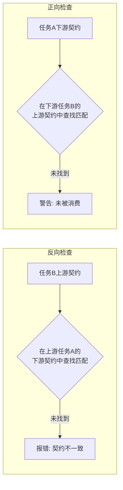
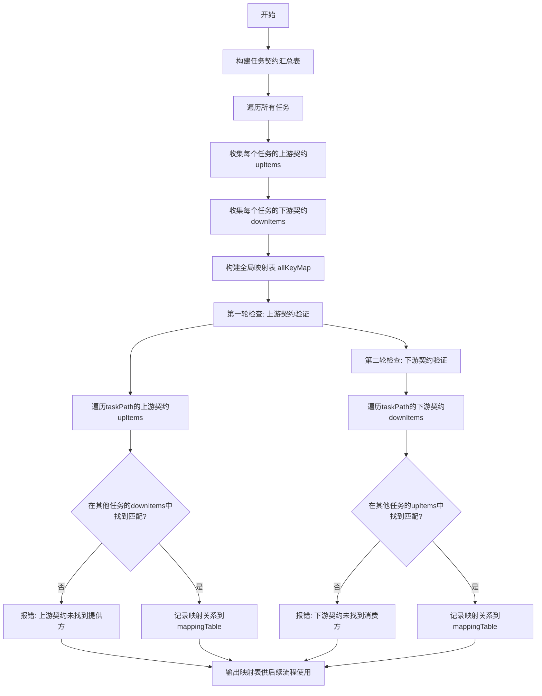
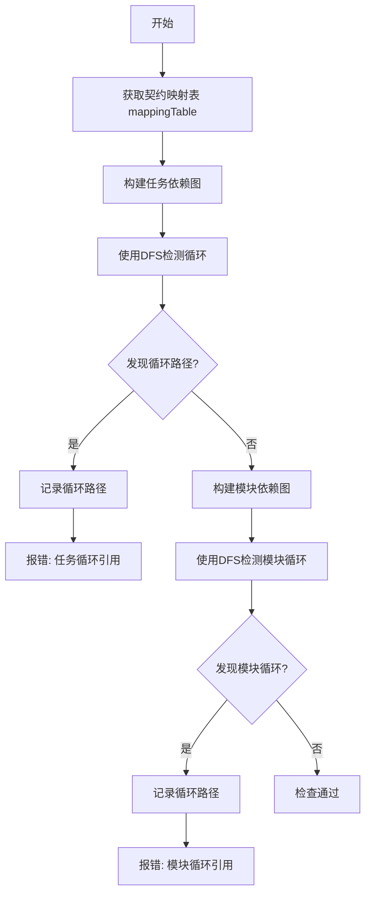

# MCP AITDD 静态编译逻辑改进计划

## 文档信息
- 创建日期: 2026-03-04
- 完成日期: 2026-03-04
- 状态: 已完成
- 关联文档: [static-compile-analysis.md](static-compile-analysis.md)

---

## 完成摘要

### 验证结果

| 验证项 | 结果 | 说明 |
|--------|------|------|
| 编译验证 | ✅ 通过 | `go build ./...` 成功，无编译错误 |
| 单元测试 | ✅ 通过 | `go test ./...` 成功，所有测试通过 |

### 实施完成情况

所有四个阶段的改进工作已完成：

1. **阶段一: 契约检查重构** - 已完成
   - 新增 `UpDownContractItems` 和 `ContractMapping` 数据结构
   - 实现 `buildContractMappingTable()` 函数
   - 重构契约一致性检查逻辑

2. **阶段二: 循环引用检查重构** - 已完成
   - 实现 DFS 循环检测算法
   - 重构模块循环引用检查
   - 新增任务级循环引用检查

3. **阶段三: 孤立检查分离** - 已完成
   - 重构孤立任务检查使用契约映射表
   - 新增孤立模块检查函数

4. **阶段四: 集成测试** - 已完成
   - 编译验证通过
   - 单元测试通过
   - 文档已更新

## 1. 问题概述

经过代码分析，发现当前静态编译逻辑存在以下关键问题：

| 问题编号 | 问题描述 | 严重程度 | 影响范围 |
|----------|----------|----------|----------|
| P1 | 契约一致性检查逻辑错误 | 严重 | 契约验证 |
| P2 | 契约检查策略不完整 | 严重 | 依赖验证 |
| P3 | 模块循环引用检查逻辑错误 | 严重 | 循环检测 |
| P4 | 孤立任务与孤立模块检查混淆 | 中等 | 孤立检测 |

## 2. 问题详细分析

### 2.1 P1: 契约一致性检查逻辑错误

**当前实现问题**:



**问题说明**:
- 正向检查（下游契约未被消费）不应该是警告，而应该是**错误**
- 契约接口既然定义了，就表示下游一定需要，上游一定要提供
- 当前逻辑将正向检查降级为警告是错误的

**改进方案**:
- 正向检查和反向检查都应该报错误
- 删除 W-S-02 规则，统一使用 E-S-07

---

### 2.2 P2: 契约检查策略不完整

**当前实现问题**:
- 当前实现是逐个任务独立检查契约匹配
- 没有构建完整的上下游契约映射表
- 缺少全局视角的契约关系验证

**改进方案**:

#### 2.2.1 新增数据结构

```go
// UpDownContractItems 任务契约汇总结构
type UpDownContractItems struct {
    TaskPathName string                `json:"taskPathName"`
    UpItems      []ContractDetailItem  `json:"upItems"`  // 上游提供的契约
    DownItems    []ContractDetailItem  `json:"downItems"` // 下游需要的契约
}

// ContractMapping 契约映射关系
type ContractMapping struct {
    FromTask    string `json:"fromTask"`    // 提供方任务路径
    ToTask      string `json:"toTask"`      // 消费方任务路径
    ContractItem ContractDetailItem `json:"contractItem"` // 契约条目
}
```

#### 2.2.2 新检查算法



#### 2.2.3 伪代码实现

```go
// 第一步: 构建任务契约汇总表
allKeyMap := make(map[string]*UpDownContractItems)

for _, task := range allTasks {
    temp := &UpDownContractItems{
        TaskPathName: task.PathName,
        UpItems:      []ContractDetailItem{},
        DownItems:    []ContractDetailItem{},
    }
    
    // 解析上游契约
    if task.UpstreamContractDetail != "" {
        var upContract ContractDetail
        json.Unmarshal([]byte(task.UpstreamContractDetail), &upContract)
        temp.UpItems = append(temp.UpItems, upContract.List...)
    }
    
    // 解析下游契约
    if task.DownstreamContractDetail != "" {
        var downContract ContractDetail
        json.Unmarshal([]byte(task.DownstreamContractDetail), &downContract)
        temp.DownItems = append(temp.DownItems, downContract.List...)
    }
    
    allKeyMap[task.PathName] = temp
}

// 第二步: 检查上游契约
mappingTable := []ContractMapping{}

for taskPath, items := range allKeyMap {
    for _, upItem := range items.UpItems {
        found := false
        for otherPath, otherItems := range allKeyMap {
            if otherPath == taskPath {
                continue // 跳过自己
            }
            for _, downItem := range otherItems.DownItems {
                if contractsMatch(upItem, downItem) {
                    found = true
                    mappingTable = append(mappingTable, ContractMapping{
                        FromTask:    otherPath,
                        ToTask:      taskPath,
                        ContractItem: upItem,
                    })
                    break
                }
            }
            if found {
                break
            }
        }
        if !found {
            // 报错: 任务 taskPath 的上游契约 upItem 未找到提供方
            addError(taskPath, "E-S-07", fmt.Sprintf(
                "上游契约 [Label:%s, API:%s, From:%s] 未找到提供方",
                upItem.Label, upItem.ContractAPI, upItem.From))
        }
    }
}

// 第三步: 检查下游契约
for taskPath, items := range allKeyMap {
    for _, downItem := range items.DownItems {
        found := false
        for otherPath, otherItems := range allKeyMap {
            if otherPath == taskPath {
                continue // 跳过自己
            }
            for _, upItem := range otherItems.UpItems {
                if contractsMatch(downItem, upItem) {
                    found = true
                    break
                }
            }
            if found {
                break
            }
        }
        if !found {
            // 报错: 任务 taskPath 的下游契约 downItem 未找到消费方
            addError(taskPath, "E-S-07", fmt.Sprintf(
                "下游契约 [Label:%s, API:%s, From:%s] 未找到消费方",
                downItem.Label, downItem.ContractAPI, downItem.From))
        }
    }
}

// 第四步: 输出映射表供后续流程使用
return mappingTable
```

---

### 2.3 P3: 模块循环引用检查逻辑错误

**当前实现问题**:
- 当前只检测双向引用（A→B 且 B→A）
- 没有检测路径循环（A→B→C→B 或 A→B→C→A）
- 没有检测同一模块内任务间的循环引用

**正确逻辑**:



#### 2.3.1 循环路径检测算法

```go
// 使用DFS检测循环引用
func detectCycleDFS(graph map[string][]string, start string, visited map[string]bool, path []string) [][]string {
    cycles := [][]string{}
    
    if visited[start] {
        // 找到循环
        for i, node := range path {
            if node == start {
                cycle := append(path[i:], start)
                cycles = append(cycles, cycle)
                break
            }
        }
        return cycles
    }
    
    visited[start] = true
    path = append(path, start)
    
    for _, neighbor := range graph[start] {
        cycles = append(cycles, detectCycleDFS(graph, neighbor, visited, path)...)
    }
    
    visited[start] = false
    
    return cycles
}
```

#### 2.3.2 检查范围

| 检查类型 | 说明 | 错误码 |
|----------|------|--------|
| 任务级循环 | 同一模块内任务间的循环引用 | E-S-11 (新增) |
| 任务级循环 | 跨模块任务间的循环引用 | E-S-11 (新增) |
| 模块级循环 | 模块间的循环依赖路径 | E-S-09 |

---

### 2.4 P4: 孤立任务与孤立模块检查混淆

**当前实现问题**:
- `checkOrphanTask()` 检查孤立任务
- `checkModuleCrossDependency()` 检查模块跨模块依赖
- 两者逻辑应该分离但当前有混淆

**改进方案**:

#### 2.4.1 孤立任务检查

**定义**: 任务没有任何上游依赖也没有下游被依赖（除非是 start/end 任务）

**检查方法**: 直接使用契约映射表
- 如果任务在映射表中既不是 FromTask 也不是 ToTask，则为孤立任务

```go
func checkOrphanTask(allTasks []Task, mappingTable []ContractMapping) []CompileIssue {
    issues := []CompileIssue{}
    
    // 构建有依赖的任务集合
    connectedTasks := make(map[string]bool)
    for _, mapping := range mappingTable {
        connectedTasks[mapping.FromTask] = true
        connectedTasks[mapping.ToTask] = true
    }
    
    for _, task := range allTasks {
        // 跳过 start/end 任务
        if isStartOrEndTask(task) {
            continue
        }
        
        if !connectedTasks[task.PathName] {
            issues = append(issues, CompileIssue{
                RuleId:     "E-S-10",
                RuleName:   "孤立任务错误",
                Message:    fmt.Sprintf("任务 %s 没有任何契约依赖关系", task.PathName),
                Suggestion: "请检查任务的上游/下游契约定义，或删除此孤立任务",
            })
        }
    }
    
    return issues
}
```

#### 2.4.2 孤立模块检查

**定义**: 模块内所有任务都没有与外部模块建立契约依赖关系

**检查方法**: 遍历模块内所有任务的契约映射

```go
func checkOrphanModule(allModules []Module, allTasks []Task, mappingTable []ContractMapping) []CompileIssue {
    issues := []CompileIssue{}
    
    for _, module := range allModules {
        hasExternalDependency := false
        
        // 获取模块内所有任务路径
        moduleTaskPaths := getModuleTaskPaths(module, allTasks)
        
        // 检查映射表中是否有跨模块依赖
        for _, mapping := range mappingTable {
            fromModule := getModuleName(mapping.FromTask)
            toModule := getModuleName(mapping.ToTask)
            
            // 如果映射涉及本模块且另一方是外部模块
            if fromModule == module.PathName && toModule != module.PathName {
                hasExternalDependency = true
                break
            }
            if toModule == module.PathName && fromModule != module.PathName {
                hasExternalDependency = true
                break
            }
        }
        
        if !hasExternalDependency {
            issues = append(issues, CompileIssue{
                RuleId:     "E-S-12", // 新增
                RuleName:   "孤立模块错误",
                Message:    fmt.Sprintf("模块 %s 没有任何跨模块依赖", module.PathName),
                Suggestion: "请检查模块的任务契约，确保至少有一个任务与外部模块建立依赖关系",
            })
        }
    }
    
    return issues
}
```

---

## 3. 改进计划

### 3.1 阶段一: 契约检查重构

| 步骤 | 任务 | 预计工作量 |
|------|------|------------|
| 1.1 | 新增 `UpDownContractItems` 和 `ContractMapping` 数据结构 | 0.5h |
| 1.2 | 实现 `buildContractMappingTable()` 函数 | 1h |
| 1.3 | 重构 `checkContractConsistency()` 使用新的映射表 | 1h |
| 1.4 | 删除 W-S-02 规则，统一使用 E-S-07 | 0.5h |
| 1.5 | 单元测试 | 1h |

### 3.2 阶段二: 循环引用检查重构

| 步骤 | 任务 | 预计工作量 |
|------|------|------------|
| 2.1 | 实现 `detectCycleDFS()` 循环检测算法 | 1h |
| 2.2 | 重构 `checkModuleCircularReference()` 使用 DFS | 1.5h |
| 2.3 | 新增同模块内任务循环引用检查 | 1h |
| 2.4 | 新增 E-S-11 规则 | 0.5h |
| 2.5 | 单元测试 | 1h |

### 3.3 阶段三: 孤立检查分离

| 步骤 | 任务 | 预计工作量 |
|------|------|------------|
| 3.1 | 重构 `checkOrphanTask()` 使用契约映射表 | 1h |
| 3.2 | 新增 `checkOrphanModule()` 函数 | 1h |
| 3.3 | 新增 E-S-12 规则 | 0.5h |
| 3.4 | 单元测试 | 1h |

### 3.4 阶段四: 集成测试

| 步骤 | 任务 | 预计工作量 |
|------|------|------------|
| 4.1 | 集成测试用例编写 | 2h |
| 4.2 | 回归测试 | 1h |
| 4.3 | 文档更新 | 0.5h |

---

## 4. 规则ID更新

| 规则ID | 名称 | 级别 | 变更说明 |
|--------|------|------|----------|
| E-S-07 | 契约不一致 | error | 统一正向和反向检查都报错误 |
| E-S-09 | 模块循环引用 | error | 重构为DFS检测 |
| E-S-10 | 孤立任务错误 | error | 使用映射表检测 |
| E-S-11 | 任务循环引用 | error | **新增** |
| E-S-12 | 孤立模块错误 | error | **新增** |
| ~~W-S-02~~ | ~~下游契约未被消费~~ | ~~warning~~ | **删除** |

---

## 5. 待确认事项

请确认以下问题后开始实施：

1. **契约检查策略**: 确认正向检查（下游契约未找到消费方）是否应该报错误而非警告？ yes
2. **循环检测范围**: 确认是否需要检测同一模块内任务间的循环引用？ yes
3. **孤立模块定义**: 确认"模块没有任何跨模块依赖"是否应该报错误？ yes
4. **映射表用途**: 确认契约映射表是否需要持久化存储供其他功能使用？ 否
