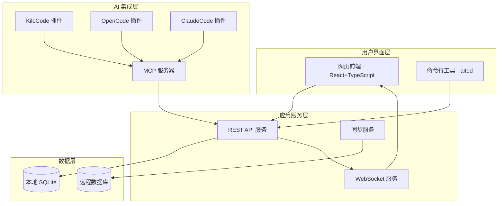
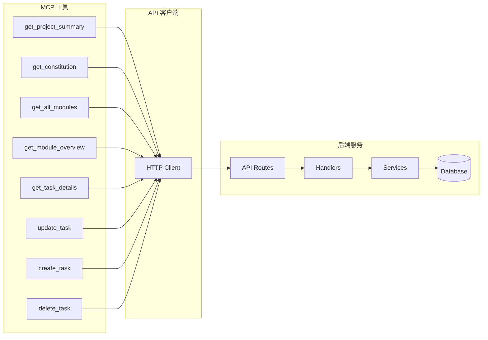
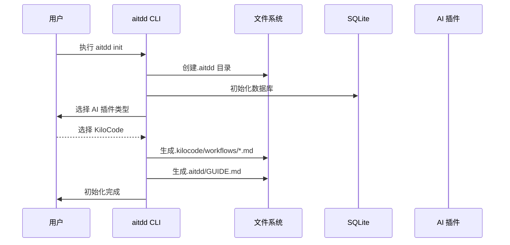
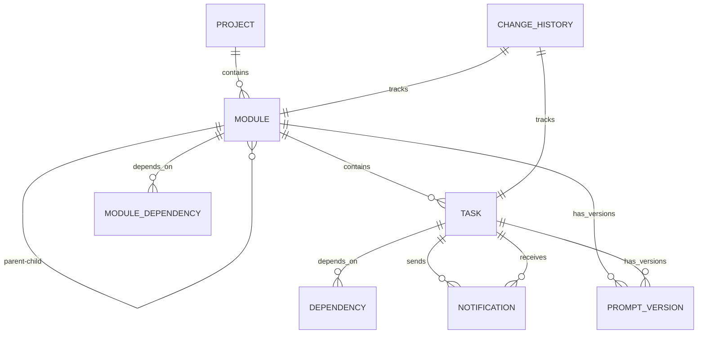
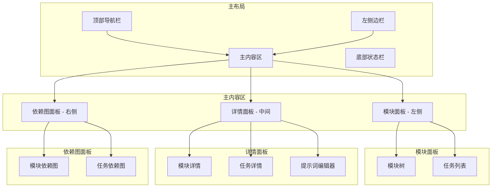
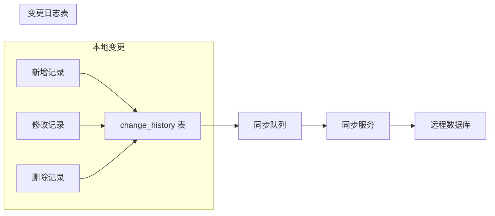
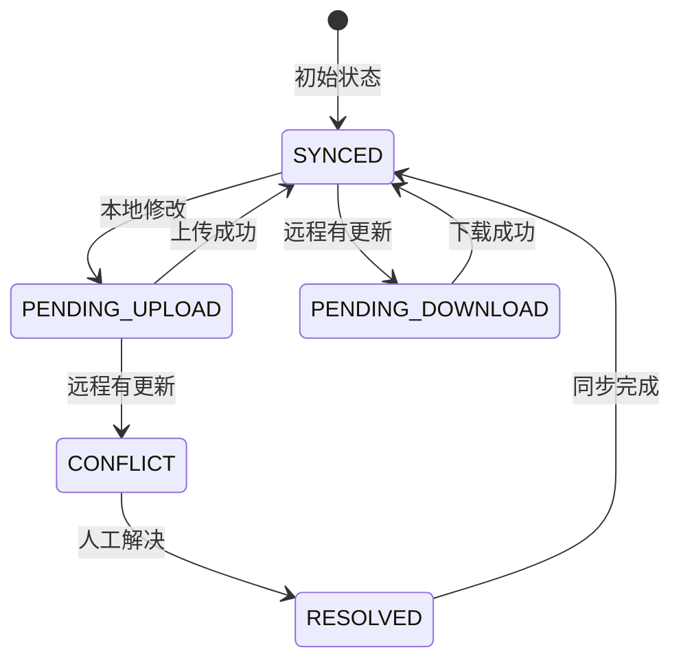

# AITDD 系统架构升级计划

**Feature Branch**: `002-ai-integration-architecture`  
**Created**: 2026-02-24  
**Status**: Draft

## 系统愿景

AITDD 是一个**提示词依赖管理系统**，通过可视化界面和 MCP 协议，让 AI 编程软件（KiloCode、OpenCode、ClaudeCode 等）能够协同工作，管理大型软件项目的模块、任务、依赖关系和提示词。

## 核心架构图



## 一、给 AI 的 MCP 工具集设计

### 1.1 工具列表

| 工具 ID | 工具名称 | 功能描述 | 对应 API |
|---------|----------|----------|----------|
| TOOL-01 | `get_project_summary` | 获取项目简述 | `GET /api/v1/project` |
| TOOL-02 | `get_constitution` | 获取项目公约 | `GET /api/v1/project/constitution` |
| TOOL-03 | `get_all_modules` | 获取所有模块和子模块 | `GET /api/v1/modules` |
| TOOL-04 | `get_module_overview` | 获取模块概览 | `GET /api/v1/modules/:id` |
| TOOL-05 | `get_module_task_ids` | 获取模块中所有任务 ID 列表 | `GET /api/v1/modules/:id/tasks?fields=id` |
| TOOL-06 | `get_task_details` | 获取任务详细信息 | `GET /api/v1/tasks/:id` |
| TOOL-07 | `update_task` | 修改任务详细信息 | `PUT /api/v1/tasks/:id` |
| TOOL-08 | `create_task` | 在模块中创建任务 | `POST /api/v1/tasks` |
| TOOL-09 | `delete_task` | 删除任务 | `DELETE /api/v1/tasks/:id` |
| TOOL-10 | `delete_module` | 删除模块 | `DELETE /api/v1/modules/:id` |
| TOOL-11 | `open_frontend` | 打开前端网页 | 触发浏览器 |
| TOOL-12 | `send_notification` | 发送通知 | `POST /api/v1/notifications` |
| TOOL-13 | `read_notifications` | 读取未读通知 | `GET /api/v1/notifications?read=false` |
| TOOL-14 | `lock_resource` | 锁定资源 | `POST /api/v1/lock` |
| TOOL-15 | `unlock_resource` | 解锁资源 | `POST /api/v1/unlock` |
| TOOL-16 | `get_lock_status` | 查询锁定状态 | `GET /api/v1/lock/status` |
| TOOL-17 | `create_module_dependency` | 创建模块依赖 | `POST /api/v1/modules/:id/dependencies` |
| TOOL-18 | `get_module_dependencies` | 获取模块依赖 | `GET /api/v1/modules/:id/dependencies` |
| TOOL-19 | `create_task_dependency` | 创建任务依赖 | `POST /api/v1/dependencies` |
| TOOL-20 | `get_task_dependencies` | 获取任务依赖 | `GET /api/v1/dependencies?taskId=:id` |

### 1.2 MCP 服务器实现架构



## 二、命令行工具设计

### 2.1 命令列表

| 命令 | 功能 | 生成的文件 |
|------|------|------------|
| `/aitdd.start` | 系统指南和 MCP 注册 | 读取 `.aitdd/GUIDE.md` |
| `/aitdd.constitution` | 制定或更新项目公约 | 调用 `PUT /api/v1/project/constitution` |
| `/aitdd.specify` | 明确需求和用户故事 | 调用 `POST /api/v1/modules` 创建需求模块 |
| `/aitdd.plan` | 创建技术实施计划 | 调用 `POST /api/v1/modules` 创建技术模块 |
| `/aitdd.tasks` | 生成或修改任务清单 | 调用 `POST /api/v1/tasks` |
| `/aitdd.implement` | 执行任务 | 调用 `PUT /api/v1/tasks/:id/status` |
| `/aitdd.debug` | 查询和修复 bug | 调用多个 API 分析链路 |

### 2.2 Workflow 文件结构

```
项目根目录/
├── .aitdd/
│   ├── aitdd.db              # SQLite 数据库
│   ├── GUIDE.md              # 系统使用指南
│   └── config.json           # 配置信息
├── .kilocode/
│   └── workflows/
│       ├── aitdd.start.md
│       ├── aitdd.constitution.md
│       ├── aitdd.specify.md
│       ├── aitdd.plan.md
│       ├── aitdd.tasks.md
│       ├── aitdd.implement.md
│       └── aitdd.debug.md
├── .opencode/
│   └── workflows/
│       └── ... (同上)
└── .claude/
    └── commands/
        └── ... (同上)
```

### 2.3 Workflow 文件模板示例

```markdown
---
name: aitdd.constitution
description: 制定或更新项目管理原则和开发指南
---

# AITDD 项目公约命令

## 功能说明
此命令用于制定或更新项目的管理原则和开发指南。

## 使用方式
向 AI 助手描述你想要制定的公约内容，AI 将调用 MCP 工具更新项目公约。

## MCP 工具
- `update_constitution`: 更新项目公约

## 示例
用户：我想添加一条新的开发规范，所有 API 必须遵循 RESTful 风格
AI: 好的，我将更新项目公约...
```

## 三、插件系统集成

### 3.1 插件类型

| 插件 | 命令注入方式 | Workflow 目录 |
|------|-------------|---------------|
| KiloCode | `.kilocode/workflows/*.md` | `.kilocode/workflows/` |
| OpenCode | `.opencode/workflows/*.md` | `.opencode/workflows/` |
| ClaudeCode | `.claude/commands/*.md` | `.claude/commands/` |
| Cursor | `.cursor/commands/*.md` | `.cursor/commands/` |

### 3.2 初始化流程



### 3.3 安装程序架构

```
aitdd-cli/
├── bin/
│   └── aitdd              # 可执行文件
├── lib/
│   ├── init.js            # 初始化逻辑
│   ├── serve.js           # 服务启动逻辑
│   ├── plugins/           # 插件配置
│   │   ├── kilocode.js
│   │   ├── opencode.js
│   │   └── claudecode.js
│   └── templates/         # 模板文件
│       ├── GUIDE.md
│       └── workflows/
└── package.json
```

## 四、数据模型扩展

### 4.1 模块依赖表

```sql
CREATE TABLE IF NOT EXISTS module_dependencies (
    id TEXT PRIMARY KEY,
    upstream_module_id TEXT NOT NULL REFERENCES modules(id) ON DELETE CASCADE,
    downstream_module_id TEXT NOT NULL REFERENCES modules(id) ON DELETE CASCADE,
    contract TEXT,  -- JSON: 依赖契约细节
    prompt_dependency TEXT,  -- 提示词依赖描述
    status TEXT NOT NULL DEFAULT 'active',
    created_at INTEGER NOT NULL,
    updated_at INTEGER NOT NULL,
    sync_status TEXT NOT NULL DEFAULT 'SYNCED',
    UNIQUE(upstream_module_id, downstream_module_id)
);
```

### 4.2 提示词版本表

```sql
CREATE TABLE IF NOT EXISTS prompt_versions (
    id TEXT PRIMARY KEY,
    entity_type TEXT NOT NULL,  -- 'module' or 'task'
    entity_id TEXT NOT NULL,
    version INTEGER NOT NULL,
    prompt TEXT NOT NULL,
    change_summary TEXT,
    created_by TEXT,
    created_at INTEGER NOT NULL
);
```

### 4.3 实体关系图



## 五、前端 UI 重构

### 5.1 页面布局



### 5.2 视觉设计规范

```
配色方案:
- 主色调：#1a1a2e (深蓝背景)
- 次色调：#16213e (卡片背景)
- 强调色：#e94560 (粉色高亮)
- 文字色：#ffffff (白色文字)
- 边框色：#0f3460 (蓝色边框)

节点样式:
- 模块节点：圆角矩形，蓝色渐变
- 任务节点：圆角矩形，绿色渐变
- 依赖连线：贝塞尔曲线，带箭头
- 选中状态：发光效果
```

### 5.3 依赖图可视化组件

使用 React Flow 或 D3.js 实现：
- 可拖拽的节点
- 可缩放的画布
- 贝塞尔曲线连接
- 节点分组（按模块）
- 筛选和搜索
- 点击展开详情

## 六、版本管理与同步

### 6.1 本地版本管理



### 6.2 同步状态机



## 七、实施计划

### 阶段一：基础架构（P0）
1. 扩展数据模型（模块依赖、提示词版本）
2. 实现完整的 MCP 工具集
3. 优化 API 响应格式

### 阶段二：UI 重构（P1）
1. 重新设计页面布局
2. 实现依赖图可视化组件
3. 优化模块树和任务列表

### 阶段三：CLI 工具（P2）
1. 设计 aitdd CLI 架构
2. 实现初始化命令
3. 生成 Workflow 文件

### 阶段四：插件集成（P3）
1. 支持 KiloCode
2. 支持 OpenCode
3. 支持 ClaudeCode

### 阶段五：版本管理（P4）
1. 实现变更历史记录
2. 实现远程同步
3. 实现冲突解决

## 八、成功标准

| 指标 | 目标值 |
|------|--------|
| MCP 工具响应时间 | < 50ms |
| 依赖图渲染性能 | 支持 1000+ 节点 |
| 初始化时间 | < 3 秒 |
| 前端加载时间 | < 1.5 秒 |
| 同步延迟 | < 2 秒 |
