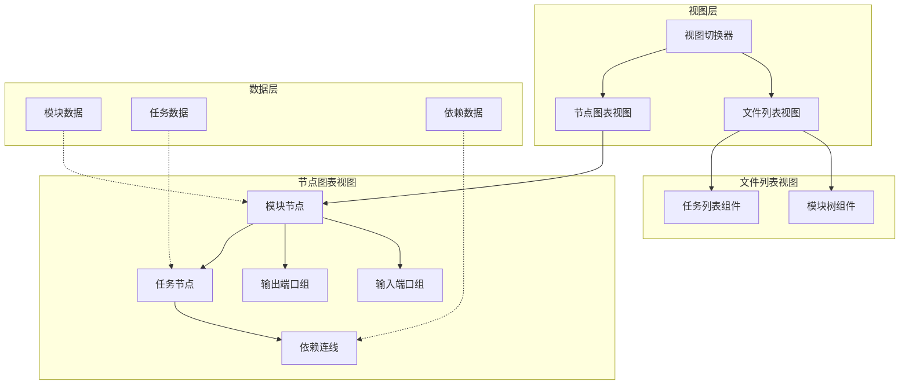

# AITDD 可视化依赖图架构设计

**Created**: 2026-02-24
**Status**: Draft

## 一、需求分析

### 1.1 当前问题
1. 模块使用文件夹图标不合适，应使用模块图表图标
2. 模块中无法创建子模块
3. 模块中无法创建任务
4. 任务之间无法创建链接
5. 节点面板需要显示所有节点和模块节点
6. 模块节点需要支持折叠
7. 模块节点应该是一个大框，框内包含任务节点

### 1.2 新增需求
1. **视图模式切换**: 顶部切换按钮，支持文件列表视图和节点图表视图
2. **模块节点设计**:
   - 模块节点是一个大的容器框
   - 模块节点左侧有一排输入节点（来自其他模块的任务依赖）
   - 模块节点右侧有一排输出节点（被其他模块依赖的任务）
   - 模块内部的任务节点与所属模块左右两边的节点自动链接
   - 模块间的依赖关系自动生成，不能手动连接
3. **任务节点**:
   - 显示依赖信息（上游契约和下游契约）
   - 任务之间可以手动创建链接
4. **自动聚合**: 任务与任务的依赖关系会自动汇总到模块层面

## 二、系统架构

### 2.1 整体架构图



### 2.2 组件层次结构

```
ModulesPage (主页面)
├── ViewSwitcher (视图切换器)
│   ├── ListViewButton (列表视图按钮)
│   └── GraphViewButton (图表视图按钮)
├── ModuleListView (文件列表视图)
│   ├── ModuleTree (模块树)
│   │   └── ModuleTreeNode (模块树节点)
│   └── TaskList (任务列表)
│       └── TaskListItem (任务列表项)
└── ModuleGraphView (节点图表视图)
    ├── ReactFlowCanvas (React Flow 画布)
    │   └── ModuleNode (模块节点)
    │       ├── ModuleHeader (模块头部)
    │       ├── InputPortGroup (输入端口组)
    │       │   └── InputPort (输入端口)
    │       ├── TaskContainer (任务容器)
    │       │   └── TaskNode (任务节点)
    │       │       ├── TaskHeader (任务头部)
    │       │       ├── TaskContracts (契约信息)
    │       │       │   ├── UpstreamContract (上游契约)
    │       │       │   └── DownstreamContract (下游契约)
    │       │       └── TaskActions (操作按钮)
    │       └── OutputPortGroup (输出端口组)
    │           └── OutputPort (输出端口)
    └── GraphControls (图表控制)
        ├── ZoomControl (缩放控制)
        ├── LayoutToggle (布局切换)
        └── FilterPanel (筛选面板)
```

## 三、数据模型设计

### 3.1 前端类型定义

```typescript
// 视图模式
export type ViewMode = 'list' | 'graph';

// 模块节点数据
export interface ModuleNodeData {
  id: string;
  label: string;
  status: ModuleStatus;
  collapsed: boolean;
  tasks: Task[];
  inputPorts: PortData[];
  outputPorts: PortData[];
}

// 端口数据（用于模块间依赖）
export interface PortData {
  id: string;
  taskId: string;
  taskName: string;
  direction: 'input' | 'output';
  connectedModules: string[]; // 连接的模块 ID 列表
}

// 任务节点数据
export interface TaskNodeData {
  id: string;
  moduleId: string;
  label: string;
  status: TaskStatus;
  upstreamContractDetail?: ContractDetail;
  downstreamContractDetail?: ContractDetail;
  dependencies: TaskDependency[];
}

// React Flow 节点类型
export type GraphNode = Node<ModuleNodeData | TaskNodeData>;
export type GraphEdge = Edge<{ 
  type: 'task-dependency' | 'module-dependency';
  automated: boolean;
}>;
```

### 3.2 后端 API 扩展

需要新增以下 API：

```go
// 获取模块的输入输出端口（自动聚合任务依赖）
GET /api/v1/modules/:id/ports
Response: {
  inputPorts: PortData[],
  outputPorts: PortData[]
}

// 获取完整的图表数据（包含模块、任务、依赖）
GET /api/v1/project/graph
Response: {
  modules: Module[],
  tasks: Task[],
  taskDependencies: TaskDependency[],
  moduleDependencies: ModuleDependency[]
}

// 创建任务依赖（手动连接）
POST /api/v1/tasks/:id/dependencies
Request: {
  downstreamTaskId: string,
  contractSummary?: string
}

// 删除任务依赖
DELETE /api/v1/tasks/:id/dependencies/:dependencyId
```

## 四、核心功能设计

### 4.1 视图切换器

```tsx
interface ViewSwitcherProps {
  currentMode: ViewMode;
  onModeChange: (mode: ViewMode) => void;
}

const ViewSwitcher: React.FC<ViewSwitcherProps> = ({
  currentMode,
  onModeChange,
}) => {
  return (
    <div className="view-switcher">
      <Button
        type={currentMode === 'list' ? 'primary' : 'default'}
        icon={<UnorderedListOutlined />}
        onClick={() => onModeChange('list')}
      >
        文件列表
      </Button>
      <Button
        type={currentMode === 'graph' ? 'primary' : 'default'}
        icon={<DeploymentUnitOutlined />}
        onClick={() => onModeChange('graph')}
      >
        节点图表
      </Button>
    </div>
  );
};
```

### 4.2 模块节点设计

```tsx
interface ModuleNodeProps {
  data: ModuleNodeData;
  selected: boolean;
  onToggleCollapse: () => void;
  onAddTask: (moduleId: string) => void;
  onAddSubModule: (parentId: string) => void;
}

const ModuleNode: React.FC<ModuleNodeProps> = ({
  data,
  selected,
  onToggleCollapse,
  onAddTask,
  onAddSubModule,
}) => {
  return (
    <div className={`module-node ${selected ? 'selected' : ''}`}>
      {/* 模块头部 */}
      <div className="module-header">
        <ChipIcon className="module-icon" />
        <span className="module-label">{data.label}</span>
        <Button icon={<CaretDownOutlined />} onClick={onToggleCollapse} />
      </div>
      
      {/* 输入端口组（左侧） */}
      {!data.collapsed && (
        <div className="input-port-group">
          {data.inputPorts.map(port => (
            <InputPort key={port.id} data={port} />
          ))}
        </div>
      )}
      
      {/* 任务容器 */}
      {!data.collapsed && (
        <div className="task-container">
          {data.tasks.map(task => (
            <TaskNode key={task.id} data={task} />
          ))}
          <Button icon={<PlusOutlined />} onClick={() => onAddTask(data.id)}>
            添加任务
          </Button>
          <Button icon={<PlusOutlined />} onClick={() => onAddSubModule(data.id)}>
            添加子模块
          </Button>
        </div>
      )}
      
      {/* 输出端口组（右侧） */}
      {!data.collapsed && (
        <div className="output-port-group">
          {data.outputPorts.map(port => (
            <OutputPort key={port.id} data={port} />
          ))}
        </div>
      )}
    </div>
  );
};
```

### 4.3 任务节点设计

```tsx
interface TaskNodeProps {
  data: TaskNodeData;
  selected: boolean;
  onEdit: (taskId: string) => void;
  onLinkTask: (taskId: string) => void;
}

const TaskNode: React.FC<TaskNodeProps> = ({
  data,
  selected,
  onEdit,
  onLinkTask,
}) => {
  return (
    <div className={`task-node ${selected ? 'selected' : ''}`}>
      {/* 任务头部 */}
      <div className="task-header">
        <FileTextOutlined className="task-icon" />
        <span className="task-label">{data.label}</span>
        <Tag color={getStatusColor(data.status)}>{data.status}</Tag>
      </div>
      
      {/* 契约信息 */}
      <div className="task-contracts">
        {data.upstreamContractDetail && (
          <div className="upstream-contract">
            <div className="contract-label">
              <ArrowDownOutlined /> 上游契约
            </div>
            <div className="contract-detail">
              {data.upstreamContractDetail.description}
            </div>
          </div>
        )}
        {data.downstreamContractDetail && (
          <div className="downstream-contract">
            <div className="contract-label">
              下游契约 <ArrowUpOutlined />
            </div>
            <div className="contract-detail">
              {data.downstreamContractDetail.description}
            </div>
          </div>
        )}
      </div>
      
      {/* 操作按钮 */}
      <div className="task-actions">
        <Button size="small" icon={<EditOutlined />} onClick={() => onEdit(data.id)} />
        <Button size="small" icon={<LinkOutlined />} onClick={() => onLinkTask(data.id)} />
      </div>
    </div>
  );
};
```

### 4.4 依赖关系自动聚合

```typescript
// 计算模块的输入输出端口
function computeModulePorts(
  moduleId: string,
  tasks: Task[],
  taskDependencies: TaskDependency[],
  modules: Module[]
): { inputPorts: PortData[]; outputPorts: PortData[] } {
  const moduleTasks = tasks.filter(t => t.moduleId === moduleId);
  const moduleTaskIds = new Set(moduleTasks.map(t => t.id));
  
  const inputPorts: PortData[] = [];
  const outputPorts: PortData[] = [];
  
  // 遍历所有任务依赖
  taskDependencies.forEach(dep => {
    const upstreamTask = tasks.find(t => t.id === dep.upstreamTaskId);
    const downstreamTask = tasks.find(t => t.id === dep.downstreamTaskId);
    
    if (!upstreamTask || !downstreamTask) return;
    
    // 上游任务在当前模块，下游任务在其他模块 -> 输出端口
    if (moduleTaskIds.has(upstreamTask.id) && !moduleTaskIds.has(downstreamTask.id)) {
      outputPorts.push({
        id: `output-${dep.id}`,
        taskId: upstreamTask.id,
        taskName: upstreamTask.name,
        direction: 'output',
        connectedModules: [downstreamTask.moduleId],
      });
    }
    
    // 下游任务在当前模块，上游任务在其他模块 -> 输入端口
    if (moduleTaskIds.has(downstreamTask.id) && !moduleTaskIds.has(upstreamTask.id)) {
      inputPorts.push({
        id: `input-${dep.id}`,
        taskId: downstreamTask.id,
        taskName: downstreamTask.name,
        direction: 'input',
        connectedModules: [upstreamTask.moduleId],
      });
    }
  });
  
  return { inputPorts, outputPorts };
}
```

## 五、后端修改

### 5.1 新增 API Handler

```go
// GetModulePorts 获取模块的输入输出端口
func GetModulePorts(c *gin.Context) {
  moduleID := c.Param("id")
  
  // 获取模块下的所有任务
  var tasks []models.Task
  database.DB.Where("module_id = ?", moduleID).Find(&tasks)
  
  taskIDs := make([]string, len(tasks))
  for i, task := range tasks {
    taskIDs[i] = task.ID
  }
  
  // 获取任务依赖
  var dependencies []models.Dependency
  database.DB.Where("upstream_task_id IN ? OR downstream_task_id IN ?", taskIDs, taskIDs).
    Find(&dependencies)
  
  // 计算输入输出端口
  inputPorts := []PortData{}
  outputPorts := []PortData{}
  
  for _, dep := range dependencies {
    var upstreamTask models.Task
    var downstreamTask models.Task
    database.DB.First(&upstreamTask, "id = ?", dep.UpstreamTaskID)
    database.DB.First(&downstreamTask, "id = ?", dep.DownstreamTaskID)
    
    // 判断方向
    upstreamInModule := contains(taskIDs, dep.UpstreamTaskID)
    downstreamInModule := contains(taskIDs, dep.DownstreamTaskID)
    
    if upstreamInModule && !downstreamInModule {
      // 输出端口
      outputPorts = append(outputPorts, PortData{
        ID:       "output-" + dep.ID,
        TaskID:   upstreamTask.ID,
        TaskName: upstreamTask.Name,
        Direction: "output",
      })
    } else if !upstreamInModule && downstreamInModule {
      // 输入端口
      inputPorts = append(inputPorts, PortData{
        ID:       "input-" + dep.ID,
        TaskID:   downstreamTask.ID,
        TaskName: downstreamTask.Name,
        Direction: "input",
      })
    }
  }
  
  Success(c, gin.H{
    "inputPorts":  inputPorts,
    "outputPorts": outputPorts,
  })
}

// GetProjectGraph 获取完整的项目图表数据
func GetProjectGraph(c *gin.Context) {
  projectID := c.Query("projectId")
  
  // 获取所有模块
  var modules []models.Module
  database.DB.Where("project_id = ?", projectID).Find(&modules)
  
  // 获取所有任务
  var tasks []models.Task
  database.DB.Where("module_id IN ?", 
    database.DB.Model(&models.Module{}).Select("id").Where("project_id = ?", projectID)).
    Find(&tasks)
  
  // 获取所有任务依赖
  var dependencies []models.Dependency
  database.DB.Where("upstream_task_id IN ? OR downstream_task_id IN ?",
    getTaskIDs(tasks), getTaskIDs(tasks)).
    Find(&dependencies)
  
  // 获取所有模块依赖
  var moduleDependencies []models.ModuleDependency
  database.DB.Where("module_id IN ?", getModuleIDs(modules)).
    Find(&moduleDependencies)
  
  Success(c, gin.H{
    "modules":            modules,
    "tasks":              tasks,
    "taskDependencies":   dependencies,
    "moduleDependencies": moduleDependencies,
  })
}
```

### 5.2 新增路由

```go
// 在 routes.go 中添加
{
  // 图表相关
  graph := v1.Group("/graph")
  {
    graph.GET("/project", GetProjectGraph)
    graph.GET("/modules/:id/ports", GetModulePorts)
  }
}
```

## 六、实施计划

### 阶段一：基础架构 (P0)
1. 更新类型定义
2. 创建视图切换器组件
3. 创建 ModuleGraphView 组件
4. 创建 ModuleNode 组件框架

### 阶段二：模块节点 (P0)
1. 实现模块头部（图标、折叠按钮）
2. 实现输入端口组
3. 实现输出端口组
4. 实现任务容器
5. 添加子模块创建功能

### 阶段三：任务节点 (P1)
1. 实现任务节点样式
2. 显示契约信息
3. 实现任务间手动链接
4. 实现依赖关系显示

### 阶段四：自动聚合 (P1)
1. 实现端口自动计算逻辑
2. 实现模块间依赖自动连线
3. 实现依赖关系统计

### 阶段五：后端 API (P2)
1. 实现 GetModulePorts API
2. 实现 GetProjectGraph API
3. 优化任务依赖创建 API

## 七、视觉设计

### 7.1 模块节点样式

```
┌─────────────────────────────────────────────┐
│ [芯片图标] 模块名称           [折叠按钮]    │
├──────────┬────────────────────┬─────────────┤
│ 输入端口 │   任务容器          │  输出端口   │
│ ○ 任务 A  │ ┌───────────────┐  │  任务 C ○  │
│ ○ 任务 B  │ │ [任务 1] [+]  │  │  任务 D ○  │
│          │ │ [任务 2] [+]  │  │             │
│          │ └───────────────┘  │             │
└──────────┴────────────────────┴─────────────┘
```

### 7.2 任务节点样式

```
┌─────────────────────────┐
│ [图标] 任务名 [状态标签] │
├─────────────────────────┤
│ ↓ 上游契约              │
│ 接口描述...             │
├─────────────────────────┤
│ 下游契约 ↑              │
│ 接口描述...             │
├─────────────────────────┤
│ [编辑] [链接]           │
└─────────────────────────┘
```

## 八、成功标准

1. 视图切换流畅，无卡顿
2. 模块节点可折叠/展开
3. 任务依赖关系自动聚合到模块层面
4. 模块间依赖自动生成连线
5. 任务节点显示完整的契约信息
6. 支持手动创建任务间依赖
7. 支持在模块内创建子模块和任务
